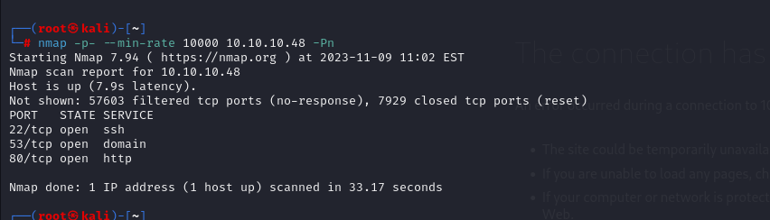
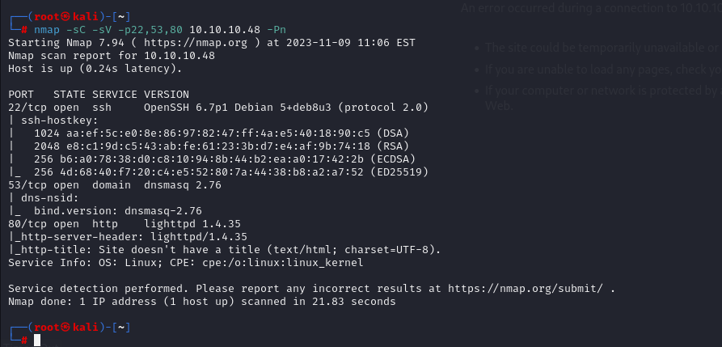
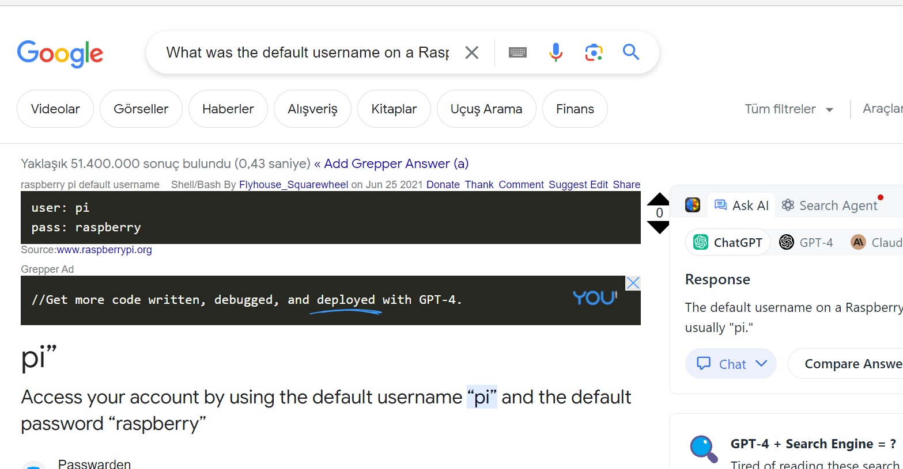
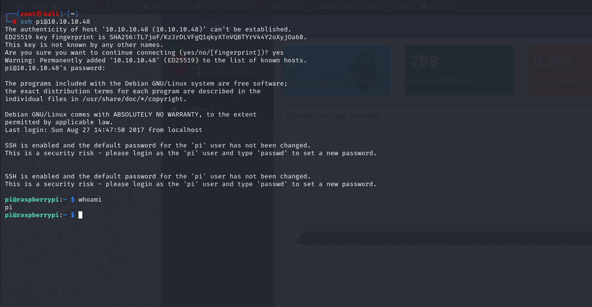
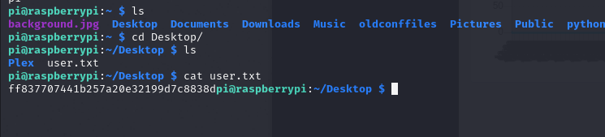
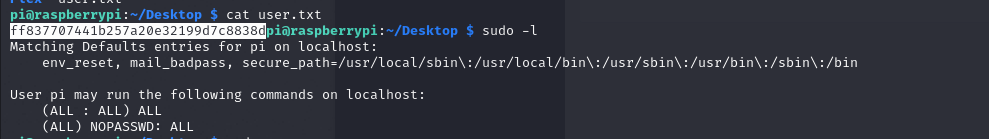
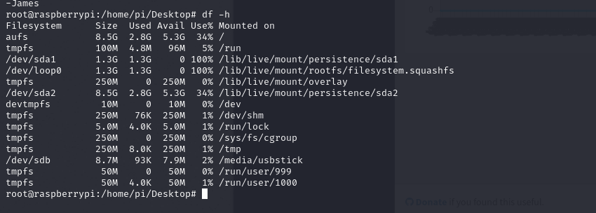
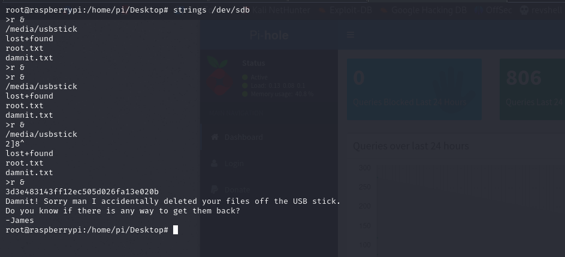
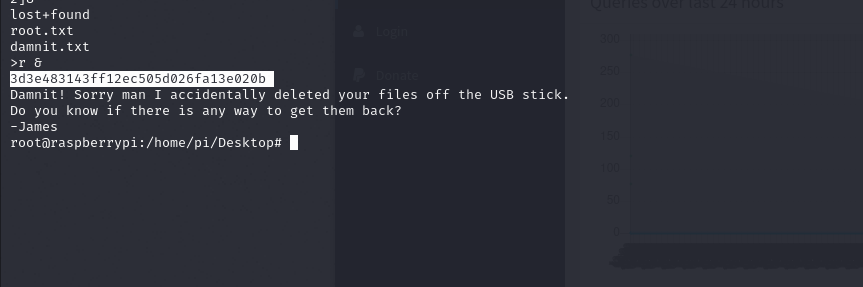

# [Mirai](https://app.hackthebox.com/machines/mirai)

```bash
nmap -p- --min-rate 10000 10.10.10.48 -Pn
```



```bash
nmap -sC -sV -p22,53,80 10.10.10.48 -Pn
```




Directory brute-forcing

```bash
gobuster dir -u http://10.10.10.48 -w /usr/share/wordlists/dirbuster/directory-list-2.3-small.txt -x php -t 40
```

We found nothing interesting for us.


Default credentials for RasbperryPI


pi: raspberry

Let's try to connect via SSH, and it worked.




user.txt




I check privileges via `sudo -l` command.




I escalate user to root just one command `sudo -s` command.

Let's look at all mounting

```bash
df -h
```




Let's read '/dev/sdb' via `strings` command.




root.txt is here, we can see flag

