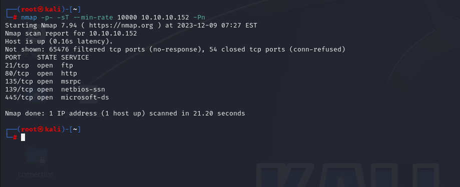
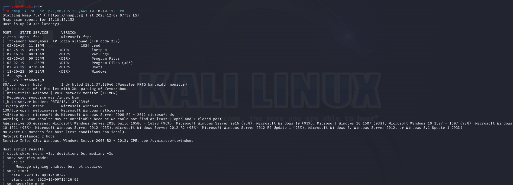
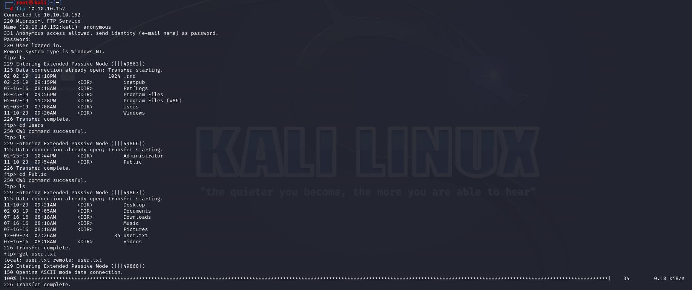
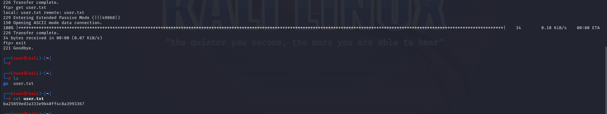
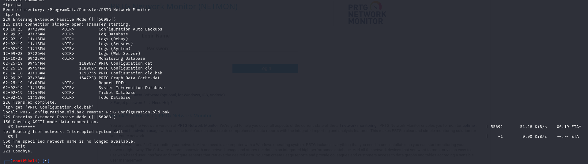
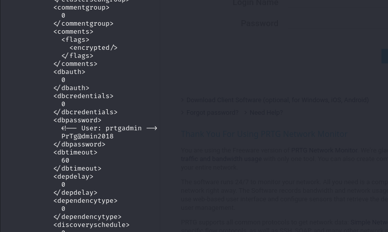
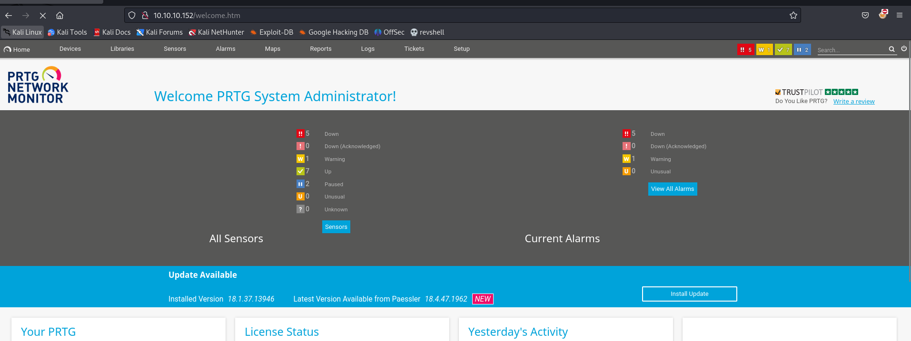
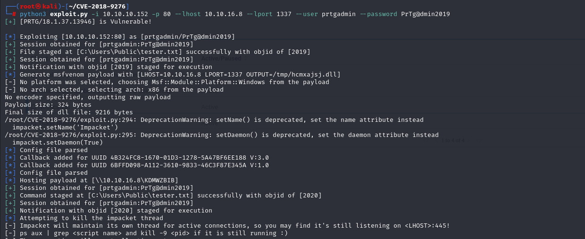
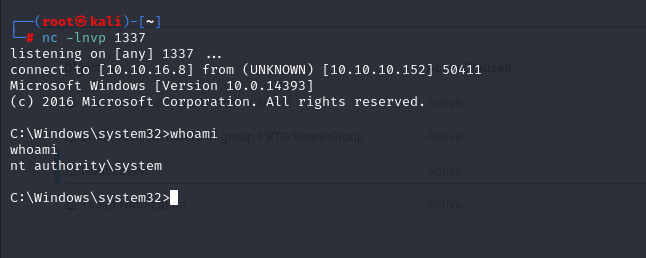
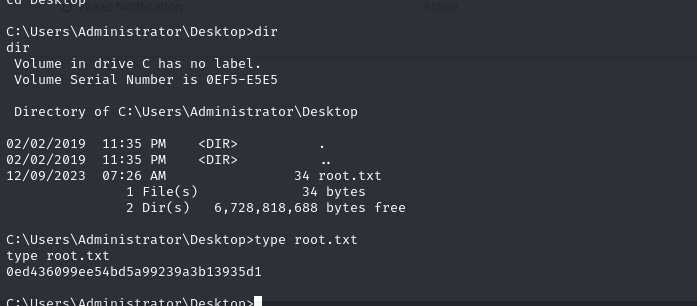

# [Netmon](https://app.hackthebox.com/machines/netmon)

```bash
nmap -p- -sT --min-rate 10000 10.10.10.152 -Pn 
```




After discovering open ports(21,80,135,139,445) of application, let's do greater nmap scan.

```bash
nmap -A -sC -sV -p21,80,135,139,445 10.10.10.152 -Pn
```




Let's try to access to FTP service as because it allows for '**anonymous**' login.




user.txt




I also do more enumeration on FTP server and find files which have sensitive credentials **'\ProgramData\Paessler\PRTG Network Monitor'**

I grab file called **'PRTG Configuration.old.bak'**




I got credentials from here.



prtgadmin: PrTg@dmin2018

Then, I access to web service which is located for port(80) via above credentials.

It fails, then one thing comes to my mind, maybe it is '2019',

prtgadmin: PrTg@dmin2019

This one works without any problem.




Then, I found [exploit](https://github.com/A1vinSmith/CVE-2018-9276) whose CVE number is 'CVE-2018-9276' for PRTG Network Monitor.




I got reverse shell.



root.txt

