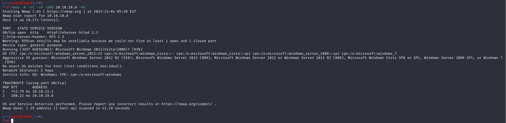

# [Optimum](https://app.hackthebox.com/machines/Optimum)

```bash
nmap -p- --min-rate 10000  10.10.10.8 -Pn
```


I see that only port 80 is open, let's do greater nmap scan for this port.

```bash
nmap -A -sC -sV -p80 10.10.10.8 -Pn
```



While I see port 80 is that HttpFileServer 2.3.4 version, we can search publicly known exploit.


That's [CVE-2014-6287](https://github.com/am0nsec/exploit/blob/master/windows/http/RejettoHTTPFileServer-2.3/rejetto_hfs.py)


Let's use this exploit. I use `msfconsole` as because it's preferable for me.
`exploit/windows/http/rejetto_hfs_exec`


I gained a shell.


user.txt


While I searched exploit for this version of Windows Server 2012


Let's find publicly known exploits for this version, I find **'MS16-032'**, that's CVE number is `CVE-2016-0999`


Here's our [exploit](https://github.com/FuzzySecurity/PowerShell-Suite/blob/master/Invoke-MS16-032.ps1)


I just did `Ctrl+Z` to run session on **background**.


Then, I use MS16-032 vulnerability and set session which run in background.


While I got shell, I see that I am **ROOT USER.**


root.txt

