# [Poison](https://app.hackthebox.com/machines/poison)

```bash
rustscan 10.10.10.84
```

After finding (22,80) open ports , let's do nmap scan.

```bash
nmap -A -sC -sV -p22,80 10.10.10.84 -Pn
```

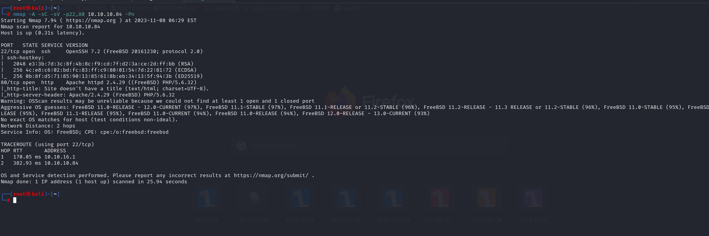


After opening http service in browser , we can see simple stuff.

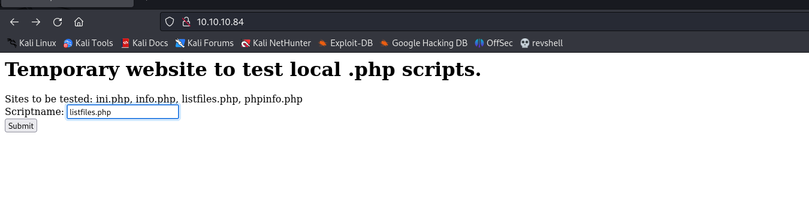


listfiles.php

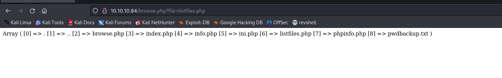


Here we have (pwdbackup.txt) file, let's read this.

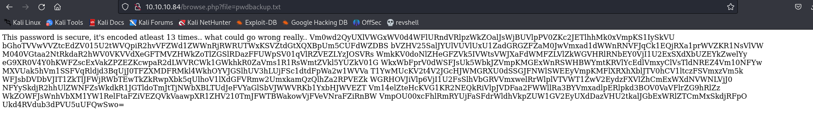


After decoding 13 times via base64, we see the password.

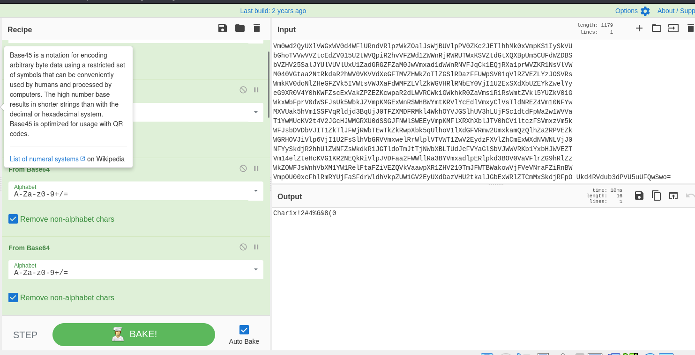


password=> Charix!2#4%6&8(0


Our browse.php file is also vulnerable to LFI that we can read '/etc/passwd' file easily.

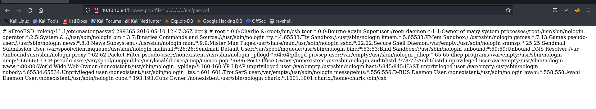


From result, we see that there is 'charix' user is valid.

I see valid credentials (charix: Charix!2#4%6&8(0 ), test them for ssh login.

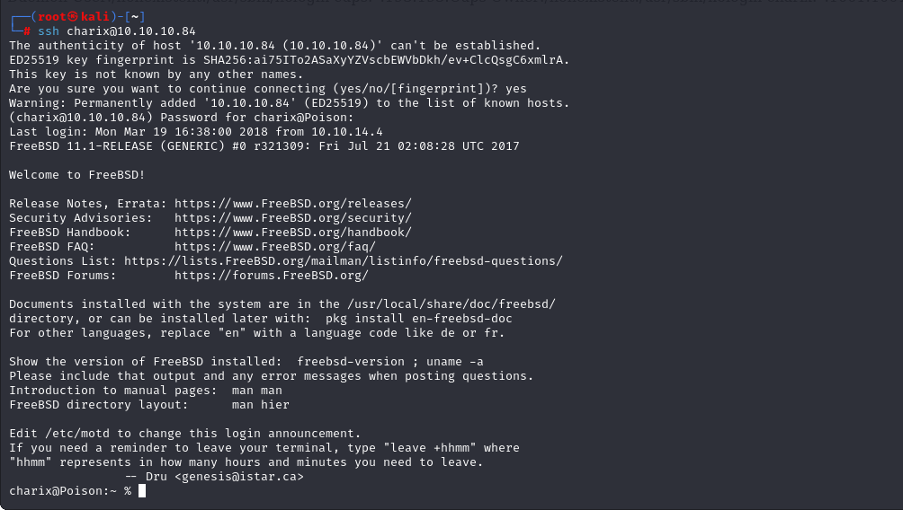


user.txt

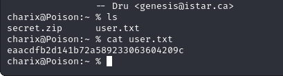


Here we have secret.zip file, let's download to our attacker's machine, I tried all methods but, **sftp** worked.
```bash
sftp charix@10.10.10.84  # password=>Charix!2#4%6&8(0
```

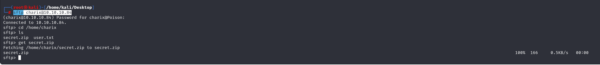


Let's unzip this password protected zip file via unzip command.
And we use the same password for unzip process.

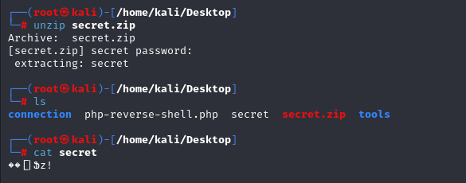

While we see processes via 'ps aux' command. We see that VNC is runnning by root.

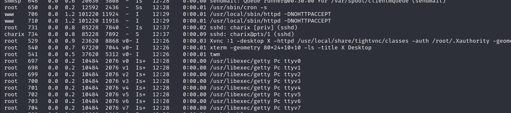

We can also prove from the LISTENING ports.

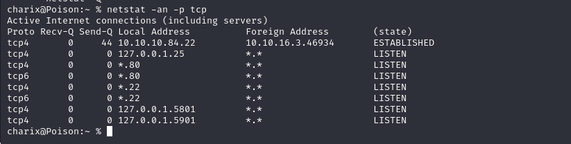


Let's try to join VNC Server.

First we look at our '/etc/proxychains.conf' file. 

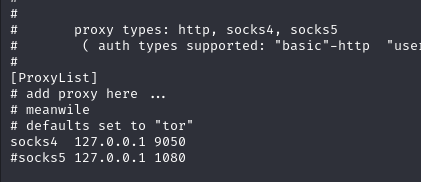

From here we see that we have to use 'socks4' with (9050 port)
```bash
ssh -D 9050 charix@10.10.10.84
```

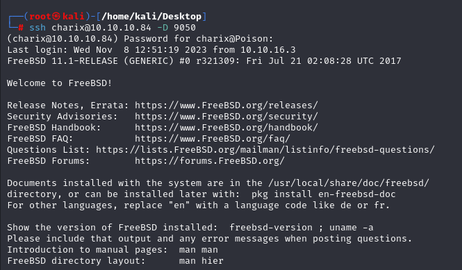


After creating socks4 proxy(dynamic port -D), we can join VNC Server.
Also here we use secret file which we got from zip file.

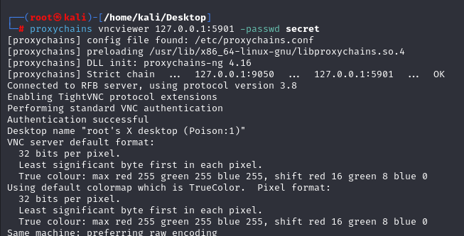


root.txt

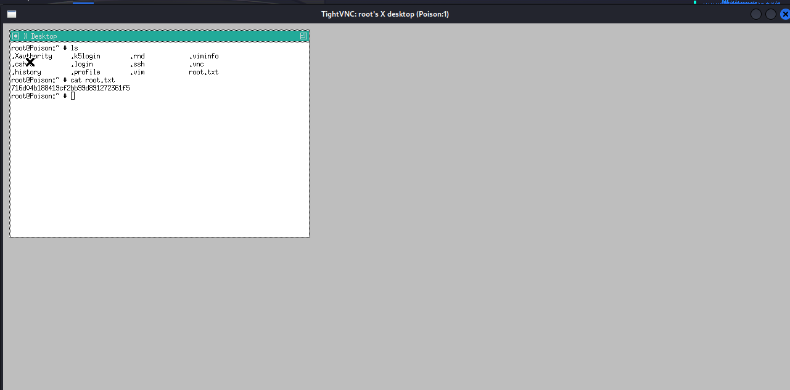