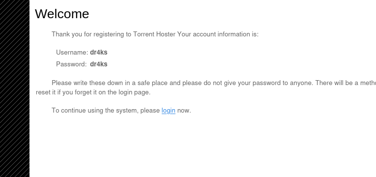

# [Popcorn](https://app.hackthebox.com/machines/popcorn)

```bash
nmap -sT -p- --min-rate 10000 10.10.10.6 -Pn
```


```bash
nmap -sC -sV -p22,80 10.10.10.6 -Pn 
```


Directory brute-forcing

```bash
gobuster dir -u http://10.10.10.6 -w /usr/share/wordlists/dirbuster/directory-list-2.3-small.txt -x php -t 40 
```


I find a directory called '/torrent', let's enumerate here.

I login here,




I try to upload a file here, and I get a reverse shell.

While I upload clean php-reverse-shell, it doesn't allow me.


Let's try to bypass it and upload webshell.


For this, I **download sample torrent file**, and upload this , while I upload this, **I click to EDIT torrent file** change the content of file with php reverse shell.

I upload malicious php file into machine by doing below steps.

    1. change file extension to .php.gif 
    2. Add 'GIF89a;' this string at the beginning of the file.
    3. Change 'Content-Type' to 'image/gif' in request header.


While **browsing malicious php** file on '/torrent/upload' directory, I get a reverse shell.


I spawned a interactive shell.

```bash
python -c 'import pty;pty.spawn("/bin/bash")'
Ctrl + Z
stty raw -echo;fg
export TERM=xterm
export SHELL=bash
```


user.txt


After enumeration machine, I see that it is vulnerable to 'DirtyCow' vulnerability. As because below version.


I search for exploit on kali, and I find a script.


Let's upload this script into machine, and run it.


After downloading C file, let's compile it and execute.


root.txt

