# [Ready](https://app.hackthebox.com/machines/ready)

```bash
nmap -p- --min-rate 10000 10.10.10.220
```
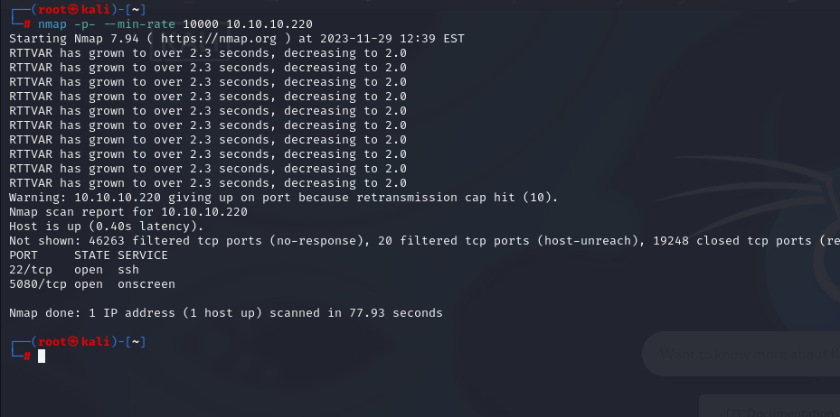

After knowing (22, 5080) ports are open, let's do greater nmap scan.

```bash
nmap -A -sC -sV -p22,5080 10.10.10.220
```

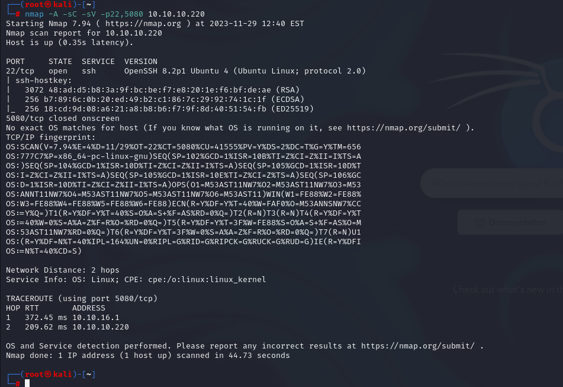


On port of 5080, we see that there is Gitlab server.

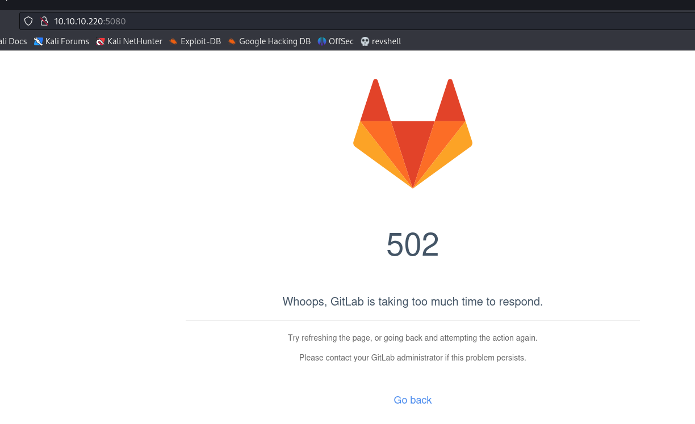


I see version of on-premise Gitlab server, that's 11.4.7 which should be updated.

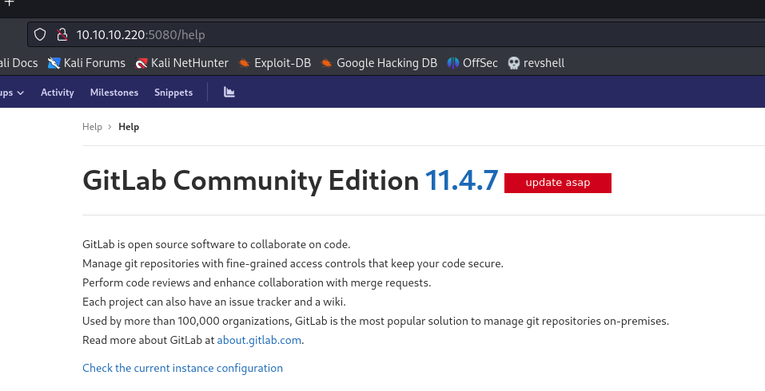

I searched publicly-known exploits for this version of Gitlab.
I see two CVEs being CVE-2018-19585 and CVE-2018-19571.

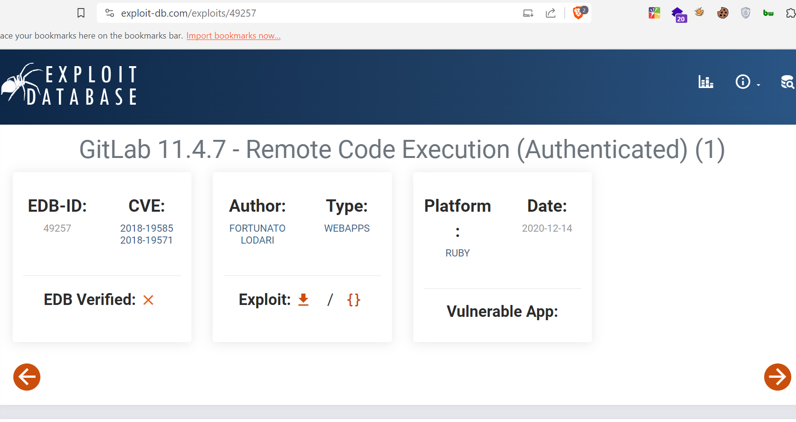


Let's try to find exploit to use [this](https://github.com/Algafix/gitlab-RCE-11.4.7).

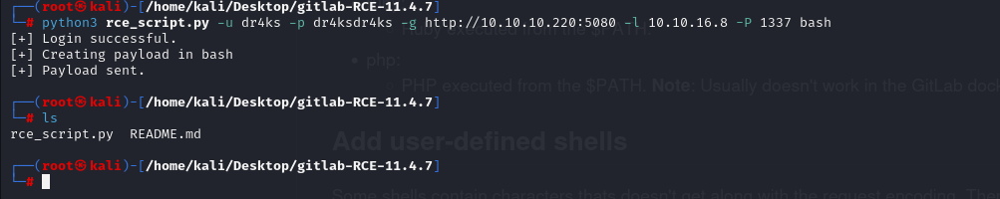

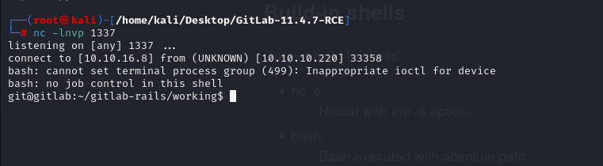


Let's make interactive shell.
```bash
python3 -c 'import pty; pty.spawn("/bin/bash")'
CTRL+Z
stty raw -echo; fg
export TERM=xterm
export SHELL=bash
```

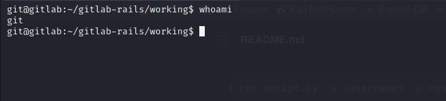


user.txt

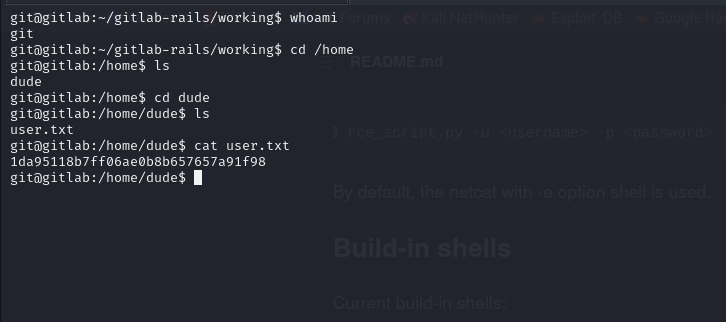


We find interesting directory called '/opt/backup' , there is Ruby file, which attracts me to do something on this file like searching..


```bash
cat gitlab.rb | grep -v "^#" | grep .
```

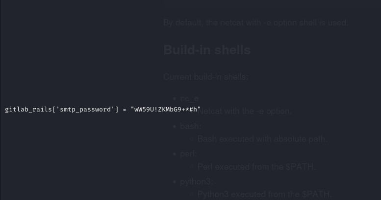

I find password, (wW59U!ZKMbG9+*#h) which password reusing happens here also.

Let's switch into 'root' user for container.

root: wW59U!ZKMbG9+*#h

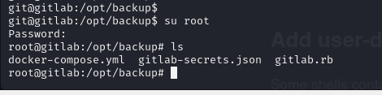


To check if we have access to host partition or not then we can run `fdisk -l` command.

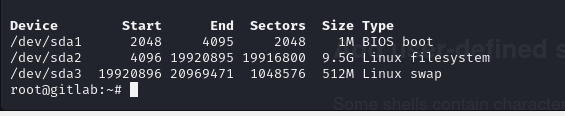


Now we see that we can mount "/dev/sda2" to access , let's do this.
```bash
mkdir host
mount /dev/sda2 /root/host
```

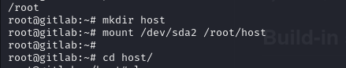


root.txt

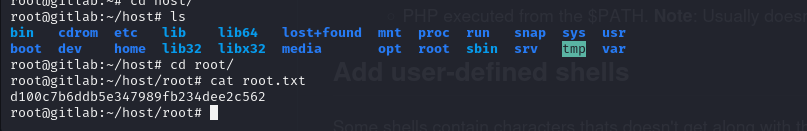