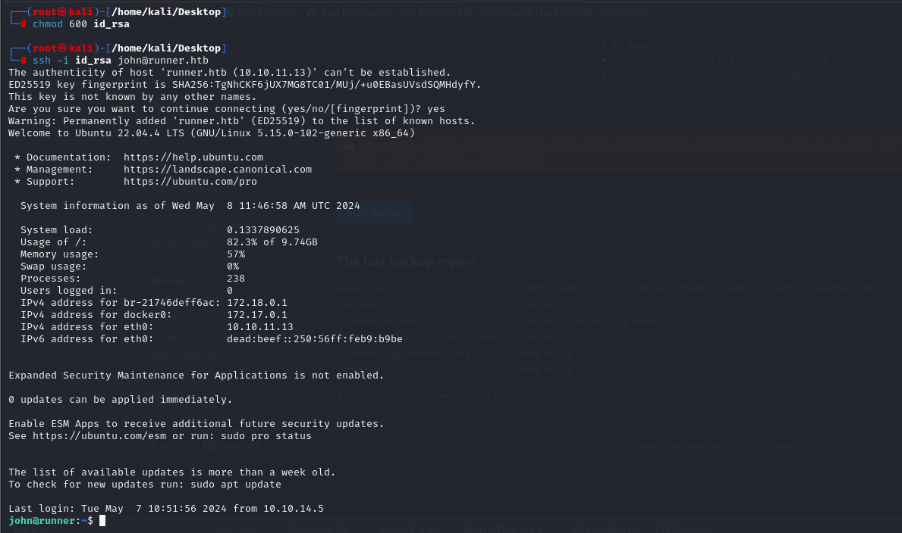

# [Runner](https://app.hackthebox.com/machines/runner)

```bash
nmap -p- --min-rate 10000 10.10.11.13 -Pn
```


After detection of open ports, let's do greater nmap scan for these ports.

```bash
nmap -A -sC -sV -p22,80,8000 10.10.11.13 -Pn 
```


From nmap scan result, I see that this ip address is resolved into `runner.htb`, let's add this into `/etc/hosts` file for resolving purposes.


While opening web application on port `80`, it returns such an page.


Let's do `Subdomain Enumeration` via `wfuzz`.

```bash
wfuzz -u http://runner.htb -H "Host: FUZZ.runner.htb" -w /usr/share/seclists/Discovery/DNS/subdomains-top1million-20000.txt
```


Let's add `teamcity.runner.htb` domain name to `/etc/hosts` file.


While I open `teamcity.runner.htb`, it returns `Teamcity` web application and login form.


Version is `Version 2023.05.3 (build 129390)`.


I searched publicly known exploit for this version of web application. That's [CVE-2023-42793](https://github.com/H454NSec/CVE-2023-42793)

Let's use this.

```bash
python3 CVE-2023-42793.py -u http://teamcity.runner.htb/
```


H454NSec3879:@H454NSec

Let's use this credentials to login into system.


I find one last backup, let's download this and analyze data inside of this.


Once I extract data, I find `id_rsa` from here, let's try to use this to authenticate into machine.


Let's change mode of this `id_rsa` and use for authentication via `ssh`.

```bash
chmod 600 id_rsa
ssh -i id_rsa
```




I brute-force possible users from list of Teamcity application and `john` is correct one for me.


user.txt


I also find `database_dump` folder after extraction and read `users` file which contains user's information.


Let's take password hash of `matthew` user and tries to crack with `hashcat`.

```bash
hashcat -m 3200 hash.txt --wordlist /usr/share/wordlists/rockyou.txt
```


matthew: piper123

For `Privilege Escalation`, I just run `netstat -ntpl` to see open ports.


I see port `9000`, let's do `Port Forwarding` to see what application is running.

```bash
ssh -L 9000:localhost:9000 -i id_rsa john@runner.htb
```


While I open web application port `9000`, it opens up `Portainer`. I authenticat myself into here via `matthew` credentials.


Then, I find this [blog](https://rioasmara.com/2021/08/15/use-portainer-for-privilege-escalation/) for `Privilege Escalation`.

I also use vulnerability whose id is `CVE-2024–21626`.


I deploy container after setting this configuration.


I can read all system sensitive files belong to `root` user.

```bash
cat ../../../../../../root/root.txt
cat ../../../../../../root/.ssh/id_rsa
```


root.txt


