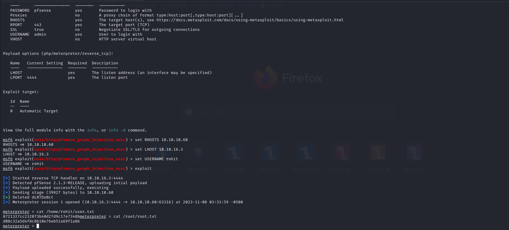

# [Sense](https://app.hackthebox.com/machines/sense)

```bash
nmap -p80,443 -A -sC -sV 10.10.10.60 -Pn
```


Let's do directory brute-forcing.
```bash
ffuf -u https://10.10.10.60/FUZZ -w /usr/share/wordlists/dirbuster/directory-list-2.3-medium.txt 
```


Here, we got 'system-users.txt' file and content of this like.


Default password credentials:  rohit:pfsense


We login with above credentials.


We learn that 2.1.3-RELEASE version is used by pfsense.

I already found exploit of this (CVE-2016-10709)=>


Let's use msfconsole. Due to attack vector, we will be root user while injecting payload. That's why we can read both user.txt and root.txt flags.


