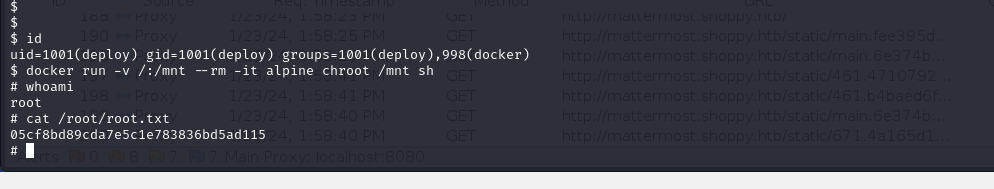

# [Shoppy](https://app.hackthebox.com/machines/shoppy)

```bash
nmap -p- --min-rate 10000 10.10.11.180 -Pn
```


After knowing open ports, let's do greater nmap scan.

```bash
nmap -A -sC -sV -p22,80,9093 10.10.11.180 
```


From nmap scan result, I see that this ip address is automatically resolved into 'shoppy.htb', that's why I need to add this domain into `/etc/hosts` file.


Let's do subdomain enumeration via `wfuzz` tool.

```bash
wfuzz -u http://10.10.11.180 -H "Host: FUZZ.shoppy.htb" -w /usr/share/seclists/Discovery/DNS/bitquark-subdomains-top100000.txt --hh 169
```

I also did directory enumeration for `shoppy.htb` application via `feroxbuster` tool.
```bash
feroxbuster --url http://shoppy.htb/
```


I see `Admin` page, let's try to inject some payloads for this login system.


Login `POST` request is like below.


Firstly, I put `'` character into username field, but it doesn't show anything.

Let's change Content-Type and try to do NoSQL Injections.


From this error, I see that application is running on `/home/jaeger/ShoppyApp` folder.

I see that application is behaved like parsing `.json` data, let's try to add NoSQL Injection payload to bypass authentication.

Finally, I found correct bypass.
```bash
username=admin' || 'a'=='a&password=test
```


I access application and see that there's option called `Search for users`.


While I write `admin` into input, it gives me password of this user.


So, to get all users, I will `NoSQL` injection payload to get all users list `admin' || '1'=='1`


Let's crack passwords of this users via [Crackstation](https://crackstation.net)


From subdomain enumeration, I found `mattermost.shoppy.htb`, I use this credentials to login into here.

josh:remembermethisway


After enumeration, I found that there's `Deploy Machine` channel is created and sensitive credentials are shared via chat.


username: jaeger
password: Sh0ppyBest@pp!

Let's use this credentials to connect into machine via `ssh`.

user.txt


For privilege escalation, I just run `sudo -l` command.


I look at this binary via `strings` file. But I use `-el` option due to see **'16-bit character string'**.


Password: Sample.

Let's run this binary and enter password , see what happens.


Again, I get credentials of `deploy` user.

deploy: Deploying@pp!


Now, I just run `id` command and see that this user belongs to `docker` group.


I get exploit from [Gtfobins](https://gtfobins.github.io/gtfobins/docker/#shell) for `docker` group.

```bash
docker run -v /:/mnt --rm -it alpine chroot /mnt sh
```


root.txt


